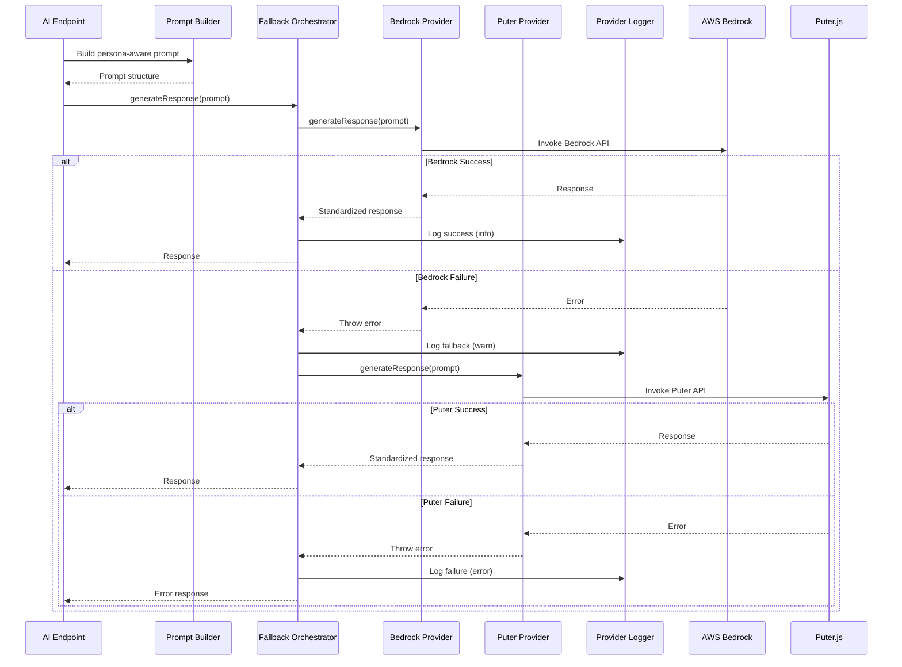

# AI Provider Fallback System - Design Document

## Overview

The AI Provider Fallback System introduces a resilient architecture for Vyapar AI's explanation and interpretation features. The system maintains AWS Bedrock as the primary AI provider (demonstrating AWS integration for hackathon judges) while providing Puter.js as a transparent fallback when Bedrock is unavailable. This design preserves the deterministic-first principle where AI is used exclusively for explanation and interpretation, never for financial calculations.

The architecture consists of three main components:

1. **Provider Abstraction Layer**: A unified interface that standardizes communication with different AI providers
2. **Provider Implementations**: Concrete implementations for AWS Bedrock and Puter.js that conform to the abstraction layer
3. **Fallback Orchestrator**: Logic that automatically switches from primary to fallback provider on failures

This design ensures that AI features remain operational during AWS service disruptions, particularly critical during hackathon demos and presentations, while maintaining full compatibility with existing prompt building and persona-aware AI functionality.

## Architecture

### System Context

```mermaid
graph TB
    subgraph "API Layer"
        A[/api/analyze]
        B[/api/ask]
        C[/api/explain]
        D[/api/benchmark/explain]
        E[/api/indices/explain]
    end
    
    subgraph "AI Provider Fallback System"
        F[Fallback Orchestrator]
        G[Provider Abstraction Layer]
        H[Bedrock Provider]
        I[Puter Provider]
        J[Provider Logger]
    end
    
    subgraph "External Services"
        K[AWS Bedrock]
        L[Puter.js AI]
    end
    
    subgraph "Existing Infrastructure"
        M[Prompt Builder]
        N[Error Utils]
        O[Logger]
    end
    
    A --> F
    B --> F
    C --> F
    D --> F
    E --> F
    
    F --> G
    G --> H
    G --> I
    
    H --> K
    I --> L
    
    F --> J
    J --> O
    F --> N
    
    M --> A
    M --> B
    M --> C
    M --> D
    M --> E
```

### Component Interaction Flow



## Components and Interfaces

### 1. Provider Abstraction Layer

**File**: `lib/ai/provider-abstraction.ts`

The Provider Abstraction Layer defines a standard interface that all AI providers must implement. This enables seamless switching between providers without modifying endpoint code.

```typescript
/**
 * Standard response format for all AI providers
 */
export interface AIProviderResponse {
  success: boolean;
  content?: string;
  error?: string;
  errorType?: 'authentication' | 'rate_limit' | 'timeout' | 'service_error' | 'unknown';
  provider: 'bedrock' | 'puter';
}

/**
 * Options for AI generation requests
 */
export interface GenerateOptions {
  maxRetries?: number;
  timeout?: number;
  language?: Language;
}

/**
 * Abstract interface that all AI providers must implement
 */
export interface AIProvider {
  /**
   * Generate AI response from prompt
   * @param prompt - The prompt text to send to the AI
   * @param options - Optional configuration for the request
   * @returns Standardized response with success flag, content, and metadata
   */
  generateResponse(prompt: string, options?: GenerateOptions): Promise<AIProviderResponse>;
  
  /**
   * Get the provider identifier
   * @returns Provider name ('bedrock' or 'puter')
   */
  getProviderName(): 'bedrock' | 'puter';
  
  /**
   * Check if the provider is configured and ready to use
   * @returns True if provider is configured with necessary credentials/settings
   */
  isConfigured(): boolean;
}
```

### 2. Bedrock Provider Implementation

**File**: `lib/ai/bedrock-provider.ts`

Wraps the existing AWS Bedrock client functionality in the provider interface.

```typescript
import { BedrockRuntimeClient, InvokeModelCommand } from '@aws-sdk/client-bedrock-runtime';
import { AIProvider, AIProviderResponse, GenerateOptions } from './provider-abstraction';
import { Language } from '../types';

export class BedrockProvider implements AIProvider {
  private client: BedrockRuntimeClient;
  private modelId: string;
  
  constructor(client?: BedrockRuntimeClient, modelId?: string) {
    // Support dependency injection for testing
    this.client = client || new BedrockRuntimeClient({
      region: process.env.AWS_REGION || 'us-east-1',
      credentials: {
        accessKeyId: process.env.AWS_ACCESS_KEY_ID || '',
        secretAccessKey: process.env.AWS_SECRET_ACCESS_KEY || '',
        ...(process.env.AWS_SESSION_TOKEN ? { sessionToken: process.env.AWS_SESSION_TOKEN } : {}),
      },
    });
    
    this.modelId = modelId || process.env.BEDROCK_MODEL_ID || 'anthropic.claude-3-sonnet-20240229-v1:0';
  }
  
  async generateResponse(prompt: string, options?: GenerateOptions): Promise<AIProviderResponse> {
    const maxRetries = options?.maxRetries ?? 2;
    const language = options?.language ?? 'en';
    
    let lastError: any;
    
    for (let attempt = 0; attempt <= maxRetries; attempt++) {
      try {
        // Determine model type and format request
        const modelType = this.getModelType(this.modelId);
        const requestBody = this.formatRequest(prompt, modelType);
        
        const command = new InvokeModelCommand({
          modelId: this.modelId,
          contentType: 'application/json',
          accept: 'application/json',
          body: JSON.stringify(requestBody),
        });
        
        const response = await this.client.send(command);
        const responseBody = JSON.parse(new TextDecoder().decode(response.body));
        
        // Extract content based on model type
        const content = this.extractContent(responseBody, modelType);
        
        return {
          success: true,
          content,
          provider: 'bedrock',
        };
        
      } catch (error: any) {
        lastError = error;
        
        // Handle throttling with exponential backoff
        if (error.name === 'ThrottlingException' && attempt < maxRetries) {
          const waitTime = Math.pow(2, attempt) * 1000;
          await new Promise(resolve => setTimeout(resolve, waitTime));
          continue;
        }
        
        // Map error types
        const errorType = this.mapErrorType(error);
        
        // Don't retry on non-throttling errors
        if (errorType !== 'rate_limit') {
          break;
        }
      }
    }
    
    // Return error response
    const errorType = this.mapErrorType(lastError);
    return {
      success: false,
      error: this.getErrorMessage(lastError, errorType),
      errorType,
      provider: 'bedrock',
    };
  }
  
  getProviderName(): 'bedrock' | 'puter' {
    return 'bedrock';
  }
  
  isConfigured(): boolean {
    return !!(
      process.env.AWS_REGION &&
      process.env.AWS_ACCESS_KEY_ID &&
      process.env.AWS_SECRET_ACCESS_KEY
    );
  }
  
  private getModelType(modelId: string): 'claude' | 'nova' {
    if (modelId.includes('anthropic') || modelId.includes('claude')) {
      return 'claude';
    }
    if (modelId.includes('nova')) {
      return 'nova';
    }
    return 'claude';
  }
  
  private formatRequest(prompt: string, modelType: 'claude' | 'nova'): any {
    if (modelType === 'nova') {
      return {
        messages: [{ role: 'user', content: [{ text: prompt }] }],
        inferenceConfig: { max_new_tokens: 2000 },
      };
    } else {
      return {
        anthropic_version: 'bedrock-2023-05-31',
        max_tokens: 2000,
        messages: [{ role: 'user', content: [{ type: 'text', text: prompt }] }],
      };
    }
  }
  
  private extractContent(responseBody: any, modelType: 'claude' | 'nova'): string {
    if (modelType === 'nova') {
      return responseBody.output?.message?.content?.[0]?.text || '';
    } else {
      return responseBody.content?.[0]?.text || '';
    }
  }
  
  private mapErrorType(error: any): AIProviderResponse['errorType'] {
    if (error.name === 'ThrottlingException') return 'rate_limit';
    if (error.name === 'TimeoutError' || error.code === 'ETIMEDOUT') return 'timeout';
    if (error.name === 'ServiceUnavailableException') return 'service_error';
    if (error.name === 'UnauthorizedException' || error.name === 'AccessDeniedException') return 'authentication';
    return 'unknown';
  }
  
  private getErrorMessage(error: any, errorType: AIProviderResponse['errorType']): string {
    switch (errorType) {
      case 'rate_limit':
        return 'Too many requests. Please try again in a moment.';
      case 'timeout':
        return 'Request timed out. Please try again.';
      case 'service_error':
        return 'AI service is temporarily unavailable.';
      case 'authentication':
        return 'Authentication failed.';
      default:
        return error?.message || 'Failed to get AI response.';
    }
  }
}
```

### 3. Puter Provider Implementation

**File**: `lib/ai/puter-provider.ts`

Implements the provider interface using Puter.js AI SDK.

```typescript
import { AIProvider, AIProviderResponse, GenerateOptions } from './provider-abstraction';
import { Language } from '../types';

export class PuterProvider implements AIProvider {
  private apiEndpoint: string;
  
  constructor(apiEndpoint?: string) {
    // Puter.js endpoint (no API key required)
    this.apiEndpoint = apiEndpoint || 'https://api.puter.com/ai/chat';
  }
  
  async generateResponse(prompt: string, options?: GenerateOptions): Promise<AIProviderResponse> {
    const timeout = options?.timeout ?? 8000; // 8 second timeout for Puter
    
    try {
      const controller = new AbortController();
      const timeoutId = setTimeout(() => controller.abort(), timeout);
      
      const response = await fetch(this.apiEndpoint, {
        method: 'POST',
        headers: {
          'Content-Type': 'application/json',
        },
        body: JSON.stringify({
          messages: [
            {
              role: 'user',
              content: prompt,
            },
          ],
          model: 'gpt-3.5-turbo', // Puter.js default model
        }),
        signal: controller.signal,
      });
      
      clearTimeout(timeoutId);
      
      if (!response.ok) {
        // Handle rate limiting
        if (response.status === 429) {
          return {
            success: false,
            error: 'Rate limit exceeded. Please try again later.',
            errorType: 'rate_limit',
            provider: 'puter',
          };
        }
        
        // Handle other errors
        return {
          success: false,
          error: `Puter API error: ${response.statusText}`,
          errorType: 'service_error',
          provider: 'puter',
        };
      }
      
      const data = await response.json();
      const content = data.choices?.[0]?.message?.content || '';
      
      return {
        success: true,
        content,
        provider: 'puter',
      };
      
    } catch (error: any) {
      // Handle timeout
      if (error.name === 'AbortError') {
        return {
          success: false,
          error: 'Request timed out.',
          errorType: 'timeout',
          provider: 'puter',
        };
      }
      
      // Handle network errors
      return {
        success: false,
        error: error.message || 'Failed to connect to Puter AI service.',
        errorType: 'unknown',
        provider: 'puter',
      };
    }
  }
  
  getProviderName(): 'bedrock' | 'puter' {
    return 'puter';
  }
  
  isConfigured(): boolean {
    // Puter.js requires no configuration
    return true;
  }
}
```

### 4. Fallback Orchestrator

**File**: `lib/ai/fallback-orchestrator.ts`

Manages the fallback logic and provider selection.

```typescript
import { AIProvider, AIProviderResponse, GenerateOptions } from './provider-abstraction';
import { BedrockProvider } from './bedrock-provider';
import { PuterProvider } from './puter-provider';
import { logger } from '../logger';
import { ErrorCode, createErrorResponse } from '../error-utils';
import { Language } from '../types';

export interface FallbackConfig {
  enableFallback: boolean;
  totalTimeout: number;
}

export class FallbackOrchestrator {
  private primaryProvider: AIProvider;
  private fallbackProvider: AIProvider;
  private config: FallbackConfig;
  
  constructor(
    primaryProvider?: AIProvider,
    fallbackProvider?: AIProvider,
    config?: Partial<FallbackConfig>
  ) {
    // Support dependency injection for testing
    this.primaryProvider = primaryProvider || new BedrockProvider();
    this.fallbackProvider = fallbackProvider || new PuterProvider();
    
    // Read configuration from environment
    const enableFallback = process.env.ENABLE_AI_FALLBACK !== 'false';
    
    this.config = {
      enableFallback: config?.enableFallback ?? enableFallback,
      totalTimeout: config?.totalTimeout ?? 10000,
    };
    
    // Validate and log configuration
    this.validateConfig();
  }
  
  async generateResponse(
    prompt: string,
    options?: GenerateOptions,
    metadata?: { endpoint?: string; userId?: string }
  ): Promise<AIProviderResponse> {
    const startTime = Date.now();
    
    // Log request
    logger.info('AI request initiated', {
      endpoint: metadata?.endpoint,
      userId: metadata?.userId,
      fallback_enabled: this.config.enableFallback,
    });
    
    // Attempt primary provider (Bedrock)
    try {
      const primaryResponse = await this.primaryProvider.generateResponse(prompt, options);
      
      if (primaryResponse.success) {
        // Log success
        logger.info('AI request handled by AWS Bedrock', {
          endpoint: metadata?.endpoint,
          userId: metadata?.userId,
          duration_ms: Date.now() - startTime,
        });
        
        return primaryResponse;
      }
      
      // Primary failed, check if fallback is enabled
      if (!this.config.enableFallback) {
        logger.error('AI request failed, fallback disabled', {
          endpoint: metadata?.endpoint,
          userId: metadata?.userId,
          error: primaryResponse.error,
          errorType: primaryResponse.errorType,
        });
        
        return primaryResponse;
      }
      
      // Log fallback attempt
      logger.warn('AI request failed on Bedrock, using Puter.js fallback', {
        endpoint: metadata?.endpoint,
        userId: metadata?.userId,
        bedrock_error: primaryResponse.error,
        bedrock_error_type: primaryResponse.errorType,
      });
      
      // Attempt fallback provider (Puter)
      const fallbackResponse = await this.fallbackProvider.generateResponse(prompt, options);
      
      if (fallbackResponse.success) {
        logger.info('AI request handled by Puter.js fallback', {
          endpoint: metadata?.endpoint,
          userId: metadata?.userId,
          duration_ms: Date.now() - startTime,
        });
        
        return fallbackResponse;
      }
      
      // Both providers failed
      logger.error('AI request failed on both providers', {
        endpoint: metadata?.endpoint,
        userId: metadata?.userId,
        bedrock_error: primaryResponse.error,
        bedrock_error_type: primaryResponse.errorType,
        puter_error: fallbackResponse.error,
        puter_error_type: fallbackResponse.errorType,
        duration_ms: Date.now() - startTime,
      });
      
      // Return combined error
      return {
        success: false,
        error: 'AI service temporarily unavailable. Please try again later.',
        errorType: 'service_error',
        provider: 'bedrock', // Report primary provider in error
      };
      
    } catch (error: any) {
      logger.error('Unexpected error in fallback orchestrator', {
        endpoint: metadata?.endpoint,
        userId: metadata?.userId,
        error: error.message,
        stack: error.stack,
      });
      
      return {
        success: false,
        error: 'Unexpected error occurred.',
        errorType: 'unknown',
        provider: 'bedrock',
      };
    }
  }
  
  /**
   * Get the current configuration
   */
  getConfig(): FallbackConfig {
    return { ...this.config };
  }
  
  /**
   * Reset provider state (for testing)
   */
  reset(): void {
    // Reset any cached state if needed
    logger.debug('Fallback orchestrator reset');
  }
  
  private validateConfig(): void {
    // Validate fallback setting
    const envValue = process.env.ENABLE_AI_FALLBACK;
    if (envValue && envValue !== 'true' && envValue !== 'false') {
      logger.warn('Invalid ENABLE_AI_FALLBACK value, using default (true)', {
        provided_value: envValue,
      });
    }
    
    logger.info('Fallback orchestrator initialized', {
      fallback_enabled: this.config.enableFallback,
      total_timeout_ms: this.config.totalTimeout,
      primary_provider: this.primaryProvider.getProviderName(),
      fallback_provider: this.fallbackProvider.getProviderName(),
    });
  }
}

// Singleton instance for application-wide use
let orchestratorInstance: FallbackOrchestrator | null = null;

export function getFallbackOrchestrator(): FallbackOrchestrator {
  if (!orchestratorInstance) {
    orchestratorInstance = new FallbackOrchestrator();
  }
  return orchestratorInstance;
}

// For testing: allow resetting the singleton
export function resetFallbackOrchestrator(): void {
  orchestratorInstance = null;
}
```

## Data Models

### AIProviderResponse

The standardized response format returned by all providers:

```typescript
interface AIProviderResponse {
  success: boolean;           // Whether the request succeeded
  content?: string;           // AI-generated content (present if success=true)
  error?: string;             // Error message (present if success=false)
  errorType?: string;         // Categorized error type for handling
  provider: 'bedrock' | 'puter'; // Which provider handled the request
}
```

### GenerateOptions

Configuration options for AI generation requests:

```typescript
interface GenerateOptions {
  maxRetries?: number;        // Maximum retry attempts (default: 2)
  timeout?: number;           // Request timeout in milliseconds
  language?: Language;        // User's preferred language for responses
}
```

### FallbackConfig

Configuration for the fallback orchestrator:

```typescript
interface FallbackConfig {
  enableFallback: boolean;    // Whether to enable automatic fallback
  totalTimeout: number;       // Total timeout for all attempts (ms)
}
```


## Correctness Properties

*A property is a characteristic or behavior that should hold true across all valid executions of a system—essentially, a formal statement about what the system should do. Properties serve as the bridge between human-readable specifications and machine-verifiable correctness guarantees.*

### Property Reflection

After analyzing all acceptance criteria, I identified the following properties that need testing. During reflection, I found several areas of redundancy:

- Properties 1.2, 2.5, and 3.5 all test consistent response format across providers - these can be combined into a single comprehensive property
- Properties 7.6 and 1.5 both test prompt building preservation - these are the same property
- Properties 7.7 tests response format preservation, which is related to but distinct from provider response format consistency
- Properties 4.1 and 9.4 both test ordering (Bedrock first, calculations before AI) - these are distinct properties about different orderings
- Properties 10.1 and 4.3 both test error response format - these can be combined

After consolidation, the following properties provide unique validation value:

### Property 1: Consistent Response Format Across Providers

*For any* AI provider implementation (Bedrock or Puter) and any valid prompt, the response must conform to the AIProviderResponse interface with success flag, optional content, optional error, errorType, and provider fields.

**Validates: Requirements 1.2, 2.5, 3.5**

### Property 2: Prompt Building Preservation

*For any* AI endpoint using the Fallback System and any valid persona context, the prompt building logic from lib/ai/prompt-builder.ts must produce identical prompts before and after fallback system integration.

**Validates: Requirements 1.5, 7.6**

### Property 3: Provider Error Propagation

*For any* provider implementation (Bedrock or Puter) and any error condition, when the underlying API returns an error, the provider must throw or return a descriptive error with the failure reason categorized by errorType.

**Validates: Requirements 2.4, 3.4**

### Property 4: Fallback Ordering

*For any* AI request when fallback is enabled, the Fallback System must attempt Bedrock Provider first, and only attempt Puter Provider if Bedrock fails.

**Validates: Requirements 4.1, 4.2**

### Property 5: Error Response Format Compliance

*For any* error condition where both providers fail, the Fallback System must return an error response that conforms to the ErrorResponse format from lib/error-utils.ts with success=false, code, and message fields.

**Validates: Requirements 4.3, 10.1**

### Property 6: Provider Logging Completeness

*For any* AI request processed by the Fallback System, the Provider Logger must log which provider was used (bedrock or puter) along with request metadata (endpoint, timestamp, userId if available).

**Validates: Requirements 5.1, 5.6**

### Property 7: Localized Error Messages

*For any* error condition and any supported language (English, Hindi, Marathi), the Fallback System must return error messages in the requested language using the translation system.

**Validates: Requirements 10.2**

### Property 8: Deterministic Calculation Ordering

*For any* AI endpoint using the Fallback System, all financial metrics (health score, margin, stress index, affordability index) must be computed deterministically before any AI provider is invoked.

**Validates: Requirements 9.4**

### Property 9: Business State Immutability

*For any* Fallback System operation (successful or failed), business state (daily entries, credits, profiles in DynamoDB) must remain unchanged before and after the operation.

**Validates: Requirements 9.5**

### Property 10: Sensitive Information Sanitization

*For any* error response returned to clients, the response must not contain API keys, credentials, AWS error details, or internal stack traces.

**Validates: Requirements 10.5**

## Error Handling

### Error Categories

The system defines five error categories for AI provider failures:

1. **authentication**: Invalid or missing credentials
2. **rate_limit**: Too many requests (throttling)
3. **timeout**: Request exceeded time limit
4. **service_error**: Provider service unavailable
5. **unknown**: Unclassified errors

### Error Handling Strategy

```typescript
// Provider-level error handling
class BedrockProvider {
  async generateResponse(prompt: string): Promise<AIProviderResponse> {
    try {
      // Attempt API call
      const response = await this.client.send(command);
      return { success: true, content: extractedContent, provider: 'bedrock' };
    } catch (error) {
      // Map error to category
      const errorType = this.mapErrorType(error);
      
      // Return structured error (don't throw)
      return {
        success: false,
        error: this.getErrorMessage(error, errorType),
        errorType,
        provider: 'bedrock',
      };
    }
  }
}

// Orchestrator-level error handling
class FallbackOrchestrator {
  async generateResponse(prompt: string): Promise<AIProviderResponse> {
    // Try primary provider
    const primaryResponse = await this.primaryProvider.generateResponse(prompt);
    
    if (primaryResponse.success) {
      return primaryResponse; // Success path
    }
    
    // Log primary failure
    logger.warn('Primary provider failed', { error: primaryResponse.error });
    
    if (!this.config.enableFallback) {
      return primaryResponse; // Return primary error if fallback disabled
    }
    
    // Try fallback provider
    const fallbackResponse = await this.fallbackProvider.generateResponse(prompt);
    
    if (fallbackResponse.success) {
      return fallbackResponse; // Fallback success
    }
    
    // Both failed - log and return generic error
    logger.error('Both providers failed', {
      primary: primaryResponse.error,
      fallback: fallbackResponse.error,
    });
    
    return {
      success: false,
      error: 'AI service temporarily unavailable. Please try again later.',
      errorType: 'service_error',
      provider: 'bedrock',
    };
  }
}
```

### Error Message Localization

All error messages must be localized using the existing translation system:

```typescript
// In lib/translations.ts (extend existing)
export const errorMessages = {
  en: {
    'errors.aiUnavailable': 'AI service temporarily unavailable. Please try again later.',
    'errors.aiRateLimited': 'Too many AI requests. Please wait a moment and try again.',
    'errors.aiTimeout': 'AI request timed out. Please try again.',
  },
  hi: {
    'errors.aiUnavailable': 'AI सेवा अस्थायी रूप से अनुपलब्ध है। कृपया बाद में पुनः प्रयास करें।',
    'errors.aiRateLimited': 'बहुत सारे AI अनुरोध। कृपया एक क्षण प्रतीक्षा करें और पुनः प्रयास करें।',
    'errors.aiTimeout': 'AI अनुरोध समय समाप्त हो गया। कृपया पुनः प्रयास करें।',
  },
  mr: {
    'errors.aiUnavailable': 'AI सेवा तात्पुरती अनुपलब्ध आहे. कृपया नंतर पुन्हा प्रयत्न करा.',
    'errors.aiRateLimited': 'खूप AI विनंत्या. कृपया थोडा वेळ थांबा आणि पुन्हा प्रयत्न करा.',
    'errors.aiTimeout': 'AI विनंती कालबाह्य झाली. कृपया पुन्हा प्रयत्न करा.',
  },
};
```

### Graceful Degradation

When AI is completely unavailable, endpoints should return deterministic results with a note:

```typescript
// In API endpoints
const aiResponse = await orchestrator.generateResponse(prompt);

if (!aiResponse.success) {
  // Return deterministic results without AI explanation
  return NextResponse.json({
    success: true,
    calculatedMetrics: deterministicResults,
    explanation: {
      success: false,
      message: 'AI explanation temporarily unavailable. Your calculated metrics are accurate.',
    },
  });
}
```

## Testing Strategy

### Dual Testing Approach

The AI Provider Fallback System requires both unit tests and property-based tests for comprehensive coverage:

**Unit Tests** focus on:
- Specific provider implementations (Bedrock, Puter)
- Configuration validation
- Error message formatting
- Mock provider injection
- Endpoint integration points

**Property-Based Tests** focus on:
- Response format consistency across all providers
- Fallback behavior across all error types
- Logging completeness across all request scenarios
- State immutability across all operations
- Security sanitization across all error responses

### Property-Based Testing Configuration

All property tests must:
- Run minimum 100 iterations (due to randomization)
- Use fast-check library for TypeScript
- Tag each test with feature and property reference
- Generate diverse test inputs (prompts, errors, configurations)

### Test Structure

```typescript
// Example property test structure
import fc from 'fast-check';

describe('AI Provider Fallback System - Property Tests', () => {
  /**
   * Feature: ai-provider-fallback, Property 1: Consistent Response Format Across Providers
   */
  it('should return consistent response format for all providers', async () => {
    await fc.assert(
      fc.asyncProperty(
        fc.string({ minLength: 10, maxLength: 500 }), // Random prompts
        fc.constantFrom('bedrock', 'puter'), // Provider selection
        async (prompt, providerType) => {
          const provider = providerType === 'bedrock' 
            ? new BedrockProvider(mockBedrockClient)
            : new PuterProvider(mockPuterEndpoint);
          
          const response = await provider.generateResponse(prompt);
          
          // Verify response structure
          expect(response).toHaveProperty('success');
          expect(response).toHaveProperty('provider');
          expect(response.provider).toBe(providerType);
          
          if (response.success) {
            expect(response).toHaveProperty('content');
            expect(typeof response.content).toBe('string');
          } else {
            expect(response).toHaveProperty('error');
            expect(response).toHaveProperty('errorType');
          }
        }
      ),
      { numRuns: 100 }
    );
  });
});
```

### Unit Test Coverage Requirements

Each component must have unit tests covering:

1. **BedrockProvider**:
   - Successful response handling
   - Error type mapping (throttling, timeout, service error, auth)
   - Retry logic with exponential backoff
   - Model type detection (Claude vs Nova)
   - Request formatting for different models
   - Content extraction from responses

2. **PuterProvider**:
   - Successful response handling
   - Rate limiting detection
   - Timeout handling
   - Network error handling
   - Response parsing

3. **FallbackOrchestrator**:
   - Primary provider success (no fallback)
   - Primary failure, fallback success
   - Both providers fail
   - Fallback disabled configuration
   - Configuration validation
   - Logging at each decision point

4. **Endpoint Integration**:
   - /api/analyze uses fallback system
   - /api/ask uses fallback system
   - /api/explain uses fallback system
   - /api/benchmark/explain uses fallback system
   - /api/indices/explain uses fallback system
   - Prompt building preserved
   - Response format preserved
   - Deterministic calculations occur before AI calls

### Integration Tests

Integration tests must verify:
- End-to-end flow from endpoint to provider
- Prompt builder integration
- Error utils integration
- Logger integration
- Translation system integration
- DynamoDB state isolation (no modifications)

### Mock Provider for Testing

```typescript
// lib/ai/__tests__/mock-provider.ts
export class MockProvider implements AIProvider {
  private responses: AIProviderResponse[] = [];
  private callCount = 0;
  
  constructor(private name: 'bedrock' | 'puter') {}
  
  // Configure mock responses
  setResponses(responses: AIProviderResponse[]): void {
    this.responses = responses;
    this.callCount = 0;
  }
  
  async generateResponse(prompt: string): Promise<AIProviderResponse> {
    const response = this.responses[this.callCount] || {
      success: false,
      error: 'No mock response configured',
      errorType: 'unknown',
      provider: this.name,
    };
    
    this.callCount++;
    return response;
  }
  
  getProviderName(): 'bedrock' | 'puter' {
    return this.name;
  }
  
  isConfigured(): boolean {
    return true;
  }
  
  getCallCount(): number {
    return this.callCount;
  }
  
  reset(): void {
    this.callCount = 0;
    this.responses = [];
  }
}
```

### Test Execution

Run tests with:
```bash
# Unit tests
npm test lib/ai/__tests__/

# Property tests
npm test lib/ai/__tests__/*.property.test.ts

# Integration tests
npm test __tests__/ai-fallback-integration.test.ts

# All tests
npm test
```

### Manual Testing Checklist

Before deployment, manually verify:

1. **Bedrock Success Path**:
   - Set valid AWS credentials
   - Call /api/analyze endpoint
   - Verify response contains AI explanation
   - Check logs show "AI request handled by AWS Bedrock"

2. **Fallback Path**:
   - Set invalid AWS credentials
   - Call /api/analyze endpoint
   - Verify response contains AI explanation from Puter
   - Check logs show "AI request failed on Bedrock, using Puter.js fallback"

3. **Both Fail Path**:
   - Disable network or set invalid credentials for both
   - Call /api/analyze endpoint
   - Verify response contains deterministic metrics
   - Verify error message is user-friendly
   - Check logs show "Both providers failed"

4. **Fallback Disabled**:
   - Set ENABLE_AI_FALLBACK=false
   - Set invalid AWS credentials
   - Call /api/analyze endpoint
   - Verify only Bedrock is attempted
   - Verify error returned immediately

5. **Localization**:
   - Test error messages in English, Hindi, Marathi
   - Verify translations are correct

6. **Deterministic-First**:
   - Call /api/indices/explain
   - Verify stress and affordability indices are calculated before AI call
   - Verify AI only explains pre-calculated values

## Implementation Notes

### Migration Strategy

The migration to the fallback system should be incremental:

1. **Phase 1**: Create provider abstraction and implementations
   - Implement AIProvider interface
   - Create BedrockProvider (wrap existing client)
   - Create PuterProvider
   - Write unit tests for each

2. **Phase 2**: Implement fallback orchestrator
   - Create FallbackOrchestrator class
   - Implement fallback logic
   - Add configuration support
   - Write unit and property tests

3. **Phase 3**: Migrate endpoints one at a time
   - Start with /api/explain (simplest)
   - Then /api/analyze
   - Then /api/ask
   - Then /api/benchmark/explain
   - Finally /api/indices/explain
   - Test each endpoint after migration

4. **Phase 4**: Cleanup
   - Remove direct bedrock-client.ts usage from endpoints
   - Update documentation
   - Add monitoring

### Backward Compatibility

The fallback system maintains full backward compatibility:

- Existing prompt building logic unchanged
- Existing response formats unchanged
- Existing error handling patterns preserved
- No changes to API contracts
- No changes to client code

### Performance Considerations

- **Primary path latency**: No additional overhead (direct Bedrock call)
- **Fallback path latency**: Additional 2-3 seconds for Bedrock timeout + Puter call
- **Total timeout**: 10 seconds maximum (configurable)
- **Retry strategy**: Exponential backoff for throttling only

### Configuration

Environment variables:

```bash
# Enable/disable fallback (default: true)
ENABLE_AI_FALLBACK=true

# Existing Bedrock configuration
AWS_REGION=us-east-1
AWS_ACCESS_KEY_ID=your_key
AWS_SECRET_ACCESS_KEY=your_secret
BEDROCK_MODEL_ID=anthropic.claude-3-sonnet-20240229-v1:0

# No Puter configuration needed (no API key required)
```

### Monitoring and Observability

Key metrics to track:

- **Provider success rate**: Percentage of requests handled by Bedrock vs Puter
- **Fallback frequency**: How often fallback is triggered
- **Error distribution**: Breakdown of error types (auth, rate_limit, timeout, etc.)
- **Response latency**: P50, P95, P99 for each provider
- **Total failure rate**: Percentage of requests where both providers fail

Log analysis queries:

```bash
# Count requests by provider
grep "AI request handled" logs.txt | grep -c "Bedrock"
grep "AI request handled" logs.txt | grep -c "Puter"

# Count fallback occurrences
grep -c "using Puter.js fallback" logs.txt

# Count total failures
grep -c "Both providers failed" logs.txt
```

### Security Considerations

1. **Credential Protection**:
   - Never log AWS credentials
   - Never return credentials in error responses
   - Use environment variables for all secrets

2. **Error Message Sanitization**:
   - Strip AWS error details from client responses
   - Use generic messages for authentication failures
   - Log detailed errors server-side only

3. **Rate Limiting**:
   - Respect Bedrock throttling limits
   - Handle Puter rate limits gracefully
   - Implement client-side rate limiting if needed

4. **Data Privacy**:
   - Don't log sensitive business data in prompts
   - Don't log PII in error contexts
   - Ensure Puter.js privacy policy compliance

### Deterministic-First Compliance

The fallback system strictly enforces the deterministic-first principle:

**Allowed AI Usage**:
- Explaining pre-calculated health scores
- Interpreting stress and affordability indices
- Providing business insights based on metrics
- Answering questions about financial data
- Generating recommendations based on calculations

**Prohibited AI Usage**:
- Calculating profit, margin, or any financial metric
- Computing health scores
- Determining stress or affordability indices
- Making financial decisions
- Storing or modifying business state

**Enforcement Mechanism**:
- Provider abstraction layer only accessible from explanation endpoints
- Financial calculation functions in lib/finance/ never import AI providers
- Code review checklist includes deterministic-first verification
- Integration tests verify calculations occur before AI calls

### Future Enhancements

Potential improvements for future iterations:

1. **Provider Selection Strategy**:
   - Load balancing between providers
   - Cost-based provider selection
   - Quality-based provider selection

2. **Caching Layer**:
   - Cache AI responses for identical prompts
   - TTL-based cache invalidation
   - Redis-based distributed cache

3. **Circuit Breaker**:
   - Temporarily disable failing providers
   - Automatic recovery after cooldown period
   - Prevent cascading failures

4. **Additional Providers**:
   - OpenAI integration
   - Google Vertex AI integration
   - Local model fallback (Ollama)

5. **Advanced Monitoring**:
   - CloudWatch metrics integration
   - Real-time alerting on high failure rates
   - Provider health dashboard

## Conclusion

The AI Provider Fallback System provides a robust, production-ready solution for ensuring AI feature reliability in Vyapar AI. By maintaining AWS Bedrock as the primary provider while offering Puter.js as a transparent fallback, the system demonstrates AWS integration to hackathon judges while ensuring demos never fail due to service disruptions.

The architecture strictly adheres to the deterministic-first principle, using AI exclusively for explanation and interpretation while keeping all financial calculations deterministic and testable. The provider abstraction layer enables seamless switching between providers without modifying endpoint code, and comprehensive testing ensures correctness across all scenarios.

Key benefits:
- **Reliability**: Automatic fallback ensures AI features always work
- **Transparency**: Logging tracks which provider handled each request
- **Maintainability**: Clean abstraction enables easy provider additions
- **Testability**: Mock providers enable comprehensive testing
- **Compliance**: Strict enforcement of deterministic-first principle
- **Backward Compatibility**: No changes to existing API contracts
