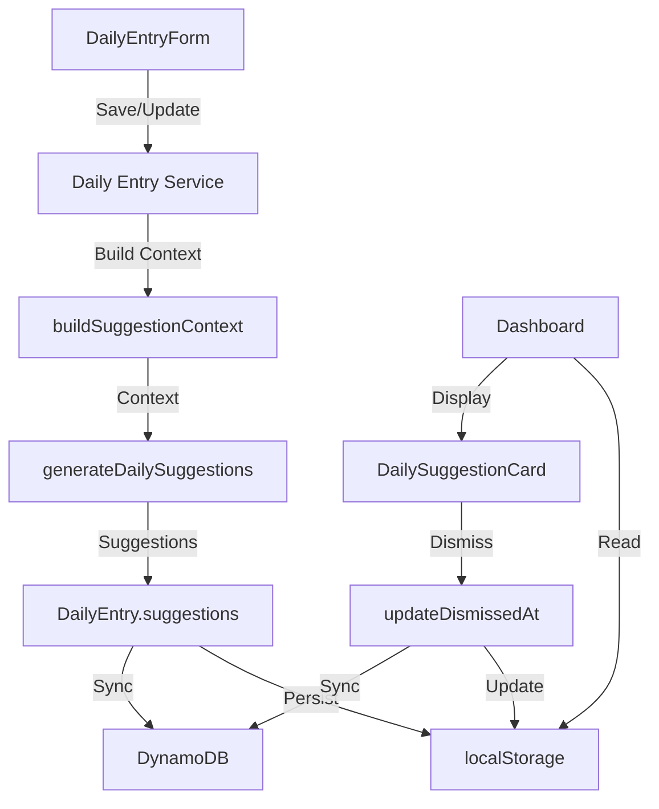

# Design Document: Daily Health Coach

## Overview

The Daily Health Coach is a deterministic, rule-based suggestion engine that transforms Vyapar AI's passive health score into an active coaching system. It analyzes daily financial data and generates 1-2 actionable suggestions in the user's local language, helping small shop owners improve their business health through concrete, understandable guidance.

### Key Design Principles

1. **Deterministic Core**: Pure TypeScript function with no side effects, no AI involvement, fully reproducible
2. **Offline-First**: Executes entirely in the browser using localStorage data, zero network dependencies
3. **Localized**: All suggestions available in English, Hindi, and Marathi
4. **Priority-Based**: Critical issues surface before warnings, warnings before informational tips
5. **Hybrid Intelligence**: Deterministic calculations produce metrics, AI layer only explains (not used in this feature)

### Architecture Position

The Daily Health Coach sits in the deterministic core layer of Vyapar AI's Hybrid Intelligence architecture:

```
┌─────────────────────────────────────────┐
│         UI Layer (React)                │
│  - DailySuggestionCard component        │
│  - Dismiss functionality                │
└─────────────────────────────────────────┘
                  ↓
┌─────────────────────────────────────────┐
│    Service Layer (Integration)          │
│  - Daily Entry Service                  │
│  - Suggestion Context Builder           │
│  - Sync Service                         │
└─────────────────────────────────────────┘
                  ↓
┌─────────────────────────────────────────┐
│  Deterministic Core (Pure Functions)    │
│  - generateDailySuggestions()           │
│  - Rule evaluation functions            │
│  - Metric calculations                  │
└─────────────────────────────────────────┘
                  ↓
┌─────────────────────────────────────────┐
│      Data Layer (localStorage)          │
│  - DailyEntry records                   │
│  - CreditEntry records                  │
│  - User preferences                     │
└─────────────────────────────────────────┘
```


## Architecture

### Component Diagram



### Core Function: generateDailySuggestions

**Location**: `/lib/finance/generateDailySuggestions.ts`

**Signature**:
```typescript
function generateDailySuggestions(context: SuggestionContext): DailySuggestion[]
```

**Characteristics**:
- Pure function (no side effects)
- Synchronous execution
- Deterministic (same input → same output)
- No external dependencies
- No network calls
- No AI involvement

**Algorithm**:
1. Initialize empty suggestions array
2. Evaluate each rule in sequence:
   - High Credit Ratio Rule
   - Margin Drop Rule
   - Low Cash Buffer Rule
   - Healthy State Rule
3. Sort suggestions by severity (critical > warning > info)
4. Return sorted suggestions array


## Components and Interfaces

### Data Models

#### SuggestionContext

Input to the suggestion engine containing all necessary financial metrics.

```typescript
interface SuggestionContext {
  // Core metrics
  health_score: number;              // 0-100
  total_sales: number;               // Total sales for the day
  total_expenses: number;            // Total expenses for the day
  total_credit_outstanding: number;  // Total unpaid credit
  
  // Calculated metrics
  current_margin: number;            // Current profit margin (0-1)
  avg_margin_last_30_days: number | null;  // Average margin over 30 days
  cash_buffer_days: number | null;   // Days of operation with current cash
  
  // User context
  language: Language;                // 'en' | 'hi' | 'mr'
  date: string;                      // ISO date string for the entry
}
```

#### DailySuggestion

Output from the suggestion engine representing a single actionable recommendation.

```typescript
interface DailySuggestion {
  id: string;                        // Unique ID (format: "suggestion_{rule}_{date}")
  created_at: string;                // ISO timestamp
  severity: 'critical' | 'warning' | 'info';
  title: string;                     // Localized title
  description: string;               // Localized description
  dismissed_at?: string;             // ISO timestamp when dismissed (optional)
  
  // Metadata for tracking
  rule_type: 'high_credit' | 'margin_drop' | 'low_cash' | 'healthy_state';
  context_data?: Record<string, any>;  // Additional context (e.g., credit_ratio, margin_values)
}
```

#### Extended DailyEntry

The existing DailyEntry interface is extended to include suggestions.

```typescript
interface DailyEntry {
  date: string;
  totalSales: number;
  totalExpense: number;
  cashInHand?: number;
  estimatedProfit: number;
  expenseRatio: number;
  profitMargin: number;
  
  // NEW: Suggestions array
  suggestions?: DailySuggestion[];
}
```


### Rule Evaluation Functions

Each rule is implemented as a separate pure function for testability and maintainability.

#### Rule 1: High Credit Ratio

```typescript
function evaluateHighCreditRule(context: SuggestionContext): DailySuggestion | null {
  // Skip if no sales or no credit
  if (context.total_sales === 0 || context.total_credit_outstanding === 0) {
    return null;
  }
  
  const creditRatio = context.total_credit_outstanding / context.total_sales;
  
  // Trigger if credit exceeds 40% of sales
  if (creditRatio > 0.4) {
    return {
      id: `suggestion_high_credit_${context.date}`,
      created_at: new Date().toISOString(),
      severity: 'critical',
      title: t('suggestions.high_credit.title', context.language),
      description: t('suggestions.high_credit.description', context.language),
      rule_type: 'high_credit',
      context_data: {
        credit_ratio: creditRatio,
        credit_outstanding: context.total_credit_outstanding,
        total_sales: context.total_sales
      }
    };
  }
  
  return null;
}
```

#### Rule 2: Margin Drop

```typescript
function evaluateMarginDropRule(context: SuggestionContext): DailySuggestion | null {
  // Skip if no historical data
  if (context.avg_margin_last_30_days === null || context.avg_margin_last_30_days === 0) {
    return null;
  }
  
  // Trigger if current margin is less than 70% of average
  if (context.current_margin < 0.7 * context.avg_margin_last_30_days) {
    return {
      id: `suggestion_margin_drop_${context.date}`,
      created_at: new Date().toISOString(),
      severity: 'warning',
      title: t('suggestions.margin_drop.title', context.language),
      description: t('suggestions.margin_drop.description', context.language),
      rule_type: 'margin_drop',
      context_data: {
        current_margin: context.current_margin,
        avg_margin: context.avg_margin_last_30_days,
        drop_percentage: ((context.avg_margin_last_30_days - context.current_margin) / context.avg_margin_last_30_days) * 100
      }
    };
  }
  
  return null;
}
```

#### Rule 3: Low Cash Buffer

```typescript
function evaluateLowCashBufferRule(context: SuggestionContext): DailySuggestion | null {
  // Skip if cash buffer cannot be calculated
  if (context.cash_buffer_days === null) {
    return null;
  }
  
  // Trigger if less than 7 days of cash buffer
  if (context.cash_buffer_days < 7) {
    return {
      id: `suggestion_low_cash_${context.date}`,
      created_at: new Date().toISOString(),
      severity: 'critical',
      title: t('suggestions.low_cash.title', context.language),
      description: t('suggestions.low_cash.description', context.language),
      rule_type: 'low_cash',
      context_data: {
        cash_buffer_days: context.cash_buffer_days
      }
    };
  }
  
  return null;
}
```

#### Rule 4: Healthy State

```typescript
const OPTIMIZATION_TIPS = [
  'suggestions.healthy_state.tip_inventory',
  'suggestions.healthy_state.tip_credit_terms',
  'suggestions.healthy_state.tip_bulk_buying',
  'suggestions.healthy_state.tip_expense_review'
];

function evaluateHealthyStateRule(
  context: SuggestionContext, 
  hasOtherSuggestions: boolean
): DailySuggestion | null {
  // Only show if health score is good and no other suggestions
  if (context.health_score >= 70 && !hasOtherSuggestions) {
    // Rotate tips based on date for variety
    const tipIndex = new Date(context.date).getDate() % OPTIMIZATION_TIPS.length;
    const tipKey = OPTIMIZATION_TIPS[tipIndex];
    
    return {
      id: `suggestion_healthy_state_${context.date}`,
      created_at: new Date().toISOString(),
      severity: 'info',
      title: t('suggestions.healthy_state.title', context.language),
      description: t(tipKey, context.language),
      rule_type: 'healthy_state',
      context_data: {
        health_score: context.health_score
      }
    };
  }
  
  return null;
}
```


### Service Layer Components

#### buildSuggestionContext Function

**Location**: `/lib/finance/suggestionContext.ts`

Constructs the SuggestionContext from daily entries and credit data.

```typescript
function buildSuggestionContext(
  currentEntry: DailyEntry,
  historicalEntries: DailyEntry[],
  creditEntries: CreditEntry[],
  language: Language
): SuggestionContext {
  // Calculate average margin from last 30 days
  const last30Days = historicalEntries
    .filter(e => isWithinLast30Days(e.date, currentEntry.date))
    .slice(0, 30);
  
  const avgMargin = last30Days.length > 0
    ? last30Days.reduce((sum, e) => sum + e.profitMargin, 0) / last30Days.length
    : null;
  
  // Calculate cash buffer days
  const avgDailyExpenses = last30Days.length > 0
    ? last30Days.reduce((sum, e) => sum + e.totalExpense, 0) / last30Days.length
    : null;
  
  const cashBufferDays = (currentEntry.cashInHand && avgDailyExpenses && avgDailyExpenses > 0)
    ? currentEntry.cashInHand / avgDailyExpenses
    : null;
  
  // Calculate total outstanding credit
  const totalCreditOutstanding = creditEntries
    .filter(c => !c.isPaid)
    .reduce((sum, c) => sum + c.amount, 0);
  
  // Calculate health score
  const creditSummary = calculateCreditSummary(creditEntries);
  const healthScoreResult = calculateHealthScore(
    currentEntry.profitMargin,
    currentEntry.expenseRatio,
    currentEntry.cashInHand,
    creditSummary
  );
  
  return {
    health_score: healthScoreResult.score,
    total_sales: currentEntry.totalSales,
    total_expenses: currentEntry.totalExpense,
    total_credit_outstanding: totalCreditOutstanding,
    current_margin: currentEntry.profitMargin,
    avg_margin_last_30_days: avgMargin,
    cash_buffer_days: cashBufferDays,
    language,
    date: currentEntry.date
  };
}
```

#### Daily Entry Service Integration

**Location**: `/lib/daily-entry-service.ts`

Integrates suggestion generation into the daily entry save/update flow.

```typescript
async function saveDailyEntry(entry: DailyEntry, userId: string): Promise<void> {
  try {
    // 1. Calculate metrics
    const calculations = calculateDailyMetrics(entry.totalSales, entry.totalExpense);
    entry.estimatedProfit = calculations.estimatedProfit;
    entry.expenseRatio = calculations.expenseRatio;
    entry.profitMargin = calculations.profitMargin;
    
    // 2. Load historical data and credits
    const historicalEntries = loadDailyEntriesFromLocalStorage(userId);
    const creditEntries = loadCreditEntriesFromLocalStorage(userId);
    const userLanguage = getUserLanguagePreference(userId);
    
    // 3. Build suggestion context
    const context = buildSuggestionContext(
      entry,
      historicalEntries,
      creditEntries,
      userLanguage
    );
    
    // 4. Generate suggestions (with error handling)
    try {
      entry.suggestions = generateDailySuggestions(context);
    } catch (error) {
      console.error('Failed to generate suggestions:', error);
      // Continue without blocking save
      entry.suggestions = [];
    }
    
    // 5. Persist to localStorage
    saveDailyEntryToLocalStorage(userId, entry);
    
    // 6. Sync to DynamoDB if online
    if (navigator.onLine) {
      await syncDailyEntryToDynamoDB(userId, entry);
    }
  } catch (error) {
    console.error('Failed to save daily entry:', error);
    throw error;
  }
}
```


### UI Components

#### DailySuggestionCard Component

**Location**: `/components/DailySuggestionCard.tsx`

Displays the highest priority undismissed suggestion.

```typescript
interface DailySuggestionCardProps {
  suggestions: DailySuggestion[];
  onDismiss: (suggestionId: string) => void;
  language: Language;
}

export function DailySuggestionCard({ suggestions, onDismiss, language }: DailySuggestionCardProps) {
  // Filter undismissed suggestions
  const undismissed = suggestions.filter(s => !s.dismissed_at);
  
  if (undismissed.length === 0) {
    return null;
  }
  
  // Sort by severity and take the first
  const sortedSuggestions = sortBySeverity(undismissed);
  const topSuggestion = sortedSuggestions[0];
  
  // Severity styling
  const severityConfig = {
    critical: { color: 'red', icon: '⚠️', bgColor: 'bg-red-50', borderColor: 'border-red-500' },
    warning: { color: 'orange', icon: '⚡', bgColor: 'bg-orange-50', borderColor: 'border-orange-500' },
    info: { color: 'blue', icon: '💡', bgColor: 'bg-blue-50', borderColor: 'border-blue-500' }
  };
  
  const config = severityConfig[topSuggestion.severity];
  
  return (
    <div className={`${config.bgColor} ${config.borderColor} border-l-4 p-4 rounded-lg shadow-sm`}>
      <div className="flex justify-between items-start">
        <div className="flex-1">
          <div className="flex items-center gap-2 mb-2">
            <span className="text-2xl">{config.icon}</span>
            <h3 className="font-semibold text-lg">
              {t('daily.todaysSuggestion', language)}
            </h3>
          </div>
          <h4 className="font-medium mb-1">{topSuggestion.title}</h4>
          <p className="text-sm text-gray-700">{topSuggestion.description}</p>
        </div>
        <button
          onClick={() => onDismiss(topSuggestion.id)}
          className="ml-4 text-gray-400 hover:text-gray-600"
          aria-label={t('dismiss', language)}
        >
          ✕
        </button>
      </div>
    </div>
  );
}

function sortBySeverity(suggestions: DailySuggestion[]): DailySuggestion[] {
  const severityOrder = { critical: 0, warning: 1, info: 2 };
  return [...suggestions].sort((a, b) => 
    severityOrder[a.severity] - severityOrder[b.severity]
  );
}
```

#### Dismiss Handler

```typescript
function handleDismissSuggestion(suggestionId: string, userId: string, date: string): void {
  // 1. Load current entry
  const entries = loadDailyEntriesFromLocalStorage(userId);
  const entry = entries.find(e => e.date === date);
  
  if (!entry || !entry.suggestions) {
    return;
  }
  
  // 2. Update dismissed_at timestamp
  const suggestion = entry.suggestions.find(s => s.id === suggestionId);
  if (suggestion) {
    suggestion.dismissed_at = new Date().toISOString();
  }
  
  // 3. Persist to localStorage
  saveDailyEntryToLocalStorage(userId, entry);
  
  // 4. Sync to DynamoDB if online
  if (navigator.onLine) {
    syncDailyEntryToDynamoDB(userId, entry).catch(error => {
      console.error('Failed to sync dismissed suggestion:', error);
      // Will retry on next sync
    });
  }
}
```


## Data Models

### localStorage Schema

Daily entries with suggestions are stored in localStorage under the key pattern:

```
vyapar_daily_entries_{userId}
```

Structure:
```json
[
  {
    "date": "2024-01-15",
    "totalSales": 5000,
    "totalExpense": 3500,
    "cashInHand": 10000,
    "estimatedProfit": 1500,
    "expenseRatio": 0.7,
    "profitMargin": 0.3,
    "suggestions": [
      {
        "id": "suggestion_high_credit_2024-01-15",
        "created_at": "2024-01-15T10:30:00Z",
        "severity": "critical",
        "title": "बहुत अधिक उधार बकाया है",
        "description": "आपकी बिक्री का 45% उधार में फंसा है। कम से कम 2-3 ग्राहकों से भुगतान लेने की कोशिश करें।",
        "rule_type": "high_credit",
        "context_data": {
          "credit_ratio": 0.45,
          "credit_outstanding": 2250,
          "total_sales": 5000
        },
        "dismissed_at": null
      }
    ]
  }
]
```

### DynamoDB Schema

Suggestions are stored as part of the DailyEntry item in DynamoDB.

**Partition Key**: `PK = USER#{user_id}`  
**Sort Key**: `SK = DAILY_ENTRY#{date}`

Item structure:
```json
{
  "PK": "USER#user123",
  "SK": "DAILY_ENTRY#2024-01-15",
  "date": "2024-01-15",
  "totalSales": 5000,
  "totalExpense": 3500,
  "cashInHand": 10000,
  "estimatedProfit": 1500,
  "expenseRatio": 0.7,
  "profitMargin": 0.3,
  "suggestions": [
    {
      "id": "suggestion_high_credit_2024-01-15",
      "created_at": "2024-01-15T10:30:00Z",
      "severity": "critical",
      "title": "बहुत अधिक उधार बकाया है",
      "description": "आपकी बिक्री का 45% उधार में फंसा है। कम से कम 2-3 ग्राहकों से भुगतान लेने की कोशिश करें।",
      "rule_type": "high_credit",
      "context_data": {
        "credit_ratio": 0.45,
        "credit_outstanding": 2250,
        "total_sales": 5000
      },
      "dismissed_at": null
    }
  ],
  "createdAt": "2024-01-15T10:30:00Z",
  "updatedAt": "2024-01-15T10:30:00Z"
}
```

### Translation Keys

All suggestion text must use translation keys from `/lib/translations.ts`:

```typescript
// High Credit Rule
'suggestions.high_credit.title': {
  en: 'Too Much Money in Credit',
  hi: 'बहुत अधिक उधार बकाया है',
  mr: 'खूप उधार थकबाकी आहे'
},
'suggestions.high_credit.description': {
  en: '{ratio}% of your sales is tied up in credit. Try to collect from at least 2-3 customers.',
  hi: 'आपकी बिक्री का {ratio}% उधार में फंसा है। कम से कम 2-3 ग्राहकों से भुगतान लेने की कोशिश करें।',
  mr: 'तुमच्या विक्रीचे {ratio}% उधारीत अडकले आहे. किमान 2-3 ग्राहकांकडून पैसे गोळा करण्याचा प्रयत्न करा.'
},

// Margin Drop Rule
'suggestions.margin_drop.title': {
  en: 'Profit Margin is Dropping',
  hi: 'लाभ मार्जिन गिर रहा है',
  mr: 'नफा मार्जिन कमी होत आहे'
},
'suggestions.margin_drop.description': {
  en: 'Your margin is {current}% vs usual {avg}%. Check if expenses increased or prices need adjustment.',
  hi: 'आपका मार्जिन {current}% है जबकि सामान्य {avg}% है। जांचें कि क्या खर्च बढ़ा है या कीमतों में समायोजन की आवश्यकता है।',
  mr: 'तुमचा मार्जिन {current}% आहे तर नेहमीचा {avg}% आहे. तपासा की खर्च वाढला आहे की किंमती समायोजित करण्याची गरज आहे.'
},

// Low Cash Buffer Rule
'suggestions.low_cash.title': {
  en: 'Cash Running Low',
  hi: 'नकदी कम हो रही है',
  mr: 'रोकड कमी होत आहे'
},
'suggestions.low_cash.description': {
  en: 'You have only {days} days of cash buffer. Consider collecting credit or reducing expenses.',
  hi: 'आपके पास केवल {days} दिनों का नकद बफर है। उधार वसूलने या खर्च कम करने पर विचार करें।',
  mr: 'तुमच्याकडे फक्त {days} दिवसांचा रोकड बफर आहे. उधार गोळा करणे किंवा खर्च कमी करणे विचारात घ्या.'
},

// Healthy State Rule
'suggestions.healthy_state.title': {
  en: 'Business is Healthy!',
  hi: 'व्यापार स्वस्थ है!',
  mr: 'व्यवसाय निरोगी आहे!'
},
'suggestions.healthy_state.tip_inventory': {
  en: 'Keep it up! Consider reviewing slow-moving inventory to free up cash.',
  hi: 'बढ़िया! धीमी गति से बिकने वाली इन्वेंटरी की समीक्षा करके नकदी मुक्त करने पर विचार करें।',
  mr: 'चांगले चालू ठेवा! रोकड मुक्त करण्यासाठी हळू विकल्या जाणाऱ्या इन्व्हेंटरीचे पुनरावलोकन करा.'
},
'suggestions.healthy_state.tip_credit_terms': {
  en: 'Great work! You could improve cash flow by reducing credit terms from 30 to 15 days.',
  hi: 'बढ़िया काम! आप उधार की अवधि 30 से 15 दिन कम करके नकदी प्रवाह में सुधार कर सकते हैं।',
  mr: 'उत्तम काम! तुम्ही उधार कालावधी 30 वरून 15 दिवसांपर्यंत कमी करून रोकड प्रवाह सुधारू शकता.'
},
'suggestions.healthy_state.tip_bulk_buying': {
  en: 'Doing well! Consider bulk buying for frequently sold items to improve margins.',
  hi: 'अच्छा चल रहा है! मार्जिन सुधारने के लिए अक्सर बिकने वाली वस्तुओं की थोक खरीद पर विचार करें।',
  mr: 'चांगले चाललेय! मार्जिन सुधारण्यासाठी वारंवार विकल्या जाणाऱ्या वस्तूंची मोठ्या प्रमाणात खरेदी करा.'
},
'suggestions.healthy_state.tip_expense_review': {
  en: 'Excellent! Review your top 3 expenses monthly to find savings opportunities.',
  hi: 'उत्कृष्ट! बचत के अवसर खोजने के लिए अपने शीर्ष 3 खर्चों की मासिक समीक्षा करें।',
  mr: 'उत्कृष्ट! बचतीच्या संधी शोधण्यासाठी तुमच्या शीर्ष 3 खर्चांचे मासिक पुनरावलोकन करा.'
},

// UI Labels
'daily.todaysSuggestion': {
  en: "Today's One Suggestion",
  hi: 'आज का एक सुझाव',
  mr: 'आजची एक सूचना'
}
```


## Correctness Properties

*A property is a characteristic or behavior that should hold true across all valid executions of a system—essentially, a formal statement about what the system should do. Properties serve as the bridge between human-readable specifications and machine-verifiable correctness guarantees.*

### Property Reflection

Before defining properties, I analyzed all acceptance criteria for redundancy:

**Redundancy Analysis**:
- Properties 2.2, 2.3, 3.2, 3.3, 4.2, 4.3, 5.2, 5.3 all test translation key usage - these can be combined into a single comprehensive property
- Properties 2.4, 3.4, 4.4 all test context data inclusion - these can be combined into one property
- Property 1.3 (returns array) is subsumed by Property 1.4 (all suggestions have required fields)
- Property 1.5 (pure function) and 1.6 (deterministic) are testing the same characteristic - determinism

**Consolidated Properties**:
After reflection, the following properties provide unique validation value without redundancy.

### Property 1: Suggestion Generation Triggers on Rule Conditions

*For any* SuggestionContext where a rule condition is met (credit ratio > 0.4, margin < 0.7 * avg, cash buffer < 7, or health score >= 70 with no other rules), the Suggestion_Engine shall generate at least one suggestion with the appropriate severity level.

**Validates: Requirements 1.1, 2.1, 3.1, 4.1, 5.1**

### Property 2: Severity-Based Priority Ordering

*For any* set of generated suggestions containing multiple severity levels, the suggestions shall be ordered with critical severity first, followed by warning, then info.

**Validates: Requirements 1.2**

### Property 3: Suggestion Structure Completeness

*For any* generated suggestion, it shall include all required fields: id, created_at, severity, title, description, and rule_type.

**Validates: Requirements 1.4**

### Property 4: Deterministic Suggestion Generation

*For any* SuggestionContext, calling generateDailySuggestions multiple times with the same context shall produce equivalent suggestions (same ids, severities, and rule_types).

**Validates: Requirements 1.5, 1.6**

### Property 5: Translation Key Consistency

*For any* generated suggestion, the title and description shall use the correct translation key pattern for its rule_type: 'suggestions.{rule_type}.title' and 'suggestions.{rule_type}.description'.

**Validates: Requirements 2.2, 2.3, 3.2, 3.3, 4.2, 4.3, 5.2, 5.3**

### Property 6: Context Data Inclusion

*For any* generated suggestion, the context_data field shall include the relevant metrics that triggered the rule (credit_ratio for high_credit, margin values for margin_drop, cash_buffer_days for low_cash, health_score for healthy_state).

**Validates: Requirements 2.4, 3.4, 4.4, 5.4**

### Property 7: Rule Skipping on Invalid Data

*For any* SuggestionContext with zero or null values for rule-specific metrics (credit_outstanding = 0, total_sales = 0, avg_margin = null, cash_buffer_days = null), the corresponding rule shall not generate a suggestion.

**Validates: Requirements 2.5, 3.5, 4.5**

### Property 8: Healthy State Exclusivity

*For any* SuggestionContext where health_score >= 70, the healthy_state suggestion shall only be generated if no critical or warning suggestions are present.

**Validates: Requirements 5.1**

### Property 9: Optimization Tip Rotation

*For any* sequence of healthy_state suggestions generated across different dates, the optimization tips shall vary (not all suggestions use the same tip).

**Validates: Requirements 5.5**

### Property 10: Suggestion ID Uniqueness

*For any* DailyEntry with multiple suggestions, all suggestion ids shall be unique within that entry.

**Validates: Requirements 6.5**

### Property 11: Dismissed Suggestion Filtering

*For any* list of suggestions displayed to the user, only suggestions where dismissed_at is null or undefined shall be included.

**Validates: Requirements 7.4**

### Property 12: ISO 8601 Timestamp Format

*For any* dismissed suggestion, the dismissed_at timestamp shall be in valid ISO 8601 format (YYYY-MM-DDTHH:mm:ss.sssZ).

**Validates: Requirements 7.5**

### Property 13: Display Priority by Severity

*For any* list of undismissed suggestions with multiple items, the DailySuggestionCard shall display the suggestion with the highest severity (critical > warning > info).

**Validates: Requirements 8.2**

### Property 14: Language-Specific Translation

*For any* SuggestionContext with a specified language ('en', 'hi', or 'mr'), all generated suggestion titles and descriptions shall be in that language.

**Validates: Requirements 9.2**

### Property 15: Translation Fallback to English

*For any* missing translation key in the requested language, the Translation_System shall return the English translation.

**Validates: Requirements 9.4**

### Property 16: Suggestion Replacement on Update

*For any* daily entry that is updated, the new suggestions shall completely replace the previous suggestions for that date (no accumulation).

**Validates: Requirements 11.4**


## Error Handling

### Suggestion Generation Errors

The suggestion engine is designed to be fault-tolerant and never block the daily entry save operation.

#### Error Scenarios and Handling

1. **Invalid Context Data**
   - **Scenario**: SuggestionContext contains NaN, Infinity, or invalid values
   - **Handling**: Skip rules that depend on invalid values, log warning, return empty array or partial suggestions
   - **User Impact**: No suggestions shown, but entry is saved successfully

2. **Translation Key Missing**
   - **Scenario**: Required translation key not found in translations.ts
   - **Handling**: Fall back to English translation, log warning
   - **User Impact**: Suggestion shown in English instead of preferred language

3. **Historical Data Insufficient**
   - **Scenario**: Less than 7 days of historical data for avg_margin calculation
   - **Handling**: Set avg_margin_last_30_days to null, skip margin_drop rule
   - **User Impact**: Margin drop suggestions not shown until sufficient data exists

4. **Calculation Errors**
   - **Scenario**: Division by zero, null reference in calculations
   - **Handling**: Wrap calculations in try-catch, return null for that metric
   - **User Impact**: Specific rule skipped, other rules continue to evaluate

5. **localStorage Quota Exceeded**
   - **Scenario**: localStorage full when saving suggestions
   - **Handling**: Catch QuotaExceededError, attempt to sync to DynamoDB, notify user
   - **User Impact**: Suggestions may not persist offline, but will sync when online

#### Error Handling Implementation

```typescript
function generateDailySuggestions(context: SuggestionContext): DailySuggestion[] {
  const suggestions: DailySuggestion[] = [];
  
  try {
    // Validate context
    if (!isValidContext(context)) {
      console.warn('Invalid suggestion context:', context);
      return [];
    }
    
    // Evaluate each rule with individual error handling
    try {
      const highCreditSuggestion = evaluateHighCreditRule(context);
      if (highCreditSuggestion) suggestions.push(highCreditSuggestion);
    } catch (error) {
      console.error('High credit rule failed:', error);
    }
    
    try {
      const marginDropSuggestion = evaluateMarginDropRule(context);
      if (marginDropSuggestion) suggestions.push(marginDropSuggestion);
    } catch (error) {
      console.error('Margin drop rule failed:', error);
    }
    
    try {
      const lowCashSuggestion = evaluateLowCashBufferRule(context);
      if (lowCashSuggestion) suggestions.push(lowCashSuggestion);
    } catch (error) {
      console.error('Low cash rule failed:', error);
    }
    
    // Healthy state rule depends on other suggestions
    const hasOtherSuggestions = suggestions.length > 0;
    try {
      const healthySuggestion = evaluateHealthyStateRule(context, hasOtherSuggestions);
      if (healthySuggestion) suggestions.push(healthySuggestion);
    } catch (error) {
      console.error('Healthy state rule failed:', error);
    }
    
    // Sort by severity
    return sortBySeverity(suggestions);
    
  } catch (error) {
    console.error('Suggestion generation failed:', error);
    return [];
  }
}

function isValidContext(context: SuggestionContext): boolean {
  return (
    typeof context.health_score === 'number' &&
    !isNaN(context.health_score) &&
    typeof context.total_sales === 'number' &&
    !isNaN(context.total_sales) &&
    typeof context.total_expenses === 'number' &&
    !isNaN(context.total_expenses) &&
    ['en', 'hi', 'mr'].includes(context.language)
  );
}
```

### Service Layer Error Handling

```typescript
async function saveDailyEntry(entry: DailyEntry, userId: string): Promise<void> {
  try {
    // ... build context ...
    
    // Generate suggestions with fallback
    try {
      entry.suggestions = generateDailySuggestions(context);
    } catch (error) {
      console.error('Failed to generate suggestions:', error);
      entry.suggestions = []; // Continue with empty suggestions
    }
    
    // Persist to localStorage with quota handling
    try {
      saveDailyEntryToLocalStorage(userId, entry);
    } catch (error) {
      if (error.name === 'QuotaExceededError') {
        // Attempt to free space by removing old entries
        cleanupOldEntries(userId);
        saveDailyEntryToLocalStorage(userId, entry);
      } else {
        throw error;
      }
    }
    
    // Sync to DynamoDB (non-blocking)
    if (navigator.onLine) {
      syncDailyEntryToDynamoDB(userId, entry).catch(error => {
        console.error('Sync failed, will retry later:', error);
        // Mark for retry
        markForSync(userId, entry.date);
      });
    }
    
  } catch (error) {
    console.error('Failed to save daily entry:', error);
    throw new Error('Failed to save daily entry. Please try again.');
  }
}
```

### UI Error Handling

```typescript
function DailySuggestionCard({ suggestions, onDismiss, language }: DailySuggestionCardProps) {
  const [error, setError] = useState<string | null>(null);
  
  const handleDismiss = async (suggestionId: string) => {
    try {
      await onDismiss(suggestionId);
      setError(null);
    } catch (err) {
      console.error('Failed to dismiss suggestion:', err);
      setError(t('error.dismissFailed', language));
    }
  };
  
  if (error) {
    return (
      <div className="bg-red-50 border-l-4 border-red-500 p-4 rounded-lg">
        <p className="text-sm text-red-700">{error}</p>
      </div>
    );
  }
  
  // ... render suggestion ...
}
```


## Testing Strategy

### Dual Testing Approach

The Daily Health Coach requires both unit tests and property-based tests for comprehensive coverage:

- **Unit tests**: Verify specific examples, edge cases, and integration points
- **Property tests**: Verify universal properties across all inputs through randomization

Both testing approaches are complementary and necessary. Unit tests catch concrete bugs in specific scenarios, while property tests verify general correctness across a wide range of inputs.

### Property-Based Testing

**Library**: `fast-check` (for TypeScript/JavaScript)

**Configuration**:
- Minimum 100 iterations per property test
- Each test tagged with reference to design document property
- Tag format: `Feature: daily-health-coach, Property {number}: {property_text}`

**Property Test Examples**:

```typescript
import fc from 'fast-check';
import { generateDailySuggestions } from '@/lib/finance/generateDailySuggestions';
import { SuggestionContext } from '@/lib/types';

describe('Daily Health Coach - Property Tests', () => {
  
  // Property 1: Suggestion Generation Triggers on Rule Conditions
  test('Feature: daily-health-coach, Property 1: Generates suggestions when rule conditions are met', () => {
    fc.assert(
      fc.property(
        fc.record({
          health_score: fc.integer({ min: 0, max: 100 }),
          total_sales: fc.float({ min: 0, max: 100000 }),
          total_expenses: fc.float({ min: 0, max: 100000 }),
          total_credit_outstanding: fc.float({ min: 0, max: 100000 }),
          current_margin: fc.float({ min: 0, max: 1 }),
          avg_margin_last_30_days: fc.option(fc.float({ min: 0, max: 1 }), { nil: null }),
          cash_buffer_days: fc.option(fc.float({ min: 0, max: 365 }), { nil: null }),
          language: fc.constantFrom('en', 'hi', 'mr'),
          date: fc.date().map(d => d.toISOString().split('T')[0])
        }),
        (context: SuggestionContext) => {
          const suggestions = generateDailySuggestions(context);
          
          // If high credit condition met, should have critical suggestion
          if (context.total_sales > 0 && context.total_credit_outstanding > 0) {
            const creditRatio = context.total_credit_outstanding / context.total_sales;
            if (creditRatio > 0.4) {
              const hasCritical = suggestions.some(s => 
                s.severity === 'critical' && s.rule_type === 'high_credit'
              );
              expect(hasCritical).toBe(true);
            }
          }
          
          // If margin drop condition met, should have warning suggestion
          if (context.avg_margin_last_30_days !== null && context.avg_margin_last_30_days > 0) {
            if (context.current_margin < 0.7 * context.avg_margin_last_30_days) {
              const hasWarning = suggestions.some(s => 
                s.severity === 'warning' && s.rule_type === 'margin_drop'
              );
              expect(hasWarning).toBe(true);
            }
          }
          
          // If low cash condition met, should have critical suggestion
          if (context.cash_buffer_days !== null && context.cash_buffer_days < 7) {
            const hasCritical = suggestions.some(s => 
              s.severity === 'critical' && s.rule_type === 'low_cash'
            );
            expect(hasCritical).toBe(true);
          }
        }
      ),
      { numRuns: 100 }
    );
  });
  
  // Property 2: Severity-Based Priority Ordering
  test('Feature: daily-health-coach, Property 2: Suggestions ordered by severity', () => {
    fc.assert(
      fc.property(
        fc.record({
          health_score: fc.integer({ min: 0, max: 100 }),
          total_sales: fc.float({ min: 1000, max: 100000 }),
          total_expenses: fc.float({ min: 500, max: 50000 }),
          total_credit_outstanding: fc.float({ min: 500, max: 50000 }), // Force high credit
          current_margin: fc.float({ min: 0, max: 0.2 }), // Force margin drop
          avg_margin_last_30_days: fc.constant(0.4), // Force margin drop
          cash_buffer_days: fc.float({ min: 1, max: 5 }), // Force low cash
          language: fc.constantFrom('en', 'hi', 'mr'),
          date: fc.date().map(d => d.toISOString().split('T')[0])
        }),
        (context: SuggestionContext) => {
          const suggestions = generateDailySuggestions(context);
          
          // Verify ordering: critical before warning before info
          for (let i = 0; i < suggestions.length - 1; i++) {
            const current = suggestions[i];
            const next = suggestions[i + 1];
            
            const severityOrder = { critical: 0, warning: 1, info: 2 };
            expect(severityOrder[current.severity]).toBeLessThanOrEqual(
              severityOrder[next.severity]
            );
          }
        }
      ),
      { numRuns: 100 }
    );
  });
  
  // Property 4: Deterministic Suggestion Generation
  test('Feature: daily-health-coach, Property 4: Same input produces same output', () => {
    fc.assert(
      fc.property(
        fc.record({
          health_score: fc.integer({ min: 0, max: 100 }),
          total_sales: fc.float({ min: 0, max: 100000 }),
          total_expenses: fc.float({ min: 0, max: 100000 }),
          total_credit_outstanding: fc.float({ min: 0, max: 100000 }),
          current_margin: fc.float({ min: 0, max: 1 }),
          avg_margin_last_30_days: fc.option(fc.float({ min: 0, max: 1 }), { nil: null }),
          cash_buffer_days: fc.option(fc.float({ min: 0, max: 365 }), { nil: null }),
          language: fc.constantFrom('en', 'hi', 'mr'),
          date: fc.date().map(d => d.toISOString().split('T')[0])
        }),
        (context: SuggestionContext) => {
          const suggestions1 = generateDailySuggestions(context);
          const suggestions2 = generateDailySuggestions(context);
          
          // Same number of suggestions
          expect(suggestions1.length).toBe(suggestions2.length);
          
          // Same ids, severities, and rule_types
          for (let i = 0; i < suggestions1.length; i++) {
            expect(suggestions1[i].id).toBe(suggestions2[i].id);
            expect(suggestions1[i].severity).toBe(suggestions2[i].severity);
            expect(suggestions1[i].rule_type).toBe(suggestions2[i].rule_type);
          }
        }
      ),
      { numRuns: 100 }
    );
  });
  
  // Property 10: Suggestion ID Uniqueness
  test('Feature: daily-health-coach, Property 10: All suggestion IDs are unique', () => {
    fc.assert(
      fc.property(
        fc.record({
          health_score: fc.integer({ min: 0, max: 100 }),
          total_sales: fc.float({ min: 1000, max: 100000 }),
          total_expenses: fc.float({ min: 500, max: 50000 }),
          total_credit_outstanding: fc.float({ min: 500, max: 50000 }),
          current_margin: fc.float({ min: 0, max: 0.2 }),
          avg_margin_last_30_days: fc.constant(0.4),
          cash_buffer_days: fc.float({ min: 1, max: 5 }),
          language: fc.constantFrom('en', 'hi', 'mr'),
          date: fc.date().map(d => d.toISOString().split('T')[0])
        }),
        (context: SuggestionContext) => {
          const suggestions = generateDailySuggestions(context);
          const ids = suggestions.map(s => s.id);
          const uniqueIds = new Set(ids);
          
          expect(uniqueIds.size).toBe(ids.length);
        }
      ),
      { numRuns: 100 }
    );
  });
});
```


### Unit Testing

Unit tests focus on specific examples, edge cases, and integration points.

**Test Coverage Requirements**:
- Each individual rule (high credit, margin drop, low cash, healthy state)
- Edge cases (zero values, null values, boundary conditions)
- Translation key usage
- Dismiss functionality
- localStorage persistence
- DynamoDB sync integration

**Unit Test Examples**:

```typescript
describe('Daily Health Coach - Unit Tests', () => {
  
  describe('High Credit Rule', () => {
    test('generates critical suggestion when credit ratio exceeds 40%', () => {
      const context: SuggestionContext = {
        health_score: 60,
        total_sales: 10000,
        total_expenses: 7000,
        total_credit_outstanding: 4500, // 45% of sales
        current_margin: 0.3,
        avg_margin_last_30_days: 0.3,
        cash_buffer_days: 10,
        language: 'en',
        date: '2024-01-15'
      };
      
      const suggestions = generateDailySuggestions(context);
      const highCreditSuggestion = suggestions.find(s => s.rule_type === 'high_credit');
      
      expect(highCreditSuggestion).toBeDefined();
      expect(highCreditSuggestion?.severity).toBe('critical');
      expect(highCreditSuggestion?.context_data?.credit_ratio).toBeCloseTo(0.45);
    });
    
    test('skips rule when total_sales is zero', () => {
      const context: SuggestionContext = {
        health_score: 60,
        total_sales: 0,
        total_expenses: 0,
        total_credit_outstanding: 1000,
        current_margin: 0,
        avg_margin_last_30_days: 0.3,
        cash_buffer_days: 10,
        language: 'en',
        date: '2024-01-15'
      };
      
      const suggestions = generateDailySuggestions(context);
      const highCreditSuggestion = suggestions.find(s => s.rule_type === 'high_credit');
      
      expect(highCreditSuggestion).toBeUndefined();
    });
    
    test('skips rule when credit_outstanding is zero', () => {
      const context: SuggestionContext = {
        health_score: 60,
        total_sales: 10000,
        total_expenses: 7000,
        total_credit_outstanding: 0,
        current_margin: 0.3,
        avg_margin_last_30_days: 0.3,
        cash_buffer_days: 10,
        language: 'en',
        date: '2024-01-15'
      };
      
      const suggestions = generateDailySuggestions(context);
      const highCreditSuggestion = suggestions.find(s => s.rule_type === 'high_credit');
      
      expect(highCreditSuggestion).toBeUndefined();
    });
  });
  
  describe('Margin Drop Rule', () => {
    test('generates warning suggestion when margin drops below 70% of average', () => {
      const context: SuggestionContext = {
        health_score: 60,
        total_sales: 10000,
        total_expenses: 7500,
        total_credit_outstanding: 1000,
        current_margin: 0.2, // 20%
        avg_margin_last_30_days: 0.35, // 35%, so 70% = 24.5%
        cash_buffer_days: 10,
        language: 'en',
        date: '2024-01-15'
      };
      
      const suggestions = generateDailySuggestions(context);
      const marginDropSuggestion = suggestions.find(s => s.rule_type === 'margin_drop');
      
      expect(marginDropSuggestion).toBeDefined();
      expect(marginDropSuggestion?.severity).toBe('warning');
    });
    
    test('skips rule when avg_margin_last_30_days is null', () => {
      const context: SuggestionContext = {
        health_score: 60,
        total_sales: 10000,
        total_expenses: 7500,
        total_credit_outstanding: 1000,
        current_margin: 0.2,
        avg_margin_last_30_days: null,
        cash_buffer_days: 10,
        language: 'en',
        date: '2024-01-15'
      };
      
      const suggestions = generateDailySuggestions(context);
      const marginDropSuggestion = suggestions.find(s => s.rule_type === 'margin_drop');
      
      expect(marginDropSuggestion).toBeUndefined();
    });
  });
  
  describe('Low Cash Buffer Rule', () => {
    test('generates critical suggestion when cash buffer is less than 7 days', () => {
      const context: SuggestionContext = {
        health_score: 60,
        total_sales: 10000,
        total_expenses: 7000,
        total_credit_outstanding: 1000,
        current_margin: 0.3,
        avg_margin_last_30_days: 0.3,
        cash_buffer_days: 5,
        language: 'en',
        date: '2024-01-15'
      };
      
      const suggestions = generateDailySuggestions(context);
      const lowCashSuggestion = suggestions.find(s => s.rule_type === 'low_cash');
      
      expect(lowCashSuggestion).toBeDefined();
      expect(lowCashSuggestion?.severity).toBe('critical');
      expect(lowCashSuggestion?.context_data?.cash_buffer_days).toBe(5);
    });
    
    test('skips rule when cash_buffer_days is null', () => {
      const context: SuggestionContext = {
        health_score: 60,
        total_sales: 10000,
        total_expenses: 7000,
        total_credit_outstanding: 1000,
        current_margin: 0.3,
        avg_margin_last_30_days: 0.3,
        cash_buffer_days: null,
        language: 'en',
        date: '2024-01-15'
      };
      
      const suggestions = generateDailySuggestions(context);
      const lowCashSuggestion = suggestions.find(s => s.rule_type === 'low_cash');
      
      expect(lowCashSuggestion).toBeUndefined();
    });
  });
  
  describe('Healthy State Rule', () => {
    test('generates info suggestion when health score >= 70 and no other suggestions', () => {
      const context: SuggestionContext = {
        health_score: 75,
        total_sales: 10000,
        total_expenses: 6000,
        total_credit_outstanding: 1000,
        current_margin: 0.4,
        avg_margin_last_30_days: 0.35,
        cash_buffer_days: 15,
        language: 'en',
        date: '2024-01-15'
      };
      
      const suggestions = generateDailySuggestions(context);
      const healthySuggestion = suggestions.find(s => s.rule_type === 'healthy_state');
      
      expect(healthySuggestion).toBeDefined();
      expect(healthySuggestion?.severity).toBe('info');
    });
    
    test('does not generate when other suggestions exist', () => {
      const context: SuggestionContext = {
        health_score: 75,
        total_sales: 10000,
        total_expenses: 6000,
        total_credit_outstanding: 5000, // High credit ratio
        current_margin: 0.4,
        avg_margin_last_30_days: 0.35,
        cash_buffer_days: 15,
        language: 'en',
        date: '2024-01-15'
      };
      
      const suggestions = generateDailySuggestions(context);
      const healthySuggestion = suggestions.find(s => s.rule_type === 'healthy_state');
      
      expect(healthySuggestion).toBeUndefined();
    });
    
    test('rotates optimization tips based on date', () => {
      const contexts = [
        { ...baseContext, date: '2024-01-01' },
        { ...baseContext, date: '2024-01-02' },
        { ...baseContext, date: '2024-01-03' },
        { ...baseContext, date: '2024-01-04' }
      ];
      
      const descriptions = contexts.map(ctx => {
        const suggestions = generateDailySuggestions(ctx);
        return suggestions.find(s => s.rule_type === 'healthy_state')?.description;
      });
      
      // At least 2 different tips in 4 days
      const uniqueDescriptions = new Set(descriptions);
      expect(uniqueDescriptions.size).toBeGreaterThanOrEqual(2);
    });
  });
  
  describe('Translation', () => {
    test('uses Hindi translations when language is hi', () => {
      const context: SuggestionContext = {
        health_score: 60,
        total_sales: 10000,
        total_expenses: 7000,
        total_credit_outstanding: 4500,
        current_margin: 0.3,
        avg_margin_last_30_days: 0.3,
        cash_buffer_days: 10,
        language: 'hi',
        date: '2024-01-15'
      };
      
      const suggestions = generateDailySuggestions(context);
      const highCreditSuggestion = suggestions.find(s => s.rule_type === 'high_credit');
      
      expect(highCreditSuggestion?.title).toContain('उधार');
    });
    
    test('uses Marathi translations when language is mr', () => {
      const context: SuggestionContext = {
        health_score: 60,
        total_sales: 10000,
        total_expenses: 7000,
        total_credit_outstanding: 4500,
        current_margin: 0.3,
        avg_margin_last_30_days: 0.3,
        cash_buffer_days: 10,
        language: 'mr',
        date: '2024-01-15'
      };
      
      const suggestions = generateDailySuggestions(context);
      const highCreditSuggestion = suggestions.find(s => s.rule_type === 'high_credit');
      
      expect(highCreditSuggestion?.title).toContain('उधार');
    });
  });
  
  describe('Dismiss Functionality', () => {
    test('sets dismissed_at timestamp when suggestion is dismissed', () => {
      const entry: DailyEntry = {
        date: '2024-01-15',
        totalSales: 10000,
        totalExpense: 7000,
        estimatedProfit: 3000,
        expenseRatio: 0.7,
        profitMargin: 0.3,
        suggestions: [
          {
            id: 'suggestion_high_credit_2024-01-15',
            created_at: '2024-01-15T10:00:00Z',
            severity: 'critical',
            title: 'Test',
            description: 'Test',
            rule_type: 'high_credit'
          }
        ]
      };
      
      const suggestionId = 'suggestion_high_credit_2024-01-15';
      dismissSuggestion(entry, suggestionId);
      
      const suggestion = entry.suggestions?.find(s => s.id === suggestionId);
      expect(suggestion?.dismissed_at).toBeDefined();
      expect(new Date(suggestion!.dismissed_at!).getTime()).toBeGreaterThan(0);
    });
  });
});
```

### Code Coverage Target

- **Minimum**: 90% code coverage for `/lib/finance/generateDailySuggestions.ts`
- **Recommended**: 95%+ coverage including all edge cases
- **Coverage tool**: Jest with coverage reporting

### Integration Testing

Integration tests verify the complete flow from daily entry save to suggestion display.

```typescript
describe('Daily Health Coach - Integration Tests', () => {
  test('complete flow: save entry → generate suggestions → display → dismiss', async () => {
    const userId = 'test_user_123';
    const entry: DailyEntry = {
      date: '2024-01-15',
      totalSales: 10000,
      totalExpense: 7000,
      cashInHand: 5000
    };
    
    // 1. Save entry (triggers suggestion generation)
    await saveDailyEntry(entry, userId);
    
    // 2. Verify suggestions were generated
    const savedEntry = loadDailyEntryFromLocalStorage(userId, '2024-01-15');
    expect(savedEntry.suggestions).toBeDefined();
    expect(savedEntry.suggestions!.length).toBeGreaterThan(0);
    
    // 3. Verify undismissed suggestions are displayed
    const undismissed = savedEntry.suggestions!.filter(s => !s.dismissed_at);
    expect(undismissed.length).toBe(savedEntry.suggestions!.length);
    
    // 4. Dismiss a suggestion
    const suggestionId = savedEntry.suggestions![0].id;
    await dismissSuggestion(userId, '2024-01-15', suggestionId);
    
    // 5. Verify suggestion is marked as dismissed
    const updatedEntry = loadDailyEntryFromLocalStorage(userId, '2024-01-15');
    const dismissedSuggestion = updatedEntry.suggestions!.find(s => s.id === suggestionId);
    expect(dismissedSuggestion?.dismissed_at).toBeDefined();
  });
});
```


## Implementation Checklist

### Phase 1: Core Engine (Priority: Critical)

- [ ] Create `/lib/finance/generateDailySuggestions.ts`
- [ ] Implement `SuggestionContext` and `DailySuggestion` types in `/lib/types.ts`
- [ ] Implement `evaluateHighCreditRule()` function
- [ ] Implement `evaluateMarginDropRule()` function
- [ ] Implement `evaluateLowCashBufferRule()` function
- [ ] Implement `evaluateHealthyStateRule()` function
- [ ] Implement `generateDailySuggestions()` main function with sorting
- [ ] Add translation keys to `/lib/translations.ts`

### Phase 2: Service Layer (Priority: High)

- [ ] Create `/lib/finance/suggestionContext.ts`
- [ ] Implement `buildSuggestionContext()` function
- [ ] Update `/lib/daily-entry-service.ts` to integrate suggestion generation
- [ ] Add error handling for suggestion generation failures
- [ ] Implement suggestion persistence to localStorage
- [ ] Implement suggestion sync to DynamoDB

### Phase 3: UI Components (Priority: High)

- [ ] Create `/components/DailySuggestionCard.tsx`
- [ ] Implement severity-based styling (critical=red, warning=orange, info=blue)
- [ ] Implement dismiss button functionality
- [ ] Add `handleDismissSuggestion()` function
- [ ] Integrate DailySuggestionCard into Dashboard
- [ ] Add accessibility attributes (ARIA labels, keyboard navigation)

### Phase 4: Testing (Priority: Critical)

- [ ] Install `fast-check` for property-based testing
- [ ] Write property tests for all 16 correctness properties
- [ ] Write unit tests for each rule function
- [ ] Write unit tests for edge cases (zero values, null values)
- [ ] Write unit tests for translation functionality
- [ ] Write integration tests for complete flow
- [ ] Achieve 90%+ code coverage
- [ ] Run tests in CI/CD pipeline

### Phase 5: Documentation (Priority: Medium)

- [ ] Add JSDoc comments to all functions
- [ ] Create usage examples in README
- [ ] Document translation key patterns
- [ ] Create troubleshooting guide
- [ ] Add demo data for testing

### Phase 6: Optimization (Priority: Low)

- [ ] Profile suggestion generation performance
- [ ] Optimize context building for large datasets
- [ ] Add caching for frequently accessed data
- [ ] Implement lazy loading for historical data

## Dependencies

### External Libraries

- `fast-check`: Property-based testing library
- `date-fns`: Date manipulation (already in project)
- `@aws-sdk/client-dynamodb`: DynamoDB client (already in project)

### Internal Dependencies

- `/lib/types.ts`: Type definitions
- `/lib/translations.ts`: Translation system
- `/lib/calculations.ts`: Health score and metric calculations
- `/lib/daily-entry-sync.ts`: Sync service
- `/lib/dynamodb-client.ts`: DynamoDB client wrapper

## Performance Considerations

### Suggestion Generation Performance

- **Target**: < 50ms for suggestion generation
- **Optimization**: Evaluate rules in parallel if needed
- **Caching**: Cache historical data calculations

### localStorage Performance

- **Target**: < 100ms for read/write operations
- **Optimization**: Batch updates when possible
- **Cleanup**: Remove old dismissed suggestions after 30 days

### DynamoDB Sync Performance

- **Target**: < 500ms for sync operation
- **Optimization**: Batch write items when syncing multiple entries
- **Retry**: Exponential backoff for failed syncs

## Security Considerations

### Data Privacy

- All suggestions generated locally in browser
- No suggestion data sent to external services
- User data never leaves device unless explicitly synced to user's DynamoDB

### Input Validation

- Validate all SuggestionContext fields before processing
- Sanitize user input in translations (prevent XSS)
- Validate date formats (ISO 8601 only)

### localStorage Security

- No sensitive financial data in suggestions
- Suggestions contain only aggregated metrics
- Clear suggestions on logout

## Accessibility

### WCAG 2.1 AA Compliance

- Color contrast ratio >= 4.5:1 for all text
- Severity indicators use both color and icons
- Dismiss button has clear ARIA label
- Keyboard navigation support (Tab, Enter, Escape)
- Screen reader announcements for new suggestions

### Color Vision Deficiency Support

- Critical: Red + ⚠️ icon
- Warning: Orange + ⚡ icon
- Info: Blue + 💡 icon

Icons provide redundant information beyond color alone.

## Monitoring and Observability

### Metrics to Track

- Suggestion generation success rate
- Average suggestions per day
- Dismissal rate by rule type
- Translation fallback frequency
- localStorage quota usage
- Sync success/failure rate

### Logging

- Log all suggestion generation attempts
- Log rule evaluation results (debug level)
- Log translation fallbacks (warn level)
- Log sync failures (error level)

### Error Tracking

- Track suggestion generation errors
- Track localStorage quota errors
- Track DynamoDB sync errors
- Track translation missing key errors

## Future Enhancements

### Phase 2 Features (Post-MVP)

1. **Suggestion History**: View past suggestions and track progress
2. **Suggestion Actions**: Quick actions from suggestions (e.g., "Collect Credit" button)
3. **Suggestion Insights**: AI-powered explanation of why suggestion was triggered
4. **Custom Rules**: Allow users to define custom thresholds
5. **Suggestion Notifications**: Push notifications for critical suggestions
6. **Suggestion Analytics**: Track which suggestions lead to improved health scores

### Advanced Features

1. **Predictive Suggestions**: Use historical patterns to predict future issues
2. **Seasonal Adjustments**: Adjust thresholds based on seasonal patterns
3. **Peer Comparison**: Compare suggestions with similar businesses
4. **Goal Tracking**: Set goals and track progress via suggestions
5. **Multi-language Support**: Add more regional languages

## Conclusion

The Daily Health Coach design provides a robust, deterministic, and offline-first suggestion system that transforms passive health scores into actionable daily guidance. By following the Hybrid Intelligence principle, it ensures all financial logic remains deterministic and testable, while leaving room for AI-powered explanations in future enhancements.

The design prioritizes:
- **Reliability**: Pure functions, comprehensive error handling, offline-first
- **Testability**: Property-based tests + unit tests for 90%+ coverage
- **Usability**: Localized, severity-based, dismissible suggestions
- **Maintainability**: Clear separation of concerns, well-documented code
- **Performance**: Fast generation, efficient storage, background sync

This foundation enables the Daily Health Coach to become a core habit-forming feature that shop owners check every day to improve their business health.
