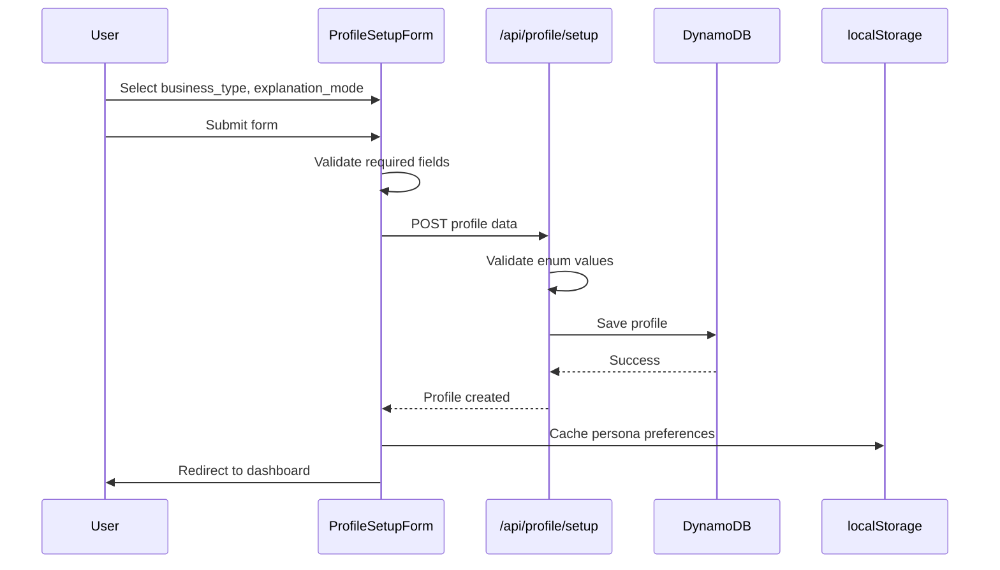
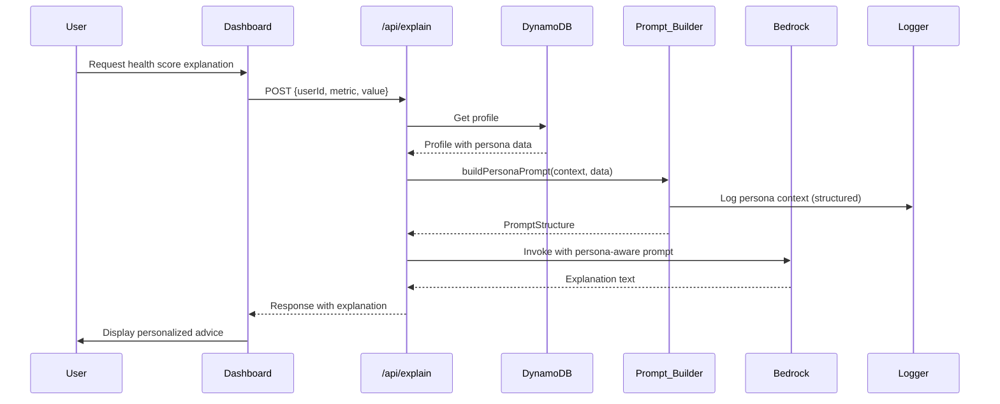
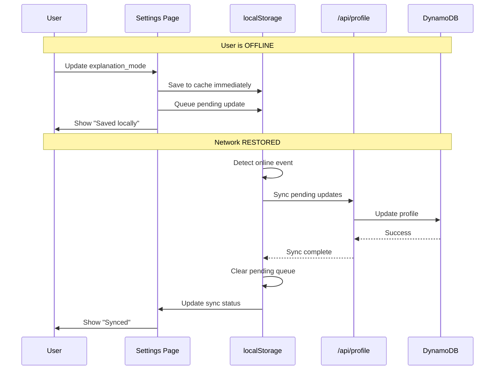
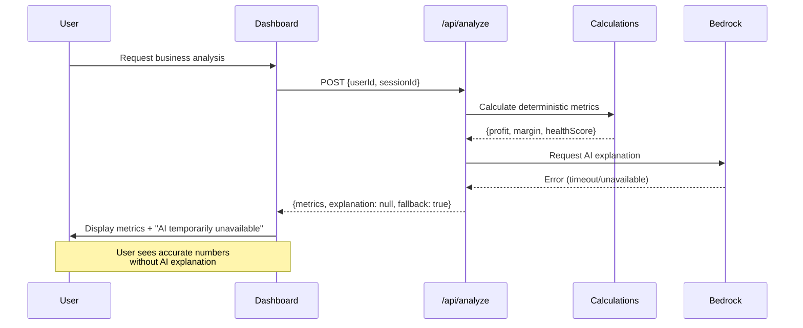

# Design Document: Persona-Aware AI

## Overview

The Persona-Aware AI feature transforms generic AI responses into personalized, contextually relevant advice tailored to each shop owner's specific business type, location, and communication preferences. This feature operates strictly as an interpretation layer—AI explains deterministic financial metrics but never calculates them.

### Key Design Principles

1. **Deterministic-First Architecture**: All financial calculations happen in pure TypeScript functions before AI involvement
2. **Centralized Prompt Management**: All AI prompts are built through a single prompt builder library in `/lib/ai/`
3. **Offline-First**: Core functionality works without AI; persona preferences cached in localStorage
4. **No Hardcoded Prompts**: API routes never contain inline prompt strings
5. **Structured Logging**: All AI interactions logged with persona context for debugging

### Business Value

- **Relevance**: Kirana owners get grocery-specific advice, salon owners get service business guidance
- **Accessibility**: Simple mode uses plain language; detailed mode explains financial concepts
- **Cultural Context**: City tier awareness enables location-appropriate recommendations
- **Trust**: AI explains pre-calculated numbers, never computes them, ensuring accuracy

## Architecture

### System Components

```
┌─────────────────────────────────────────────────────────────┐
│                      User Interface Layer                    │
│  ┌──────────────────┐         ┌─────────────────────────┐  │
│  │ ProfileSetupForm │         │  UserSettingsPage       │  │
│  └──────────────────┘         └─────────────────────────┘  │
└─────────────────────────────────────────────────────────────┘
                              │
                              ▼
┌─────────────────────────────────────────────────────────────┐
│                      API Route Layer                         │
│  ┌──────────────┐  ┌──────────────┐  ┌──────────────┐     │
│  │ /api/explain │  │ /api/analyze │  │  /api/ask    │     │
│  └──────────────┘  └──────────────┘  └──────────────┘     │
└─────────────────────────────────────────────────────────────┘
                              │
                              ▼
┌─────────────────────────────────────────────────────────────┐
│                    Service Layer                             │
│  ┌──────────────────┐         ┌─────────────────────────┐  │
│  │  Profile_Store   │         │   Prompt_Builder        │  │
│  │  (DynamoDB)      │         │   (/lib/ai/)            │  │
│  └──────────────────┘         └─────────────────────────┘  │
└─────────────────────────────────────────────────────────────┘
                              │
                              ▼
┌─────────────────────────────────────────────────────────────┐
│                    AI Service Layer                          │
│  ┌──────────────────┐         ┌─────────────────────────┐  │
│  │  Bedrock Client  │         │   Logger                │  │
│  └──────────────────┘         └─────────────────────────┘  │
└─────────────────────────────────────────────────────────────┘
```

### Data Flow

1. **Profile Setup**: User selects business_type, city_tier, explanation_mode → Stored in DynamoDB + localStorage
2. **AI Request**: API route retrieves profile → Passes to Prompt_Builder → Builds persona-aware prompt
3. **AI Response**: Bedrock returns explanation → API returns to UI → User sees personalized advice
4. **Offline Mode**: If AI unavailable, deterministic metrics still displayed without explanation


## Components and Interfaces

### 1. Profile Store (DynamoDB)

**Location**: `lib/dynamodb-client.ts` (extend existing ProfileService)

**Data Model**:
```typescript
interface UserProfile {
  userId: string;              // PK
  shopName: string;
  userName: string;
  language: 'en' | 'hi' | 'mr';
  
  // NEW: Persona fields
  business_type: 'kirana' | 'salon' | 'pharmacy' | 'restaurant' | 'other';
  city_tier?: 'tier-1' | 'tier-2' | 'tier-3' | 'rural' | null;
  explanation_mode: 'simple' | 'detailed';
  
  phoneNumber?: string;
  createdAt: string;
  updatedAt: string;
}
```

**Methods**:
```typescript
// Extend existing ProfileService
class ProfileService {
  // Existing methods...
  
  // NEW: Validate persona fields
  static validateBusinessType(type: string): boolean;
  static validateCityTier(tier: string | null): boolean;
  static validateExplanationMode(mode: string): boolean;
}
```

**DynamoDB Schema**:
- **Table**: VyaparAI-Users
- **PK**: `USER#{userId}`
- **SK**: `PROFILE`
- **Attributes**: All UserProfile fields
- **GSI**: None required (profile lookups by userId only)

### 2. Prompt Builder Library

**Location**: `/lib/ai/prompt-builder.ts` (NEW FILE)

**Core Interface**:
```typescript
interface PersonaContext {
  business_type: 'kirana' | 'salon' | 'pharmacy' | 'restaurant' | 'other';
  city_tier?: 'tier-1' | 'tier-2' | 'tier-3' | 'rural';
  explanation_mode: 'simple' | 'detailed';
  language: 'en' | 'hi' | 'mr';
}

interface PromptStructure {
  system: string;      // System instructions with persona context
  user: string;        // User message with data and question
}

// Main prompt builder function
function buildPersonaPrompt(
  context: PersonaContext,
  promptType: 'explain' | 'analyze' | 'ask',
  data: {
    metric?: string;
    value?: number;
    calculatedMetrics?: Record<string, number>;
    question?: string;
    [key: string]: any;
  }
): PromptStructure;
```

**Helper Functions**:
```typescript
// Generate persona identity section
function getPersonaIdentity(business_type: string, language: string): string;

// Generate business context section
function getBusinessContext(business_type: string, language: string): string;

// Generate location context section
function getLocationContext(city_tier: string, language: string): string;

// Generate explanation mode instructions
function getExplanationInstructions(mode: string, language: string): string;

// Generate deterministic metrics section
function formatMetricsForPrompt(metrics: Record<string, number>): string;
```


### 3. API Route Integration

**Modified Routes**: `/api/explain`, `/api/analyze`, `/api/ask`

**Common Pattern**:
```typescript
export async function POST(request: NextRequest) {
  // 1. Extract userId from request
  const { userId, ...otherParams } = await request.json();
  
  // 2. Retrieve profile with persona data
  const profile = await ProfileService.getProfile(userId);
  if (!profile) {
    return NextResponse.json({
      success: false,
      error: 'PROFILE_INCOMPLETE'
    }, { status: 400 });
  }
  
  // 3. Build persona context
  const personaContext: PersonaContext = {
    business_type: profile.business_type,
    city_tier: profile.city_tier,
    explanation_mode: profile.explanation_mode,
    language: profile.language
  };
  
  // 4. Build prompt using Prompt_Builder
  const prompt = buildPersonaPrompt(personaContext, 'explain', {
    metric: otherParams.metric,
    value: otherParams.value
  });
  
  // 5. Log persona context (structured)
  logger.info('AI request', {
    userId,
    persona_context: personaContext,
    prompt_type: 'explain'
  });
  
  // 6. Call AI service
  const response = await invokeBedrockModel(prompt);
  
  // 7. Return response
  return NextResponse.json(response);
}
```

### 4. Offline-First Storage

**Location**: Client-side localStorage

**Cached Data**:
```typescript
interface CachedPersona {
  business_type: string;
  city_tier?: string;
  explanation_mode: string;
  language: string;
  lastSyncedAt: string;
}

// localStorage keys
const PERSONA_CACHE_KEY = 'vyapar_persona_cache';
const PENDING_UPDATES_KEY = 'vyapar_persona_pending';
```

**Sync Logic**:
```typescript
// On profile update
function updatePersona(updates: Partial<PersonaContext>) {
  // 1. Update localStorage immediately
  const cached = getCachedPersona();
  const updated = { ...cached, ...updates };
  localStorage.setItem(PERSONA_CACHE_KEY, JSON.stringify(updated));
  
  // 2. Try to sync to DynamoDB
  if (navigator.onLine) {
    syncPersonaToDynamoDB(updated);
  } else {
    // 3. Queue for later sync
    queuePendingUpdate(updated);
  }
}

// On network restore
window.addEventListener('online', () => {
  const pending = getPendingUpdates();
  if (pending.length > 0) {
    syncPendingUpdates(pending);
  }
});
```

### 5. Logger Integration

**Location**: `lib/logger.ts` (extend existing)

**Structured Logging Format**:
```typescript
interface LogEntry {
  timestamp: string;
  level: 'debug' | 'info' | 'warn' | 'error';
  message: string;
  context: {
    userId?: string;
    persona_context?: PersonaContext;
    prompt_type?: string;
    error?: string;
  };
}

// Usage in Prompt_Builder
logger.info('Building persona-aware prompt', {
  userId,
  persona_context: {
    business_type: context.business_type,
    city_tier: context.city_tier,
    explanation_mode: context.explanation_mode
  },
  prompt_type: 'explain'
});

// NEVER log full prompt in production
if (process.env.NODE_ENV !== 'production') {
  logger.debug('Full prompt', { prompt: promptText });
}
```


## Data Models

### Profile Storage (DynamoDB)

**Table**: VyaparAI-Users (existing table)

**Item Structure**:
```json
{
  "PK": "USER#user-123",
  "SK": "PROFILE",
  "userId": "user-123",
  "shopName": "राम किराना स्टोर",
  "userName": "राम शर्मा",
  "language": "hi",
  "business_type": "kirana",
  "city_tier": "tier-2",
  "explanation_mode": "simple",
  "phoneNumber": "+919876543210",
  "createdAt": "2024-01-15T10:30:00Z",
  "updatedAt": "2024-01-20T14:45:00Z"
}
```

**Validation Rules**:
- `business_type`: ENUM ['kirana', 'salon', 'pharmacy', 'restaurant', 'other'] - REQUIRED
- `city_tier`: ENUM ['tier-1', 'tier-2', 'tier-3', 'rural'] | null - OPTIONAL
- `explanation_mode`: ENUM ['simple', 'detailed'] - REQUIRED
- `language`: ENUM ['en', 'hi', 'mr'] - REQUIRED

### Persona Context Object

**Runtime Type** (not persisted):
```typescript
interface PersonaContext {
  business_type: 'kirana' | 'salon' | 'pharmacy' | 'restaurant' | 'other';
  city_tier?: 'tier-1' | 'tier-2' | 'tier-3' | 'rural';
  explanation_mode: 'simple' | 'detailed';
  language: 'en' | 'hi' | 'mr';
}
```

### Prompt Structure

**Output from Prompt Builder**:
```typescript
interface PromptStructure {
  system: string;      // System instructions with persona
  user: string;        // User message with data
  metadata: {          // For logging only
    business_type: string;
    city_tier?: string;
    explanation_mode: string;
    prompt_type: string;
  };
}
```

### Business Type Context Mapping

**Persona Identity Templates**:
```typescript
const PERSONA_IDENTITIES = {
  kirana: {
    en: "You are a business advisor for a kirana (grocery) shop owner in India.",
    hi: "आप भारत में एक किराना दुकान के मालिक के लिए व्यवसाय सलाहकार हैं।",
    mr: "तुम्ही भारतातील किराणा दुकानाच्या मालकासाठी व्यवसाय सल्लागार आहात."
  },
  salon: {
    en: "You are a business advisor for a salon/beauty service owner in India.",
    hi: "आप भारत में एक सैलून/ब्यूटी सेवा के मालिक के लिए व्यवसाय सलाहकार हैं।",
    mr: "तुम्ही भारतातील सलून/सौंदर्य सेवा मालकासाठी व्यवसाय सल्लागार आहात."
  },
  pharmacy: {
    en: "You are a business advisor for a pharmacy/medical store owner in India.",
    hi: "आप भारत में एक फार्मेसी/मेडिकल स्टोर के मालिक के लिए व्यवसाय सलाहकार हैं।",
    mr: "तुम्ही भारतातील फार्मसी/वैद्यकीय स्टोअर मालकासाठी व्यवसाय सल्लागार आहात."
  },
  restaurant: {
    en: "You are a business advisor for a restaurant/food service owner in India.",
    hi: "आप भारत में एक रेस्तरां/खाद्य सेवा के मालिक के लिए व्यवसाय सलाहकार हैं।",
    mr: "तुम्ही भारतातील रेस्टॉरंट/खाद्य सेवा मालकासाठी व्यवसाय सल्लागार आहात."
  },
  other: {
    en: "You are a business advisor for a small retail shop owner in India.",
    hi: "आप भारत में एक छोटे खुदरा दुकान के मालिक के लिए व्यवसाय सलाहकार हैं।",
    mr: "तुम्ही भारतातील लहान किरकोळ दुकान मालकासाठी व्यवसाय सल्लागार आहात."
  }
};
```

**Business Context Templates**:
```typescript
const BUSINESS_CONTEXTS = {
  kirana: {
    en: "Focus on inventory turnover, perishable goods management, credit to regular customers, and daily cash flow.",
    hi: "इन्वेंटरी टर्नओवर, खराब होने वाले सामान के प्रबंधन, नियमित ग्राहकों को उधार, और दैनिक नकदी प्रवाह पर ध्यान दें।",
    mr: "इन्व्हेंटरी टर्नओव्हर, नाशवंत वस्तूंचे व्यवस्थापन, नियमित ग्राहकांना उधार आणि दैनंदिन रोख प्रवाहावर लक्ष केंद्रित करा."
  },
  salon: {
    en: "Focus on service pricing, staff costs, product inventory, appointment scheduling, and customer retention.",
    hi: "सेवा मूल्य निर्धारण, कर्मचारी लागत, उत्पाद इन्वेंटरी, अपॉइंटमेंट शेड्यूलिंग, और ग्राहक प्रतिधारण पर ध्यान दें।",
    mr: "सेवा किंमत, कर्मचारी खर्च, उत्पाद इन्व्हेंटरी, भेटीचे वेळापत्रक आणि ग्राहक टिकवून ठेवण्यावर लक्ष केंद्रित करा."
  },
  pharmacy: {
    en: "Focus on medicine expiry management, prescription vs OTC sales, regulatory compliance, and supplier credit terms.",
    hi: "दवा की समाप्ति प्रबंधन, प्रिस्क्रिप्शन बनाम ओटीसी बिक्री, नियामक अनुपालन, और आपूर्तिकर्ता क्रेडिट शर्तों पर ध्यान दें।",
    mr: "औषध कालबाह्यता व्यवस्थापन, प्रिस्क्रिप्शन विरुद्ध OTC विक्री, नियामक अनुपालन आणि पुरवठादार क्रेडिट अटींवर लक्ष केंद्रित करा."
  },
  restaurant: {
    en: "Focus on food cost percentage, wastage control, peak vs off-peak hours, staff scheduling, and menu pricing.",
    hi: "खाद्य लागत प्रतिशत, बर्बादी नियंत्रण, पीक बनाम ऑफ-पीक घंटे, कर्मचारी शेड्यूलिंग, और मेनू मूल्य निर्धारण पर ध्यान दें।",
    mr: "अन्न खर्च टक्केवारी, कचरा नियंत्रण, पीक विरुद्ध ऑफ-पीक तास, कर्मचारी वेळापत्रक आणि मेनू किंमतीवर लक्ष केंद्रित करा."
  },
  other: {
    en: "Focus on profit margins, inventory management, customer payment patterns, and operational efficiency.",
    hi: "लाभ मार्जिन, इन्वेंटरी प्रबंधन, ग्राहक भुगतान पैटर्न, और परिचालन दक्षता पर ध्यान दें।",
    mr: "नफा मार्जिन, इन्व्हेंटरी व्यवस्थापन, ग्राहक पेमेंट पॅटर्न आणि ऑपरेशनल कार्यक्षमतेवर लक्ष केंद्रित करा."
  }
};
```

### City Tier Context Mapping

```typescript
const CITY_TIER_CONTEXTS = {
  'tier-1': {
    en: "Operating in a tier-1 city with higher competition, digital payment adoption, and premium customer expectations.",
    hi: "टियर-1 शहर में संचालन जहां अधिक प्रतिस्पर्धा, डिजिटल भुगतान अपनाना, और प्रीमियम ग्राहक अपेक्षाएं हैं।",
    mr: "टियर-1 शहरात कार्यरत जेथे जास्त स्पर्धा, डिजिटल पेमेंट स्वीकृती आणि प्रीमियम ग्राहक अपेक्षा आहेत."
  },
  'tier-2': {
    en: "Operating in a tier-2 city with moderate competition, growing digital adoption, and value-conscious customers.",
    hi: "टियर-2 शहर में संचालन जहां मध्यम प्रतिस्पर्धा, बढ़ता डिजिटल अपनाना, और मूल्य-सचेत ग्राहक हैं।",
    mr: "टियर-2 शहरात कार्यरत जेथे मध्यम स्पर्धा, वाढती डिजिटल स्वीकृती आणि मूल्य-जागरूक ग्राहक आहेत."
  },
  'tier-3': {
    en: "Operating in a tier-3 city with local competition, mixed cash-digital payments, and relationship-based business.",
    hi: "टियर-3 शहर में संचालन जहां स्थानीय प्रतिस्पर्धा, मिश्रित नकद-डिजिटल भुगतान, और संबंध-आधारित व्यवसाय है।",
    mr: "टियर-3 शहरात कार्यरत जेथे स्थानिक स्पर्धा, मिश्र रोख-डिजिटल पेमेंट आणि नातेसंबंध-आधारित व्यवसाय आहे."
  },
  'rural': {
    en: "Operating in a rural area with limited competition, primarily cash transactions, and strong community relationships.",
    hi: "ग्रामीण क्षेत्र में संचालन जहां सीमित प्रतिस्पर्धा, मुख्य रूप से नकद लेनदेन, और मजबूत सामुदायिक संबंध हैं।",
    mr: "ग्रामीण भागात कार्यरत जेथे मर्यादित स्पर्धा, प्रामुख्याने रोख व्यवहार आणि मजबूत समुदाय संबंध आहेत."
  }
};
```


## Correctness Properties

*A property is a characteristic or behavior that should hold true across all valid executions of a system—essentially, a formal statement about what the system should do. Properties serve as the bridge between human-readable specifications and machine-verifiable correctness guarantees.*

### Property Reflection

After analyzing all acceptance criteria, I identified the following redundancies and consolidations:

**Consolidated Properties**:
- Requirements 4.1-4.6 (business type context) → Single property testing all business types
- Requirements 5.1, 5.2, 5.6 (AI interpretation layer) → Single property about prompt instructions
- Requirements 6.4, 6.5 (localStorage caching) → Single property about offline storage round-trip
- Requirements 10.1-10.3 (logging persona context) → Single property about structured logging

**Eliminated Redundancies**:
- Requirement 5.4 and 5.5 are specific examples of 5.3, covered by the general property
- Requirement 4.6 is implied by 4.1-4.5, no separate property needed

### Property 1: Profile Field Validation

*For any* profile update with business_type, city_tier, or explanation_mode fields, the Profile_Store should accept only values from the defined enums and reject invalid values with appropriate error codes.

**Validates: Requirements 1.1, 1.2, 1.3**

### Property 2: Profile Persistence Round-Trip

*For any* valid profile data, saving to Profile_Store and then retrieving should return equivalent values for all persona fields (business_type, city_tier, explanation_mode).

**Validates: Requirements 1.4**

### Property 3: Prompt Structure Completeness

*For any* valid PersonaContext, the Prompt_Builder should return a PromptStructure object containing both system and user message sections.

**Validates: Requirements 2.10**

### Property 4: Persona Identity Injection

*For any* business_type value, the Prompt_Builder should include business-specific persona identity text in the system prompt section.

**Validates: Requirements 2.4, 4.1, 4.2, 4.3, 4.4, 4.5, 4.6**

### Property 5: Business Context Injection

*For any* business_type value, the Prompt_Builder should include business-specific context (terminology, focus areas) in the system prompt section.

**Validates: Requirements 2.5, 4.1, 4.2, 4.3, 4.4, 4.5, 4.6**

### Property 6: Location Context Conditional Inclusion

*For any* PersonaContext where city_tier is not null, the Prompt_Builder should include location-specific context in the system prompt; when city_tier is null, no location context should be present.

**Validates: Requirements 2.6**

### Property 7: Explanation Mode Instructions

*For any* PersonaContext, when explanation_mode is "simple", the prompt should instruct AI to provide 2-3 bullet points with no jargon; when "detailed", it should instruct 5-7 bullets with concept explanations.

**Validates: Requirements 2.7, 2.8**

### Property 8: AI Interpretation Layer Enforcement

*For any* prompt built by Prompt_Builder, the system instructions should explicitly state that AI must explain pre-calculated metrics and must not perform financial calculations.

**Validates: Requirements 5.1, 5.2, 5.6**

### Property 9: Deterministic Metrics Inclusion

*For any* prompt built with calculatedMetrics parameter, all provided metric values should appear in the user message section of the prompt.

**Validates: Requirements 5.3**

### Property 10: Offline Storage Round-Trip

*For any* valid persona preferences (business_type, explanation_mode), storing to localStorage and retrieving should return equivalent values.

**Validates: Requirements 6.4, 6.5**

### Property 11: Offline Sync Queue

*For any* profile update made while offline, the update should be queued in localStorage and synced to Profile_Store when network connectivity is restored.

**Validates: Requirements 6.6**

### Property 12: API Response Structure Preservation

*For any* AI_Service response, the API endpoint should return it without modifying the response structure (success, content, error fields remain unchanged).

**Validates: Requirements 9.6**

### Property 13: Structured Logging with Persona Context

*For any* prompt construction, the Logger should create a structured log entry at info level containing business_type, explanation_mode, and city_tier (if present) as JSON fields.

**Validates: Requirements 10.1, 10.2, 10.3, 10.6**


## Error Handling

### Profile Validation Errors

**Scenario**: Invalid business_type, city_tier, or explanation_mode values

**Response**:
```json
{
  "success": false,
  "code": "VALIDATION_ERROR",
  "message": "Invalid profile data",
  "errors": [
    {
      "field": "business_type",
      "message": "Must be one of: kirana, salon, pharmacy, restaurant, other",
      "code": "invalid_enum"
    }
  ]
}
```

**Handling**:
- API returns 400 Bad Request
- Client displays field-specific error messages
- No partial updates (atomic validation)

### Missing Profile Data

**Scenario**: API route cannot retrieve user profile

**Response**:
```json
{
  "success": false,
  "code": "PROFILE_INCOMPLETE",
  "message": "Please complete your profile setup to use AI features"
}
```

**Handling**:
- API returns 400 Bad Request
- Client redirects to profile setup page
- Deterministic metrics still displayed (AI explanation unavailable)

### AI Service Unavailable

**Scenario**: Bedrock returns error or times out

**Response**:
```json
{
  "success": false,
  "code": "AI_SERVICE_UNAVAILABLE",
  "message": "AI explanation temporarily unavailable. Your calculated metrics are shown below."
}
```

**Handling**:
- API returns 503 Service Unavailable
- Client displays deterministic metrics without AI explanation
- Fallback message shown: "AI advisor is taking a break. Your numbers are accurate."
- User can retry after delay

### Offline Mode

**Scenario**: Network unavailable during profile update

**Handling**:
- Update localStorage immediately (optimistic update)
- Queue update in `PENDING_UPDATES_KEY`
- Show UI indicator: "Changes saved locally, will sync when online"
- On network restore, sync pending updates
- If sync fails, show retry option

### DynamoDB Errors

**Scenario**: DynamoDB throttling or service error

**Response**:
```json
{
  "success": false,
  "code": "DATABASE_ERROR",
  "message": "Unable to save profile. Please try again."
}
```

**Handling**:
- API returns 500 Internal Server Error
- Log error with context (userId, operation)
- Client shows retry button
- No data loss (localStorage preserves state)

### Logging Errors

**Scenario**: Logger fails to write

**Handling**:
- Silent failure (don't block user operations)
- Fallback to console.error in development
- No logging in production if logger unavailable
- Monitor logger health separately


## Testing Strategy

### Dual Testing Approach

This feature requires both unit tests and property-based tests for comprehensive coverage:

- **Unit tests**: Verify specific examples, edge cases, and error conditions
- **Property tests**: Verify universal properties across all inputs using randomization

Together, these approaches ensure both concrete correctness (unit tests catch specific bugs) and general correctness (property tests verify behavior across all possible inputs).

### Property-Based Testing

**Library**: `fast-check` (JavaScript/TypeScript property-based testing library)

**Configuration**:
- Minimum 100 iterations per property test
- Each test tagged with comment referencing design property
- Tag format: `// Feature: persona-aware-ai, Property {number}: {property_text}`

**Test Files**:
- `lib/ai/__tests__/prompt-builder.property.test.ts`
- `lib/__tests__/profile-store.property.test.ts`
- `lib/__tests__/offline-storage.property.test.ts`

**Example Property Test**:
```typescript
import fc from 'fast-check';
import { buildPersonaPrompt } from '@/lib/ai/prompt-builder';

// Feature: persona-aware-ai, Property 4: Persona Identity Injection
describe('Prompt Builder - Persona Identity', () => {
  it('should include business-specific persona identity for all business types', () => {
    fc.assert(
      fc.property(
        fc.constantFrom('kirana', 'salon', 'pharmacy', 'restaurant', 'other'),
        fc.constantFrom('en', 'hi', 'mr'),
        fc.constantFrom('simple', 'detailed'),
        (businessType, language, explanationMode) => {
          const context = {
            business_type: businessType,
            explanation_mode: explanationMode,
            language: language
          };
          
          const prompt = buildPersonaPrompt(context, 'explain', {
            metric: 'healthScore',
            value: 75
          });
          
          // Verify persona identity is present in system prompt
          expect(prompt.system).toContain('business advisor');
          expect(prompt.system.toLowerCase()).toContain(businessType);
        }
      ),
      { numRuns: 100 }
    );
  });
});
```

### Unit Testing

**Test Files**:
- `lib/ai/__tests__/prompt-builder.test.ts`
- `app/api/explain/__tests__/route.test.ts`
- `app/api/analyze/__tests__/route.test.ts`
- `app/api/ask/__tests__/route.test.ts`
- `components/__tests__/ProfileSetupForm.test.tsx`

**Unit Test Focus Areas**:

1. **Specific Examples**:
   - Simple mode produces 2-3 bullet instructions
   - Detailed mode produces 5-7 bullet instructions
   - Kirana context includes "inventory turnover"
   - Salon context includes "service pricing"

2. **Edge Cases**:
   - city_tier is null (optional field not set)
   - Empty calculatedMetrics object
   - Profile with only required fields

3. **Error Conditions**:
   - Invalid business_type value
   - Missing required fields
   - Profile not found
   - AI service timeout

4. **Integration Points**:
   - API route retrieves profile before building prompt
   - Prompt builder called with correct parameters
   - Logger receives structured context

**Example Unit Test**:
```typescript
import { buildPersonaPrompt } from '@/lib/ai/prompt-builder';

describe('Prompt Builder - Explanation Mode', () => {
  it('should instruct simple mode with 2-3 bullets and no jargon', () => {
    const context = {
      business_type: 'kirana',
      explanation_mode: 'simple',
      language: 'en'
    };
    
    const prompt = buildPersonaPrompt(context, 'explain', {
      metric: 'healthScore',
      value: 75
    });
    
    expect(prompt.system).toContain('2-3 bullet points');
    expect(prompt.system).toContain('no jargon');
    expect(prompt.system).toContain('simple');
  });
  
  it('should instruct detailed mode with 5-7 bullets and explanations', () => {
    const context = {
      business_type: 'kirana',
      explanation_mode: 'detailed',
      language: 'en'
    };
    
    const prompt = buildPersonaPrompt(context, 'explain', {
      metric: 'healthScore',
      value: 75
    });
    
    expect(prompt.system).toContain('5-7 bullet');
    expect(prompt.system).toContain('explain');
    expect(prompt.system).toContain('concept');
  });
});
```

### Integration Testing

**Test Scenarios**:

1. **Profile Setup Flow**:
   - User completes profile with business_type and explanation_mode
   - Profile saved to DynamoDB
   - Profile cached in localStorage
   - User redirected to dashboard

2. **AI Request Flow**:
   - API retrieves profile from DynamoDB
   - Prompt builder constructs persona-aware prompt
   - Bedrock invoked with prompt
   - Response returned to client

3. **Offline-to-Online Sync**:
   - User updates profile while offline
   - Changes stored in localStorage
   - Network restored
   - Pending updates synced to DynamoDB

**Mock Strategy**:
- Mock Bedrock client for AI tests
- Mock DynamoDB client for database tests
- Use in-memory storage for localStorage tests
- Mock logger to verify structured logging

### Test Coverage Goals

- **Prompt Builder**: 100% coverage (pure functions, fully testable)
- **Profile Store**: 90% coverage (exclude AWS SDK internals)
- **API Routes**: 85% coverage (focus on business logic)
- **UI Components**: 80% coverage (focus on logic, not rendering)

### Continuous Testing

- Run unit tests on every commit
- Run property tests on every PR
- Run integration tests before deployment
- Monitor test execution time (target: <30s for unit tests)


## Implementation Examples

### Example 1: Prompt Builder Implementation

**File**: `/lib/ai/prompt-builder.ts`

```typescript
import { PersonaContext, PromptStructure } from './types';
import { logger } from '@/lib/logger';

// Persona identity templates
const PERSONA_IDENTITIES = {
  kirana: {
    en: "You are a business advisor for a kirana (grocery) shop owner in India.",
    hi: "आप भारत में एक किराना दुकान के मालिक के लिए व्यवसाय सलाहकार हैं।",
    mr: "तुम्ही भारतातील किराणा दुकानाच्या मालकासाठी व्यवसाय सल्लागार आहात."
  },
  // ... other business types
};

const BUSINESS_CONTEXTS = {
  kirana: {
    en: "Focus on inventory turnover, perishable goods management, credit to regular customers, and daily cash flow.",
    // ... other languages
  },
  // ... other business types
};

const CITY_TIER_CONTEXTS = {
  'tier-1': {
    en: "Operating in a tier-1 city with higher competition, digital payment adoption, and premium customer expectations.",
    // ... other languages
  },
  // ... other tiers
};

export function buildPersonaPrompt(
  context: PersonaContext,
  promptType: 'explain' | 'analyze' | 'ask',
  data: Record<string, any>
): PromptStructure {
  // Log persona context (structured)
  logger.info('Building persona-aware prompt', {
    persona_context: {
      business_type: context.business_type,
      city_tier: context.city_tier,
      explanation_mode: context.explanation_mode
    },
    prompt_type: promptType
  });

  // Build system prompt
  let systemPrompt = '';
  
  // 1. Persona identity
  systemPrompt += PERSONA_IDENTITIES[context.business_type][context.language] + '\n\n';
  
  // 2. Business context
  systemPrompt += BUSINESS_CONTEXTS[context.business_type][context.language] + '\n\n';
  
  // 3. Location context (if provided)
  if (context.city_tier) {
    systemPrompt += CITY_TIER_CONTEXTS[context.city_tier][context.language] + '\n\n';
  }
  
  // 4. AI interpretation layer instructions
  systemPrompt += 'CRITICAL: You are explaining PRE-CALCULATED financial metrics. ';
  systemPrompt += 'DO NOT perform any calculations. Your role is to INTERPRET and EXPLAIN the numbers provided.\n\n';
  
  // 5. Explanation mode instructions
  if (context.explanation_mode === 'simple') {
    systemPrompt += 'Provide 2-3 bullet points. Use simple language with no financial jargon. Keep sentences short.\n';
  } else {
    systemPrompt += 'Provide 5-7 bullet points. Explain financial concepts like margin, cash flow, and profitability in simple terms.\n';
  }
  
  // Build user prompt based on type
  let userPrompt = '';
  
  if (promptType === 'explain') {
    userPrompt = buildExplainPrompt(data, context.language);
  } else if (promptType === 'analyze') {
    userPrompt = buildAnalyzePrompt(data, context.language);
  } else if (promptType === 'ask') {
    userPrompt = buildAskPrompt(data, context.language);
  }
  
  return {
    system: systemPrompt,
    user: userPrompt,
    metadata: {
      business_type: context.business_type,
      city_tier: context.city_tier,
      explanation_mode: context.explanation_mode,
      prompt_type: promptType
    }
  };
}

function buildExplainPrompt(data: Record<string, any>, language: string): string {
  let prompt = `Explain the following metric:\n\n`;
  prompt += `Metric: ${data.metric}\n`;
  prompt += `Value: ${data.value}\n\n`;
  
  if (data.calculatedMetrics) {
    prompt += `Additional Context (PRE-CALCULATED):\n`;
    for (const [key, value] of Object.entries(data.calculatedMetrics)) {
      prompt += `- ${key}: ${value}\n`;
    }
  }
  
  return prompt;
}

// ... other helper functions
```

### Example 2: API Route Integration

**File**: `/app/api/explain/route.ts`

```typescript
import { NextRequest, NextResponse } from 'next/server';
import { ProfileService } from '@/lib/dynamodb-client';
import { buildPersonaPrompt } from '@/lib/ai/prompt-builder';
import { invokeBedrockModel } from '@/lib/bedrock-client';
import { logger } from '@/lib/logger';

export async function POST(request: NextRequest) {
  try {
    const body = await request.json();
    const { userId, metric, value, context, language } = body;
    
    // Validate inputs
    if (!userId || !metric || value === undefined) {
      return NextResponse.json({
        success: false,
        code: 'MISSING_FIELDS',
        message: 'Missing required fields: userId, metric, value',
      }, { status: 400 });
    }
    
    // Retrieve profile with persona data
    const profile = await ProfileService.getProfile(userId);
    if (!profile || !profile.business_type || !profile.explanation_mode) {
      return NextResponse.json({
        success: false,
        code: 'PROFILE_INCOMPLETE',
        message: 'Please complete your profile setup to use AI features',
      }, { status: 400 });
    }
    
    // Build persona context
    const personaContext = {
      business_type: profile.business_type,
      city_tier: profile.city_tier,
      explanation_mode: profile.explanation_mode,
      language: profile.language
    };
    
    // Build persona-aware prompt
    const prompt = buildPersonaPrompt(personaContext, 'explain', {
      metric,
      value,
      calculatedMetrics: context?.breakdown
    });
    
    // Call AI service
    const response = await invokeBedrockModel(
      `${prompt.system}\n\n${prompt.user}`,
      2,
      language
    );
    
    if (!response.success) {
      // Graceful degradation: return without AI explanation
      logger.warn('AI service unavailable', {
        userId,
        error: response.error
      });
      
      return NextResponse.json({
        success: true,
        explanation: {
          success: false,
          content: 'AI explanation temporarily unavailable. Your calculated metrics are accurate.'
        },
        metric,
        value,
        fallback: true
      });
    }
    
    return NextResponse.json({
      success: true,
      explanation: response,
      metric,
      value,
    });
    
  } catch (error) {
    logger.error('Explain API error', { error });
    return NextResponse.json({
      success: false,
      code: 'INTERNAL_ERROR',
      message: 'Failed to get explanation. Please try again.',
    }, { status: 500 });
  }
}
```

### Example 3: Offline Storage Sync

**File**: `/lib/offline-persona-sync.ts`

```typescript
const PERSONA_CACHE_KEY = 'vyapar_persona_cache';
const PENDING_UPDATES_KEY = 'vyapar_persona_pending';

interface CachedPersona {
  business_type: string;
  city_tier?: string;
  explanation_mode: string;
  language: string;
  lastSyncedAt: string;
}

export function getCachedPersona(): CachedPersona | null {
  const cached = localStorage.getItem(PERSONA_CACHE_KEY);
  return cached ? JSON.parse(cached) : null;
}

export function updatePersonaCache(updates: Partial<CachedPersona>): void {
  const cached = getCachedPersona() || {
    business_type: 'other',
    explanation_mode: 'simple',
    language: 'en',
    lastSyncedAt: new Date().toISOString()
  };
  
  const updated = { ...cached, ...updates };
  localStorage.setItem(PERSONA_CACHE_KEY, JSON.stringify(updated));
}

export async function syncPersonaToDynamoDB(
  userId: string,
  persona: CachedPersona
): Promise<boolean> {
  try {
    const response = await fetch('/api/profile', {
      method: 'PUT',
      headers: { 'Content-Type': 'application/json' },
      body: JSON.stringify({
        userId,
        business_type: persona.business_type,
        city_tier: persona.city_tier,
        explanation_mode: persona.explanation_mode,
        language: persona.language
      })
    });
    
    if (response.ok) {
      // Update lastSyncedAt
      updatePersonaCache({ lastSyncedAt: new Date().toISOString() });
      // Clear pending updates
      localStorage.removeItem(PENDING_UPDATES_KEY);
      return true;
    }
    
    return false;
  } catch (error) {
    console.error('Sync failed:', error);
    return false;
  }
}

export function queuePendingUpdate(persona: CachedPersona): void {
  const pending = JSON.parse(localStorage.getItem(PENDING_UPDATES_KEY) || '[]');
  pending.push({
    persona,
    timestamp: new Date().toISOString()
  });
  localStorage.setItem(PENDING_UPDATES_KEY, JSON.stringify(pending));
}

export async function syncPendingUpdates(userId: string): Promise<void> {
  const pending = JSON.parse(localStorage.getItem(PENDING_UPDATES_KEY) || '[]');
  
  if (pending.length === 0) return;
  
  // Use last-write-wins strategy (hackathon scope)
  const latest = pending[pending.length - 1];
  const success = await syncPersonaToDynamoDB(userId, latest.persona);
  
  if (success) {
    localStorage.removeItem(PENDING_UPDATES_KEY);
  }
}

// Setup network listener
if (typeof window !== 'undefined') {
  window.addEventListener('online', () => {
    const userId = localStorage.getItem('vyapar_user_id');
    if (userId) {
      syncPendingUpdates(userId);
    }
  });
}
```


## Sequence Diagrams

### Profile Setup Flow



### AI Request with Persona Context



### Offline-to-Online Sync



### Graceful Degradation (AI Unavailable)



## Security Considerations

### Data Privacy

1. **Profile Data**: Business type and preferences are not sensitive, but stored securely in DynamoDB
2. **Logging**: Never log full prompts in production (may contain business data)
3. **API Access**: All endpoints require valid userId (authenticated session)

### Input Validation

1. **Enum Validation**: Strict validation of business_type, city_tier, explanation_mode
2. **SQL Injection**: Not applicable (DynamoDB NoSQL)
3. **XSS Prevention**: All user inputs sanitized before display

### Rate Limiting

1. **AI Requests**: Bedrock has built-in throttling
2. **Profile Updates**: Limit to 10 updates per minute per user
3. **Offline Queue**: Limit pending updates to 50 items

## Performance Considerations

### Caching Strategy

1. **Profile Cache**: Cache profile in memory for 5 minutes (API route level)
2. **localStorage**: Instant access to persona preferences (no network call)
3. **Prompt Templates**: Pre-compiled templates (no runtime string building)

### Optimization Targets

1. **Profile Retrieval**: <200ms (95th percentile)
2. **Prompt Building**: <50ms (pure function, no I/O)
3. **AI Response**: 2-5 seconds (Bedrock latency, not controllable)
4. **Offline Sync**: <500ms (background operation)

### Monitoring

1. **Profile Retrieval Time**: CloudWatch metric
2. **AI Request Success Rate**: Track failures for graceful degradation
3. **Offline Sync Success Rate**: Track pending queue size
4. **Prompt Builder Performance**: Log execution time

## Migration Strategy

### Phase 1: Add Persona Fields to Profile

1. Add `business_type`, `city_tier`, `explanation_mode` to DynamoDB schema
2. Default existing users to: `business_type: 'other'`, `explanation_mode: 'simple'`, `city_tier: null`
3. Show profile completion prompt on next login

### Phase 2: Deploy Prompt Builder

1. Create `/lib/ai/prompt-builder.ts` with all templates
2. Add unit tests and property tests
3. Deploy without integrating (no breaking changes)

### Phase 3: Integrate with API Routes

1. Update `/api/explain` to use Prompt_Builder
2. Update `/api/analyze` to use Prompt_Builder
3. Update `/api/ask` to use Prompt_Builder
4. Monitor AI response quality

### Phase 4: Enable Offline Sync

1. Deploy offline storage sync logic
2. Test online/offline transitions
3. Monitor sync success rate

### Rollback Plan

If issues arise:
1. Revert API routes to use old prompt templates
2. Keep persona fields in profile (no data loss)
3. Disable offline sync (use online-only mode)
4. Investigate and fix issues
5. Redeploy with fixes

## Future Enhancements

### Phase 2 Features (Post-Hackathon)

1. **Dynamic Persona Learning**: Track which advice users act on, refine persona templates
2. **Multi-Language Prompt Optimization**: A/B test different phrasings for Hindi/Marathi
3. **City-Specific Benchmarks**: Use city_tier for segment benchmarking
4. **Business Type Analytics**: Track which business types use which features most
5. **Persona-Aware Notifications**: Tailor push notifications to business type

### Advanced Capabilities

1. **Persona Evolution**: Allow users to refine their persona over time
2. **Multi-Store Support**: Different personas for different store locations
3. **Industry Trends**: Inject current trends for specific business types
4. **Seasonal Context**: Adjust advice based on business seasonality

