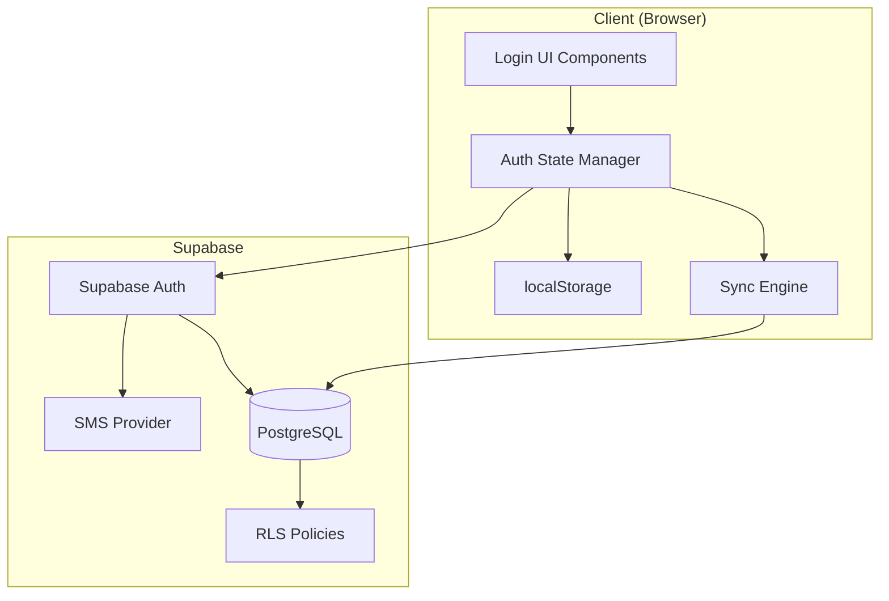
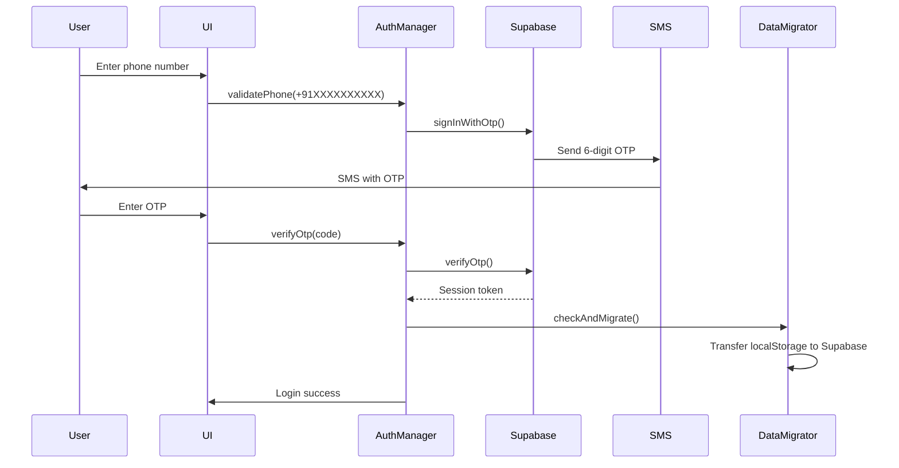
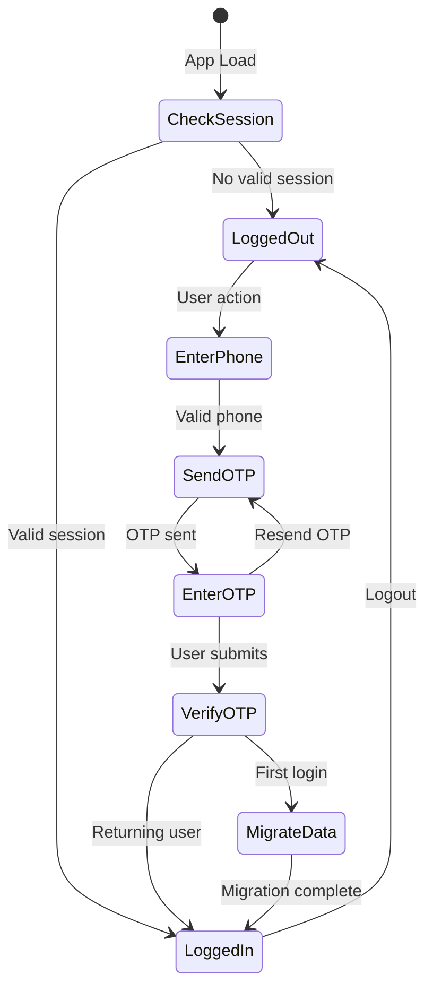

# Design Document: Phone-Based OTP Authentication

## Overview

This design implements phone-based OTP authentication for Vyapar AI using Supabase Auth. The system transitions from device-based data isolation to user account-based authentication while maintaining offline-first functionality and seamless data migration for existing users.

The authentication flow uses SMS-based OTP verification without passwords, optimized for the Indian market with automatic +91 country code handling. The design integrates with the existing hybrid sync architecture, extending it to support multi-device access while preserving the current offline-first approach.

### Key Design Principles

1. **Simplicity First**: No passwords, no complex forms - just phone number and OTP
2. **Offline-First Preserved**: Authentication state cached locally, app works offline after initial login
3. **Seamless Migration**: Existing device data automatically migrated on first login
4. **Multi-Language**: All UI and errors in English, Hindi, and Marathi
5. **Security by Default**: Supabase RLS policies enforce data isolation at database level

## Architecture

### High-Level Architecture



### Authentication Flow



### Session Management Flow



## Components and Interfaces

### 1. Authentication Manager (`lib/auth-manager.ts`)

Core authentication logic and session management.

```typescript
interface AuthManager {
  // Phone validation
  validatePhoneNumber(phone: string): ValidationResult;
  formatPhoneNumber(phone: string): string; // Returns E.164 format
  
  // OTP operations
  sendOTP(phoneNumber: string): Promise<OTPResult>;
  verifyOTP(phoneNumber: string, code: string, rememberDevice?: boolean): Promise<AuthResult>;
  resendOTP(phoneNumber: string): Promise<OTPResult>;
  
  // Session management
  getSession(): Promise<Session | null>;
  refreshSession(): Promise<Session | null>;
  logout(): Promise<void>;
  
  // State queries
  isAuthenticated(): boolean;
  getCurrentUser(): User | null;
}

interface ValidationResult {
  valid: boolean;
  formatted?: string; // E.164 format
  error?: string; // Localized error message
}

interface OTPResult {
  success: boolean;
  error?: string;
  retryAfter?: number; // Seconds until retry allowed
}

interface AuthResult {
  success: boolean;
  session?: Session;
  user?: User;
  error?: string;
  isFirstLogin?: boolean;
}

interface Session {
  accessToken: string;
  refreshToken: string;
  expiresAt: number;
  user: User;
}

interface User {
  id: string;
  phoneNumber: string;
  createdAt: string;
}

// Note: rememberDevice preference is stored separately in the session store,
// not as part of the User object. This allows the same user to have different
// preferences on different devices.
```

### 2. Login UI Components

React components for authentication flow.

#### PhoneInput Component (`components/auth/PhoneInput.tsx`)

```typescript
interface PhoneInputProps {
  onSubmit: (phoneNumber: string) => void;
  loading: boolean;
  error?: string;
  language: 'en' | 'hi' | 'mr';
}

// Features:
// - Auto-prepend +91
// - Numeric keyboard on mobile
// - Large touch targets (min 44px)
// - Real-time validation
// - Localized labels and errors
```

#### OTPInput Component (`components/auth/OTPInput.tsx`)

```typescript
interface OTPInputProps {
  phoneNumber: string;
  onVerify: (code: string) => void;
  onResend: () => void;
  loading: boolean;
  error?: string;
  canResend: boolean;
  resendCountdown: number;
  language: 'en' | 'hi' | 'mr';
}

// Features:
// - 6-digit input with auto-focus
// - Numeric keyboard
// - Resend button with countdown
// - Auto-submit on 6th digit
// - Paste support (from SMS)
```

#### AuthGuard Component (`components/auth/AuthGuard.tsx`)

```typescript
interface AuthGuardProps {
  children: React.ReactNode;
  fallback?: React.ReactNode; // Login screen
}

// Wraps protected routes
// Shows login if not authenticated
// Handles session refresh
```

### 3. Data Migration Service (`lib/data-migrator.ts`)

Handles one-time migration of device data to user account.

```typescript
interface DataMigrator {
  // Check if migration needed
  needsMigration(): boolean;
  
  // Perform migration
  migrateDeviceData(userId: string): Promise<MigrationResult>;
  
  // Mark as migrated
  markMigrated(): void;
  
  // Rollback on failure
  rollbackMigration(): Promise<void>;
}

interface MigrationResult {
  success: boolean;
  dailyEntriesMigrated: number;
  creditEntriesMigrated: number;
  errors?: string[];
}

// Migration strategy:
// 1. Read all data from localStorage
// 2. Add user_id to each record
// 3. Batch insert to Supabase
// 4. Verify all records inserted
// 5. Mark migration complete in localStorage
// 6. Keep device_id for backward compatibility
```

### 4. Session Store (`lib/session-store.ts`)

Manages session persistence and refresh.

```typescript
interface SessionStore {
  // Persistence
  saveSession(session: Session): void;
  loadSession(): Session | null;
  clearSession(): void;
  
  // Remember device
  setRememberDevice(remember: boolean): void;
  shouldRememberDevice(): boolean;
  
  // Session lifecycle
  isSessionValid(session: Session): boolean;
  getSessionExpiry(session: Session): number;
  shouldRefresh(session: Session): boolean;
}

// Storage keys:
// - vyapar-auth-session: Session data
// - vyapar-auth-remember: Remember device preference
// - vyapar-auth-migrated: Migration completion flag
```

### 5. Supabase Auth Integration (`lib/supabase-auth.ts`)

Wrapper around Supabase Auth SDK.

```typescript
interface SupabaseAuthClient {
  // OTP operations
  signInWithOtp(phone: string): Promise<{ error?: Error }>;
  verifyOtp(phone: string, token: string): Promise<{ 
    session?: Session; 
    error?: Error 
  }>;
  
  // Session operations
  getSession(): Promise<{ session?: Session; error?: Error }>;
  refreshSession(): Promise<{ session?: Session; error?: Error }>;
  signOut(): Promise<{ error?: Error }>;
  
  // User operations
  getUser(): Promise<{ user?: User; error?: Error }>;
}

// Configuration:
// - SMS provider: Supabase built-in (Twilio backend)
// - OTP length: 6 digits
// - OTP expiry: 10 minutes
// - Rate limit: 3 attempts per hour per phone
```

## Data Models

### Extended User Table Schema

```sql
-- Extend existing users table for phone auth
ALTER TABLE users ADD COLUMN IF NOT EXISTS phone_number TEXT UNIQUE;
ALTER TABLE users ADD COLUMN IF NOT EXISTS phone_verified BOOLEAN DEFAULT FALSE;
ALTER TABLE users ADD COLUMN IF NOT EXISTS auth_provider TEXT DEFAULT 'phone';

-- Index for phone lookup
CREATE INDEX IF NOT EXISTS idx_users_phone ON users(phone_number) 
WHERE phone_number IS NOT NULL;

-- Update RLS policies for authenticated users
DROP POLICY IF EXISTS "Allow anon access to users" ON users;

CREATE POLICY "Users can read own data"
  ON users
  FOR SELECT
  TO authenticated
  USING (auth.uid() = id);

CREATE POLICY "Users can update own data"
  ON users
  FOR UPDATE
  TO authenticated
  USING (auth.uid() = id)
  WITH CHECK (auth.uid() = id);
```

### Updated Daily Entries RLS

```sql
-- Replace permissive anon policy with user-based policy
DROP POLICY IF EXISTS "Allow anon access to daily entries" ON daily_entries;

CREATE POLICY "Users can access own daily entries"
  ON daily_entries
  FOR ALL
  TO authenticated
  USING (
    user_id = auth.uid() OR 
    (user_id IS NULL AND device_id = current_setting('app.device_id', true))
  )
  WITH CHECK (
    user_id = auth.uid() OR
    (user_id IS NULL AND device_id = current_setting('app.device_id', true))
  );

-- Allow unauthenticated access for backward compatibility (temporary)
CREATE POLICY "Allow device access to daily entries"
  ON daily_entries
  FOR ALL
  TO anon
  USING (device_id = current_setting('app.device_id', true))
  WITH CHECK (device_id = current_setting('app.device_id', true));
```

### Updated Credit Entries RLS

```sql
-- Same pattern for credit entries
DROP POLICY IF EXISTS "Allow anon access to credit entries" ON credit_entries;

CREATE POLICY "Users can access own credit entries"
  ON credit_entries
  FOR ALL
  TO authenticated
  USING (
    user_id = auth.uid() OR
    (user_id IS NULL AND device_id = current_setting('app.device_id', true))
  )
  WITH CHECK (
    user_id = auth.uid() OR
    (user_id IS NULL AND device_id = current_setting('app.device_id', true))
  );

CREATE POLICY "Allow device access to credit entries"
  ON credit_entries
  FOR ALL
  TO anon
  USING (device_id = current_setting('app.device_id', true))
  WITH CHECK (device_id = current_setting('app.device_id', true));
```

### Session Storage Schema

```typescript
// localStorage schema
interface StoredSession {
  accessToken: string;
  refreshToken: string;
  expiresAt: number; // Unix timestamp
  user: {
    id: string;
    phoneNumber: string;
    createdAt: string;
  };
  rememberDevice: boolean;
  deviceId: string;
}

// Migration flag
interface MigrationStatus {
  completed: boolean;
  timestamp: number;
  dailyEntriesMigrated: number;
  creditEntriesMigrated: number;
}
```

## Correctness Properties


*A property is a characteristic or behavior that should hold true across all valid executions of a system—essentially, a formal statement about what the system should do. Properties serve as the bridge between human-readable specifications and machine-verifiable correctness guarantees.*

### Property 1: Phone Number Validation and Formatting

*For any* input string, the phone validation function should correctly identify valid 10-digit Indian mobile numbers, automatically format them to E.164 format (+91XXXXXXXXXX), and reject invalid inputs with appropriate error messages in the user's selected language.

**Validates: Requirements 1.2, 1.3, 1.4**

### Property 2: OTP Generation Consistency

*For any* valid phone number, when an OTP is generated, it should always be exactly 6 numeric digits and stored with a 10-minute expiration timestamp.

**Validates: Requirements 2.1, 2.3**

### Property 3: OTP Invalidation on Regeneration

*For any* phone number with an existing unexpired OTP, requesting a new OTP should invalidate the previous OTP such that the old code can no longer be used for verification.

**Validates: Requirements 2.6**

### Property 4: Rate Limiting Enforcement

*For any* phone number, the system should allow a maximum of 3 OTP requests within a 1-hour window, and reject the 4th request with a rate limit error indicating the wait time.

**Validates: Requirements 2.5**

### Property 5: OTP Verification Correctness

*For any* generated OTP and phone number pair, verification should succeed if and only if the entered code matches the stored OTP and the OTP has not expired.

**Validates: Requirements 3.2, 3.3, 3.4**

### Property 6: Verification Attempt Limiting

*For any* OTP verification session, the system should allow a maximum of 5 verification attempts, and the 6th attempt should be rejected with an error requiring a new OTP.

**Validates: Requirements 3.6**

### Property 7: Resend Cooldown Enforcement

*For any* OTP send operation, subsequent resend requests should be blocked for 60 seconds, with the resend button disabled and a countdown timer displayed.

**Validates: Requirements 4.2, 4.4**

### Property 8: Data Migration Completeness

*For any* set of device data (daily entries and credit entries) in localStorage, when migration is triggered on first login, all entries should be transferred to the user's Supabase account with the correct user_id, and the count of migrated entries should equal the count of original entries.

**Validates: Requirements 5.2, 5.3, 5.6**

### Property 9: Migration Idempotency

*For any* user account, if migration has already been completed (migration flag is set), subsequent login attempts should not trigger migration again or duplicate data.

**Validates: Requirements 5.4**

### Property 10: Session Creation and Persistence Round Trip

*For any* successful authentication, creating a session and storing it in localStorage should allow the session to be retrieved on app reload, with all session properties (tokens, user info, expiry) preserved.

**Validates: Requirements 6.1, 6.2**

### Property 11: Session Validation Logic

*For any* stored session, validation should return true if and only if the session token is present, not expired, and valid with Supabase Auth; otherwise, the user should be redirected to the login screen.

**Validates: Requirements 6.3, 6.4, 6.5**

### Property 12: Session Refresh Before Expiry

*For any* session that is within 5 minutes of expiration, the session manager should automatically refresh the token to maintain continuous access without requiring re-authentication.

**Validates: Requirements 6.6**

### Property 13: Multi-Language Localization

*For any* authentication screen or error message, when rendered in a selected language (English, Hindi, or Marathi), all text content should be displayed in that language with no fallback to other languages.

**Validates: Requirements 7.1, 7.2, 4.5**

### Property 14: User Account Data Format

*For any* newly created user account, the phone number should be stored in E.164 format, a creation timestamp should be set, and the phone number should serve as a unique identifier (duplicate phone numbers should be rejected).

**Validates: Requirements 8.2, 8.3, 8.5**

### Property 15: Phone Number Display Formatting

*For any* phone number stored in E.164 format (+91XXXXXXXXXX), when displayed in the user profile, it should be formatted as "+91 XXXXX XXXXX" for readability.

**Validates: Requirements 8.4**

### Property 16: Logout Session Cleanup

*For any* authenticated session, when logout is triggered, the session token should be invalidated with Supabase, removed from localStorage, and the remember device preference should be cleared.

**Validates: Requirements 9.2, 9.3, 12.5**

### Property 17: Post-Logout Access Denial

*For any* protected feature or data endpoint, after a user logs out, attempts to access these features should be denied and redirect to the login screen.

**Validates: Requirements 9.5**

### Property 18: Row-Level Security Data Isolation

*For any* authenticated user querying daily entries or credit entries, the results should contain only records where user_id matches the authenticated user's ID, and attempts to query another user's data should return empty results or access denied.

**Validates: Requirements 10.1, 10.2**

### Property 19: Session Duration Based on Remember Device

*For any* login session, if "Remember this device" is checked, the session expiry should be set to 30 days from creation; if unchecked, the session expiry should be set to 7 days from creation.

**Validates: Requirements 12.2, 12.3**

### Property 20: Remember Device Preference Persistence

*For any* remember device preference setting, storing it in localStorage should allow it to be retrieved on subsequent app loads, maintaining the user's choice across sessions.

**Validates: Requirements 12.4**

## Error Handling

### Error Categories and Responses

#### 1. Phone Number Validation Errors

```typescript
enum PhoneValidationError {
  INVALID_FORMAT = 'phone_invalid_format',
  TOO_SHORT = 'phone_too_short',
  TOO_LONG = 'phone_too_long',
  NON_NUMERIC = 'phone_non_numeric',
}

// Localized error messages
const errorMessages = {
  en: {
    phone_invalid_format: 'Please enter a valid 10-digit mobile number',
    phone_too_short: 'Phone number is too short',
    phone_too_long: 'Phone number is too long',
    phone_non_numeric: 'Phone number should contain only digits',
  },
  hi: {
    phone_invalid_format: 'कृपया 10 अंकों का मोबाइल नंबर दर्ज करें',
    // ... other translations
  },
  mr: {
    phone_invalid_format: 'कृपया 10 अंकांचा मोबाइल नंबर प्रविष्ट करा',
    // ... other translations
  },
};
```

#### 2. OTP Delivery Errors

```typescript
enum OTPDeliveryError {
  SMS_FAILED = 'sms_delivery_failed',
  RATE_LIMITED = 'rate_limit_exceeded',
  INVALID_PHONE = 'invalid_phone_number',
  NETWORK_ERROR = 'network_error',
}

// Error handling strategy:
// - SMS_FAILED: Show friendly message, offer retry
// - RATE_LIMITED: Show wait time, disable retry button
// - INVALID_PHONE: Show validation error, allow correction
// - NETWORK_ERROR: Show offline message, auto-retry when online
```

#### 3. OTP Verification Errors

```typescript
enum OTPVerificationError {
  INVALID_CODE = 'otp_invalid',
  EXPIRED_CODE = 'otp_expired',
  TOO_MANY_ATTEMPTS = 'otp_too_many_attempts',
  NETWORK_ERROR = 'network_error',
}

// Error recovery:
// - INVALID_CODE: Allow retry (up to 5 attempts)
// - EXPIRED_CODE: Offer to resend OTP
// - TOO_MANY_ATTEMPTS: Require new OTP generation
// - NETWORK_ERROR: Queue verification, retry when online
```

#### 4. Migration Errors

```typescript
enum MigrationError {
  PARTIAL_FAILURE = 'migration_partial_failure',
  NETWORK_ERROR = 'migration_network_error',
  DATABASE_ERROR = 'migration_database_error',
}

// Error recovery strategy:
// - Preserve original localStorage data
// - Mark migration as incomplete
// - Retry on next login
// - Log detailed error for debugging
// - Show user-friendly message: "Your data is safe, we'll try again next time"
```

#### 5. Session Errors

```typescript
enum SessionError {
  EXPIRED = 'session_expired',
  INVALID = 'session_invalid',
  REFRESH_FAILED = 'session_refresh_failed',
}

// Error handling:
// - EXPIRED: Attempt refresh, fallback to login
// - INVALID: Clear session, redirect to login
// - REFRESH_FAILED: Retry once, then redirect to login
```

### Error Logging Strategy

```typescript
interface ErrorLog {
  timestamp: number;
  errorType: string;
  errorCode: string;
  userId?: string;
  phoneNumber?: string; // Masked: +91XXXXX1234
  context: Record<string, any>;
  userAgent: string;
}

// Log to console in development
// Send to error tracking service in production (optional)
// Never log sensitive data (full phone numbers, OTPs, tokens)
```

### Graceful Degradation

1. **Offline Mode**: 
   - Cache authentication state
   - Allow app usage with last known session
   - Queue auth operations for when online

2. **SMS Delivery Failure**:
   - Offer alternative: "Try again" or "Use different number"
   - Show estimated wait time for rate limits
   - Provide support contact for persistent issues

3. **Migration Failure**:
   - Continue with device-based data access
   - Retry migration on next login
   - Preserve all original data

## Testing Strategy

### Dual Testing Approach

This feature requires both unit tests and property-based tests for comprehensive coverage:

- **Unit tests**: Verify specific examples, edge cases, UI components, and integration points
- **Property tests**: Verify universal properties across randomized inputs (phone numbers, OTPs, sessions)

### Property-Based Testing Configuration

**Library**: Use `fast-check` for JavaScript/TypeScript property-based testing

**Configuration**:
- Minimum 100 iterations per property test
- Each test tagged with feature name and property number
- Tag format: `Feature: phone-auth, Property {N}: {property description}`

### Test Coverage by Component

#### 1. Phone Validation Tests

**Unit Tests**:
- Valid 10-digit number formats correctly
- Invalid formats rejected (9 digits, 11 digits, letters)
- Edge cases: empty string, null, undefined
- Localized error messages in all languages

**Property Tests**:
- Property 1: Phone validation and formatting
  - Generate random valid/invalid phone strings
  - Verify validation logic and E.164 formatting
  - Test error messages in all languages

#### 2. OTP Generation and Verification Tests

**Unit Tests**:
- OTP is 6 digits
- OTP expiry set correctly
- Specific verification scenarios (correct code, wrong code, expired)

**Property Tests**:
- Property 2: OTP generation consistency
- Property 3: OTP invalidation on regeneration
- Property 4: Rate limiting enforcement
- Property 5: OTP verification correctness
- Property 6: Verification attempt limiting
- Property 7: Resend cooldown enforcement

#### 3. Data Migration Tests

**Unit Tests**:
- Migration with empty localStorage
- Migration with sample data
- Migration failure handling
- Migration flag persistence

**Property Tests**:
- Property 8: Data migration completeness
  - Generate random sets of daily/credit entries
  - Verify all entries migrated with correct user_id
- Property 9: Migration idempotency
  - Test repeated migrations don't duplicate data

#### 4. Session Management Tests

**Unit Tests**:
- Session creation with valid auth
- Session storage and retrieval
- Session expiry detection
- Logout clears session

**Property Tests**:
- Property 10: Session creation and persistence round trip
- Property 11: Session validation logic
- Property 12: Session refresh before expiry
- Property 19: Session duration based on remember device
- Property 20: Remember device preference persistence

#### 5. Localization Tests

**Unit Tests**:
- Each screen renders in English
- Each screen renders in Hindi
- Each screen renders in Marathi
- Default to English when preference not set

**Property Tests**:
- Property 13: Multi-language localization
  - Generate random error scenarios
  - Verify messages in all languages

#### 6. RLS and Data Isolation Tests

**Unit Tests**:
- User can read own data
- User cannot read other user's data
- Unauthenticated access denied
- Device-based access still works (backward compatibility)

**Property Tests**:
- Property 18: Row-level security data isolation
  - Generate random user pairs
  - Verify data isolation between users

#### 7. UI Component Tests

**Unit Tests** (React Testing Library):
- PhoneInput component renders correctly
- OTPInput component handles 6-digit input
- AuthGuard redirects when not authenticated
- Logout button triggers logout flow
- Error messages display correctly

**Integration Tests**:
- Complete login flow (phone → OTP → success)
- First-time login triggers migration
- Logout clears session and redirects
- Session persistence across page reloads

### Test Data Generators

```typescript
// For property-based testing
import fc from 'fast-check';

// Generate valid Indian phone numbers
const validPhoneArb = fc.tuple(
  fc.constantFrom('6', '7', '8', '9'), // First digit
  fc.stringOf(fc.integer(0, 9).map(String), { minLength: 9, maxLength: 9 })
).map(([first, rest]) => first + rest);

// Generate invalid phone numbers
const invalidPhoneArb = fc.oneof(
  fc.string(), // Random strings
  fc.stringOf(fc.integer(0, 9).map(String), { maxLength: 9 }), // Too short
  fc.stringOf(fc.integer(0, 9).map(String), { minLength: 11 }), // Too long
  fc.stringOf(fc.char(), { minLength: 10, maxLength: 10 }) // Non-numeric
);

// Generate OTP codes
const otpArb = fc.stringOf(
  fc.integer(0, 9).map(String),
  { minLength: 6, maxLength: 6 }
);

// Generate session data
const sessionArb = fc.record({
  accessToken: fc.uuid(),
  refreshToken: fc.uuid(),
  expiresAt: fc.integer({ min: Date.now(), max: Date.now() + 86400000 }),
  user: fc.record({
    id: fc.uuid(),
    phoneNumber: validPhoneArb.map(p => `+91${p}`),
    createdAt: fc.date().map(d => d.toISOString()),
  }),
});

// Generate daily entries for migration testing
const dailyEntryArb = fc.record({
  date: fc.date({ min: new Date('2024-01-01') }).map(d => d.toISOString().split('T')[0]),
  totalSales: fc.float({ min: 0, max: 100000, noNaN: true }),
  totalExpense: fc.float({ min: 0, max: 100000, noNaN: true }),
  cashInHand: fc.option(fc.float({ min: 0, max: 100000, noNaN: true })),
});
```

### Testing Checklist

- [ ] All 20 correctness properties implemented as property tests
- [ ] Unit tests for all UI components
- [ ] Integration tests for complete auth flows
- [ ] Error handling tests for all error categories
- [ ] Localization tests for all 3 languages
- [ ] RLS policy tests with multiple users
- [ ] Migration tests with various data scenarios
- [ ] Session management tests (create, refresh, expire, logout)
- [ ] Offline behavior tests
- [ ] Rate limiting tests
- [ ] Edge case tests (expired OTP, invalid session, etc.)

### Manual Testing Scenarios

1. **Happy Path**: Phone → OTP → Login → Use app → Logout
2. **First-Time User**: Login → Data migration → Verify data in Supabase
3. **Returning User**: Login → No migration → Access existing data
4. **Multi-Device**: Login on device A → Login on device B → Verify data synced
5. **Offline**: Login → Go offline → Use app → Go online → Verify sync
6. **Error Scenarios**: Wrong OTP, expired OTP, SMS failure, network error
7. **Rate Limiting**: Request OTP 4 times quickly → Verify rate limit
8. **Session Expiry**: Wait for session to expire → Verify re-login required
9. **Remember Device**: Login with remember → Close app → Reopen → Still logged in
10. **Localization**: Test all flows in Hindi and Marathi

