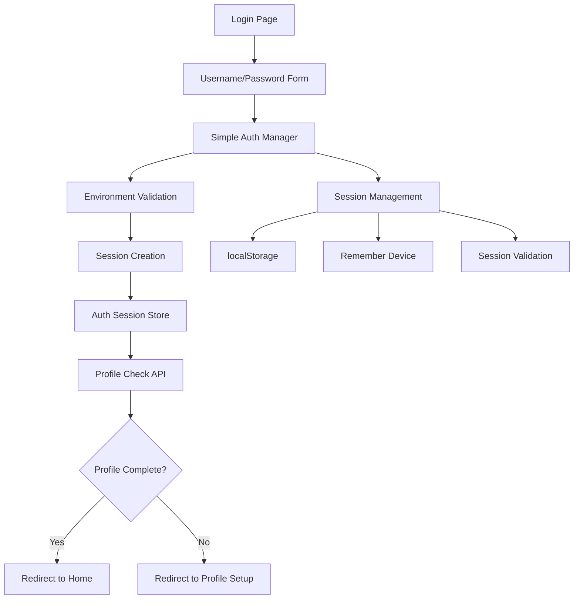
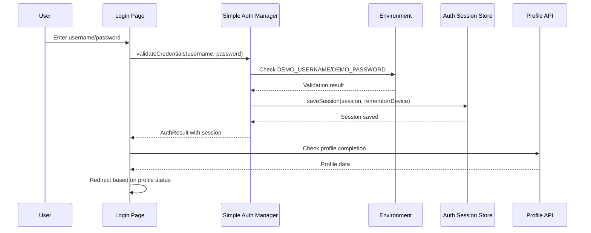
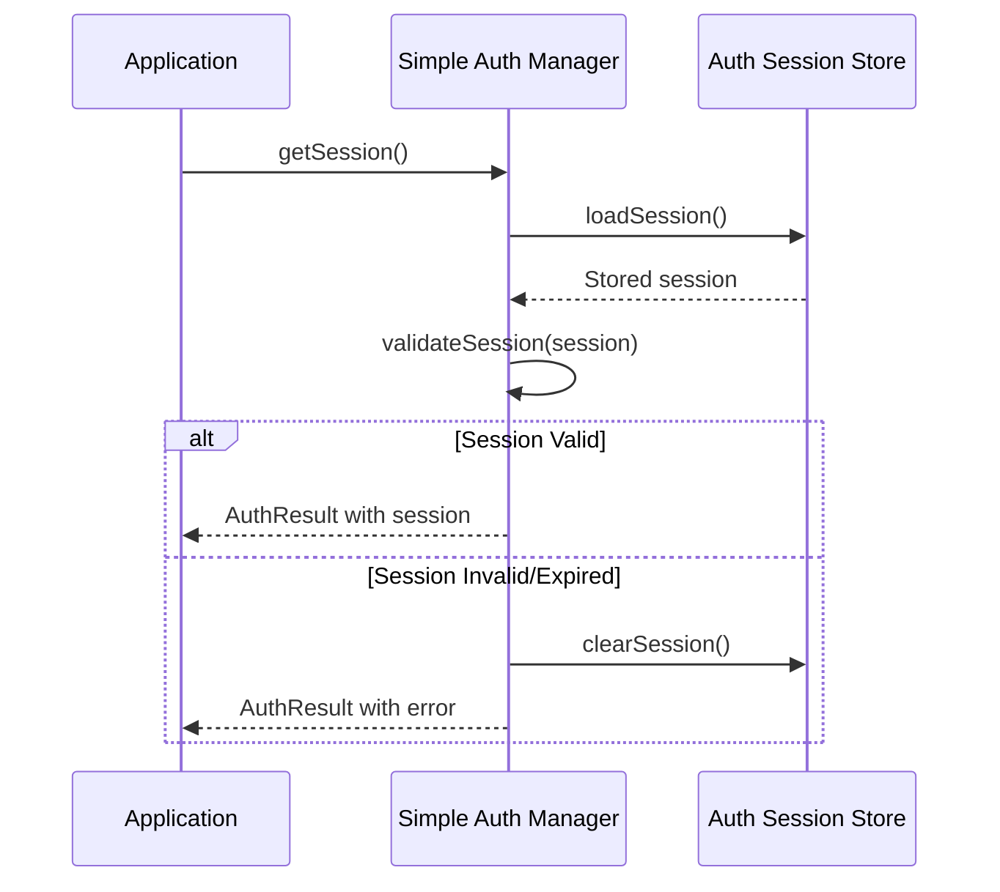

# Design Document: Simple Auth Replacement

## Overview

Replace the complex Twilio/OTP phone authentication system with a simple username/password authentication system for hackathon demo purposes. The current system uses phone number validation, OTP sending via Twilio, rate limiting, and session management with Supabase Auth, which is causing connectivity issues and is too complicated for demo scenarios. The new system will use demo credentials from environment variables (DEMO_USERNAME=admin, DEMO_PASSWORD=vyapar123) while maintaining the same session management and user flow patterns.

The replacement will keep the same UI components structure but replace phone/OTP inputs with username/password inputs, maintain the same session management (localStorage, remember device), and preserve the same redirect logic (profile check → setup or home).

## Architecture



## Sequence Diagrams

### Login Flow


### Session Validation Flow


## Components and Interfaces

### Component 1: Simple Auth Manager

**Purpose**: Handle username/password authentication using demo credentials from environment variables

**Interface**:
```typescript
interface SimpleAuthManager {
  validateCredentials(username: string, password: string, rememberDevice?: boolean): Promise<AuthResult>
  getSession(): Promise<AuthResult>
  logout(): Promise<OTPResult>
  isAuthenticated(): boolean
  getCurrentUser(): User | null
}
```

**Responsibilities**:
- Validate credentials against environment variables
- Create demo sessions with proper structure
- Maintain session lifecycle management
- Provide authentication state checking

### Component 2: Username/Password Input Form

**Purpose**: Replace PhoneInput and OTPInput with simple credential form

**Interface**:
```typescript
interface CredentialsInputProps {
  onSubmit: (username: string, password: string) => void
  loading: boolean
  error?: string
  language: Language
}
```

**Responsibilities**:
- Collect username and password input
- Validate input format and requirements
- Handle form submission and loading states
- Display localized error messages

### Component 3: Auth Session Store (Existing)

**Purpose**: Maintain existing session storage functionality

**Interface**:
```typescript
interface AuthSessionStore {
  saveSession(session: Session, rememberDevice: boolean): void
  loadSession(): Session | null
  clearSession(): void
  isSessionValid(session: Session | null): boolean
  shouldRememberDevice(): boolean
}
```

**Responsibilities**:
- Store sessions in localStorage with device preference
- Validate session expiry and structure
- Clear sessions on logout or expiry
- Maintain remember device functionality

## Data Models

### AuthResult Model

```typescript
interface AuthResult {
  success: boolean
  session?: Session
  user?: User
  error?: string
  isFirstLogin?: boolean
}
```

**Validation Rules**:
- success must be boolean
- session required when success is true
- error required when success is false
- isFirstLogin optional, defaults to false

### Session Model (Existing)

```typescript
interface Session {
  accessToken: string
  refreshToken: string
  expiresAt: number // Unix timestamp
  user: User
}
```

**Validation Rules**:
- accessToken must be non-empty string
- refreshToken must be non-empty string
- expiresAt must be future timestamp
- user must be valid User object

### User Model (Existing)

```typescript
interface User {
  id: string
  phoneNumber: string // Keep for compatibility
  createdAt: string
}
```

**Validation Rules**:
- id must be unique string
- phoneNumber kept for backward compatibility
- createdAt must be valid ISO date string

### Credentials Model

```typescript
interface Credentials {
  username: string
  password: string
}
```

**Validation Rules**:
- username must be non-empty string
- password must be non-empty string
- Both fields required for authentication

## Error Handling

### Error Scenario 1: Invalid Credentials

**Condition**: Username or password doesn't match environment variables
**Response**: Return AuthResult with success: false and localized error message
**Recovery**: Allow user to retry with correct credentials

### Error Scenario 2: Missing Environment Variables

**Condition**: DEMO_USERNAME or DEMO_PASSWORD not set in environment
**Response**: Log error and return generic authentication failure message
**Recovery**: Check environment configuration and restart application

### Error Scenario 3: Session Storage Failure

**Condition**: localStorage unavailable or quota exceeded
**Response**: Log warning and continue without persistent session
**Recovery**: Use in-memory session for current browser session

### Error Scenario 4: Profile API Failure

**Condition**: Profile check API returns error or is unreachable
**Response**: Log error and redirect to profile setup as fallback
**Recovery**: User can complete profile setup to continue

## Testing Strategy

### Unit Testing Approach

Test individual components in isolation:
- Simple Auth Manager credential validation logic
- Session creation and validation functions
- Username/Password input form validation
- Error handling for various failure scenarios

**Key Test Cases**:
- Valid credentials authentication
- Invalid credentials rejection
- Session creation with correct structure
- Session expiry validation
- Environment variable handling

**Coverage Goals**: 90% code coverage for authentication logic

### Property-Based Testing Approach

**Property Test Library**: fast-check (for TypeScript/JavaScript)

**Properties to Test**:
- Session tokens are always unique across multiple authentications
- Session expiry times are always in the future when created
- Invalid credentials always result in authentication failure
- Valid sessions always pass validation until expiry

### Integration Testing Approach

Test complete authentication flow:
- Login page form submission to session creation
- Session persistence across browser refreshes
- Profile check integration after authentication
- Logout functionality clearing all session data

**Test Environment**: Use test environment variables for credentials

## Performance Considerations

**Session Storage**: Use localStorage for persistence with minimal overhead
**Credential Validation**: Simple string comparison with O(1) complexity
**Memory Usage**: Minimal in-memory state, rely on localStorage for persistence
**Network Requests**: Eliminate external OTP/SMS API calls for faster authentication

## Security Considerations

**Demo Environment**: This is designed for hackathon/demo purposes only
**Credential Storage**: Demo credentials in environment variables (not production-ready)
**Session Security**: Maintain existing session token structure for compatibility
**Input Validation**: Basic validation to prevent injection attacks
**Rate Limiting**: Remove complex rate limiting for demo simplicity

**Security Notes**:
- Not suitable for production use
- Demo credentials are not encrypted
- No password complexity requirements
- No account lockout mechanisms

## Dependencies

**Existing Dependencies** (to maintain):
- React and Next.js for UI components
- localStorage for session persistence
- Existing translation system for localization
- Existing session store implementation

**Dependencies to Remove**:
- Twilio SDK and configuration
- Supabase Auth phone provider
- OTP generation and validation logic
- Rate limiting and cooldown mechanisms

**New Dependencies**: None required - uses existing React/TypeScript stack