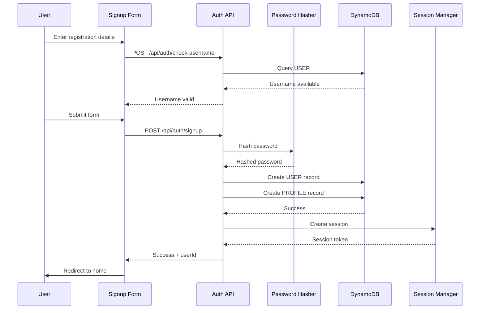

# Design Document: User Registration System

## Overview

This design document specifies the technical implementation for a user registration system in Vyapar AI. The system replaces the current demo-only authentication (hardcoded admin/vyapar123) with a full-featured signup and login flow using username/password authentication, bcrypt password hashing, and DynamoDB for data persistence.

The registration system provides:
- User account creation with business profile information
- Secure password storage using bcrypt hashing
- Username uniqueness validation
- Multi-language support (English, Hindi, Marathi)
- Session management with device persistence
- Rate limiting and security controls
- Seamless integration with existing DynamoDB infrastructure

This implementation follows AWS best practices for security and leverages the existing single-table DynamoDB design pattern already established in the codebase.

## Architecture

### System Components

```mermaid
graph TB
    subgraph "Client Layer"
        A[Login Page] --> B[Signup Form]
        A --> C[Login Form]
        B --> D[Username Validator]
        C --> E[Password Input]
    end
    
    subgraph "API Layer"
        F[/api/auth/signup] --> G[Input Sanitizer]
        H[/api/auth/login] --> G
        I[/api/auth/check-username] --> G
        G --> J[Password Hasher]
        G --> K[Username Validator]
    end
    
    subgraph "Data Layer"
        L[DynamoDB Service] --> M[(User Store)]
        L --> N[(Profile Store)]
        M --> O[PK: USER#username]
        N --> P[PK: PROFILE#userId]
    end
    
    subgraph "Session Layer"
        Q[Session Manager] --> R[localStorage]
        Q --> S[Auth Session Store]
    end
    
    B --> F
    C --> H
    D --> I
    F --> L
    H --> L
    J --> L
    H --> Q
    F --> Q
    
    style A fill:#e1f5ff
    style F fill:#fff4e1
    style L fill:#e8f5e9
    style Q fill:#f3e5f5
```

### Authentication Flow



### Data Flow Architecture

The system follows a layered architecture:

1. **Presentation Layer**: React components for signup/login forms
2. **API Layer**: Next.js API routes for authentication endpoints
3. **Business Logic Layer**: Password hashing, validation, sanitization
4. **Data Access Layer**: DynamoDB service for CRUD operations
5. **Session Layer**: localStorage-based session management

## Components and Interfaces

### 1. Signup Form Component

**Location**: `components/auth/SignupForm.tsx`

**Purpose**: Collects user registration information with real-time validation

**Props Interface**:
```typescript
interface SignupFormProps {
  onSubmit: (data: SignupData) => Promise<void>;
  loading: boolean;
  error: string;
  language: Language;
}

interface SignupData {
  username: string;
  password: string;
  confirmPassword: string;
  shopName: string;
  ownerName: string;
  businessType: BusinessType;
  city: string;
  phoneNumber?: string;
  language: Language;
}

type BusinessType = 'retail' | 'wholesale' | 'services' | 'manufacturing' | 'restaurant' | 'other';
```

**Key Features**:
- Real-time username availability checking (debounced 500ms)
- Client-side password strength validation
- Password match validation
- Field-level error display
- Multi-language labels and error messages
- Accessible form controls with ARIA labels

**Validation Rules**:
- Username: 3-20 characters, alphanumeric + underscore only
- Password: Minimum 8 characters, 1 uppercase, 1 lowercase, 1 number
- Shop name: 1-100 characters
- Owner name: 1-100 characters
- City: 1-100 characters
- Phone: Optional, international format if provided

### 2. Login Form Component

**Location**: `components/auth/LoginForm.tsx`

**Purpose**: Authenticates existing users

**Props Interface**:
```typescript
interface LoginFormProps {
  onSubmit: (username: string, password: string) => Promise<void>;
  loading: boolean;
  error: string;
  language: Language;
}
```

**Key Features**:
- Simple username/password input
- Remember device checkbox
- Error message display
- Loading state indication

### 3. Login Page with Mode Toggle

**Location**: `app/login/page.tsx`

**Purpose**: Unified authentication page with signup/login toggle

**State Management**:
```typescript
type AuthMode = 'signin' | 'signup';

interface LoginPageState {
  mode: AuthMode;
  loading: boolean;
  error: string;
  language: Language;
  rememberDevice: boolean;
}
```

**Key Features**:
- Toggle between Sign In and Sign Up modes
- Smooth transitions between modes
- Form data clears on mode switch
- Language selector
- Remember device preference

### 4. Username Validator Service

**Location**: `lib/username-validator.ts`

**Purpose**: Validates username format and checks uniqueness

**Interface**:
```typescript
interface UsernameValidationResult {
  valid: boolean;
  error?: string;
  available?: boolean;
}

class UsernameValidator {
  static validateFormat(username: string): UsernameValidationResult;
  static checkAvailability(username: string): Promise<UsernameValidationResult>;
  static sanitize(username: string): string;
}
```

**Validation Logic**:
- Format: `/^[a-zA-Z0-9_]{3,20}$/`
- Case-insensitive uniqueness check
- Sanitization: trim whitespace, lowercase conversion

### 5. Password Hasher Service

**Location**: `lib/password-hasher.ts`

**Purpose**: Handles password hashing and verification using bcrypt

**Interface**:
```typescript
interface PasswordHashResult {
  success: boolean;
  hash?: string;
  error?: string;
}

interface PasswordVerifyResult {
  success: boolean;
  match: boolean;
  error?: string;
}

class PasswordHasher {
  static async hash(password: string): Promise<PasswordHashResult>;
  static async verify(password: string, hash: string): Promise<PasswordVerifyResult>;
  static validateStrength(password: string): { valid: boolean; errors: string[] };
}
```

**Implementation Details**:
- Library: `bcryptjs` (pure JavaScript, no native dependencies)
- Salt rounds: 10 (balances security and performance)
- Strength validation: min 8 chars, 1 uppercase, 1 lowercase, 1 number
- Async operations to prevent blocking

### 6. Auth API Endpoints

#### POST /api/auth/signup

**Purpose**: Creates new user account and profile

**Request Body**:
```typescript
interface SignupRequest {
  username: string;
  password: string;
  shopName: string;
  ownerName: string;
  businessType: BusinessType;
  city: string;
  phoneNumber?: string;
  language: Language;
}
```

**Response**:
```typescript
interface SignupResponse {
  success: boolean;
  userId?: string;
  error?: string;
}
```

**Processing Steps**:
1. Rate limit check (5 per IP per hour)
2. Input sanitization (strip HTML, trim whitespace)
3. Username format validation
4. Username uniqueness check (case-insensitive)
5. Password strength validation
6. Password hashing (bcrypt, 10 rounds)
7. Generate unique userId (UUID v4)
8. Create USER record in DynamoDB
9. Create PROFILE record in DynamoDB
10. Create authenticated session
11. Return success with userId

**Error Responses**:
- 400: Invalid input, username taken, weak password
- 429: Rate limit exceeded
- 500: Server error (DynamoDB failure, hashing error)

#### POST /api/auth/login

**Purpose**: Authenticates existing user

**Request Body**:
```typescript
interface LoginRequest {
  username: string;
  password: string;
  rememberDevice: boolean;
}
```

**Response**:
```typescript
interface LoginResponse {
  success: boolean;
  user?: {
    id: string;
    username: string;
  };
  error?: string;
}
```

**Processing Steps**:
1. Input sanitization
2. Query USER record by username (case-insensitive)
3. Verify password hash using bcrypt
4. Create authenticated session
5. Return success with user data

**Error Responses**:
- 400: Invalid credentials
- 429: Rate limit exceeded
- 500: Server error

#### GET /api/auth/check-username

**Purpose**: Checks username availability

**Query Parameters**:
```typescript
interface CheckUsernameQuery {
  username: string;
}
```

**Response**:
```typescript
interface CheckUsernameResponse {
  available: boolean;
  valid: boolean;
  error?: string;
}
```

**Processing Steps**:
1. Rate limit check (20 per IP per minute)
2. Format validation
3. Case-insensitive uniqueness check
4. Return availability status

**Performance Target**: < 500ms response time

### 7. Input Sanitizer

**Location**: `lib/input-sanitizer.ts`

**Purpose**: Sanitizes user input to prevent injection attacks

**Interface**:
```typescript
class InputSanitizer {
  static sanitizeText(input: string): string;
  static sanitizeUsername(input: string): string;
  static sanitizePhoneNumber(input: string): string;
  static stripHtml(input: string): string;
  static detectSqlKeywords(input: string): boolean;
}
```

**Sanitization Rules**:
- Strip HTML tags using regex
- Trim whitespace
- Reject SQL keywords in unexpected fields
- Escape special characters for HTML rendering
- Normalize Unicode characters

### 8. Session Manager

**Location**: `lib/session-manager.ts`

**Purpose**: Manages authenticated user sessions

**Interface**:
```typescript
interface UserSession {
  userId: string;
  username: string;
  expiresAt: number;
  rememberDevice: boolean;
}

class SessionManager {
  static createSession(userId: string, username: string, rememberDevice: boolean): UserSession;
  static saveSession(session: UserSession): void;
  static loadSession(): UserSession | null;
  static clearSession(): void;
  static isSessionValid(session: UserSession | null): boolean;
  static getSessionDuration(rememberDevice: boolean): number;
}
```

**Session Duration**:
- Default: 7 days
- Remember device: 30 days
- Storage: localStorage

### 9. Rate Limiter

**Location**: `lib/rate-limiter.ts`

**Purpose**: Prevents abuse of authentication endpoints

**Interface**:
```typescript
interface RateLimitConfig {
  maxAttempts: number;
  windowMs: number;
}

interface RateLimitResult {
  allowed: boolean;
  remaining: number;
  resetAt: number;
}

class RateLimiter {
  static check(key: string, config: RateLimitConfig): RateLimitResult;
  static reset(key: string): void;
}
```

**Rate Limits**:
- Signup: 5 attempts per IP per hour
- Login: 10 attempts per IP per 15 minutes
- Username check: 20 attempts per IP per minute

**Implementation**: In-memory Map with automatic cleanup

## Data Models

### DynamoDB Table Schema

The system uses the existing single-table design pattern with the following entity types:

#### USER Entity

**Purpose**: Stores user authentication credentials

**Primary Key**:
- PK: `USER#<username>` (lowercase)
- SK: `METADATA`

**Attributes**:
```typescript
interface UserRecord {
  PK: string;                    // USER#username
  SK: string;                    // METADATA
  entityType: 'USER';
  userId: string;                // UUID v4
  username: string;              // Original case
  passwordHash: string;          // bcrypt hash
  createdAt: string;             // ISO 8601
  updatedAt: string;             // ISO 8601
  lastLoginAt?: string;          // ISO 8601
  loginCount: number;            // Total login count
}
```

**GSI1** (for userId lookup):
- GSI1PK: `USER#<userId>`
- GSI1SK: `METADATA`

**Example**:
```json
{
  "PK": "USER#johndoe",
  "SK": "METADATA",
  "entityType": "USER",
  "userId": "550e8400-e29b-41d4-a716-446655440000",
  "username": "JohnDoe",
  "passwordHash": "$2a$10$N9qo8uLOickgx2ZMRZoMyeIjZAgcfl7p92ldGxad68LJZdL17lhWy",
  "createdAt": "2024-01-15T10:30:00.000Z",
  "updatedAt": "2024-01-15T10:30:00.000Z",
  "loginCount": 0
}
```

#### PROFILE Entity

**Purpose**: Stores user business profile information

**Primary Key**:
- PK: `PROFILE#<userId>`
- SK: `METADATA`

**Attributes**:
```typescript
interface ProfileRecord {
  PK: string;                    // PROFILE#userId
  SK: string;                    // METADATA
  entityType: 'PROFILE';
  userId: string;                // Links to USER
  shopName: string;              // Business name
  ownerName: string;             // Owner's name
  businessType: BusinessType;    // Business category
  city: string;                  // Location
  phoneNumber?: string;          // Optional contact
  language: Language;            // UI language preference
  createdAt: string;             // ISO 8601
  updatedAt: string;             // ISO 8601
}
```

**Example**:
```json
{
  "PK": "PROFILE#550e8400-e29b-41d4-a716-446655440000",
  "SK": "METADATA",
  "entityType": "PROFILE",
  "userId": "550e8400-e29b-41d4-a716-446655440000",
  "shopName": "John's Electronics",
  "ownerName": "John Doe",
  "businessType": "retail",
  "city": "Mumbai",
  "phoneNumber": "+919876543210",
  "language": "en",
  "createdAt": "2024-01-15T10:30:00.000Z",
  "updatedAt": "2024-01-15T10:30:00.000Z"
}
```

### Access Patterns

1. **Check username availability**: Query by PK=`USER#<username>`, SK=`METADATA`
2. **Create user**: PutItem with USER and PROFILE records
3. **Authenticate user**: Query by PK=`USER#<username>`, verify password
4. **Get user profile**: Query by PK=`PROFILE#<userId>`, SK=`METADATA`
5. **Update profile**: UpdateItem on PROFILE record
6. **Get user by userId**: Query GSI1 with GSI1PK=`USER#<userId>`

### Data Consistency

- **Username uniqueness**: Enforced by DynamoDB primary key constraint
- **Case-insensitive usernames**: Store PK as lowercase, preserve original in attribute
- **Atomic operations**: Use PutItem with ConditionExpression for username uniqueness
- **Transaction support**: Use TransactWriteItems for USER + PROFILE creation

## Correctness Properties

*A property is a characteristic or behavior that should hold true across all valid executions of a system—essentially, a formal statement about what the system should do. Properties serve as the bridge between human-readable specifications and machine-verifiable correctness guarantees.*


### Property 1: Username Format Validation

*For any* string input, the username validator should accept it if and only if it contains only alphanumeric characters and underscores AND is between 3 and 20 characters in length.

**Validates: Requirements 2.1, 2.2**

### Property 2: Username Case-Insensitive Uniqueness

*For any* two usernames that differ only in case (e.g., "JohnDoe" and "johndoe"), the system should treat them as the same username and reject the second registration attempt.

**Validates: Requirements 2.3**

### Property 3: Username Validation Idempotence

*For any* username string, validating the format multiple times should produce the same validation result each time (validation is idempotent).

**Validates: Requirements 2.6**

### Property 4: Password Strength Validation

*For any* password string, the password validator should accept it if and only if it is at least 8 characters long AND contains at least one uppercase letter AND at least one lowercase letter AND at least one number.

**Validates: Requirements 3.1, 3.2**

### Property 5: Password Hashing Before Storage

*For any* valid password submitted during signup, the stored value in DynamoDB should be a bcrypt hash (starting with "$2a$" or "$2b$") and should never equal the plain text password.

**Validates: Requirements 3.3**

### Property 6: Password Verification Correctness

*For any* valid password, hashing it then verifying with the same password should return true (the hash/verify round-trip preserves correctness).

**Validates: Requirements 11.5**

### Property 7: Password Verification Security

*For any* valid password, hashing it then verifying with a different password should return false (the hash function provides security).

**Validates: Requirements 11.6**

### Property 8: Bcrypt Salt Rounds Configuration

*For any* password hash generated by the system, the hash string should indicate 10 salt rounds (format: "$2a$10$" or "$2b$10$").

**Validates: Requirements 11.2**


### Property 9: DynamoDB Key Format for USER Records

*For any* user account created, the USER record in DynamoDB should have PK in the format "USER#<username>" (lowercase) and SK equal to "METADATA".

**Validates: Requirements 4.1**

### Property 10: DynamoDB Key Format for PROFILE Records

*For any* user account created, the PROFILE record in DynamoDB should have PK in the format "PROFILE#<userId>" and SK equal to "METADATA".

**Validates: Requirements 4.2**

### Property 11: Unique UserId Generation

*For any* two user accounts created, they should have different userId values (userId generation produces unique identifiers).

**Validates: Requirements 4.3**

### Property 12: User-Profile Referential Integrity

*For any* user account created, the userId field in the USER record should equal the userId field in the corresponding PROFILE record.

**Validates: Requirements 4.4**

### Property 13: Required Fields in Data Stores

*For any* user account created, the USER record should contain username, passwordHash, userId, and createdAt fields, AND the PROFILE record should contain shopName, ownerName, businessType, city, language, and userId fields.

**Validates: Requirements 4.5, 4.6**

### Property 14: Signup Creates Both Records

*For any* valid signup request, the system should create both a USER record and a PROFILE record in DynamoDB, or neither (atomic operation).

**Validates: Requirements 5.4**

### Property 15: Login Verifies Credentials

*For any* login attempt with a username and password, the system should return success if and only if the username exists AND the password matches the stored hash.

**Validates: Requirements 5.5**


### Property 16: Session Creation After Signup

*For any* successful signup, the system should create a valid authenticated session with the new user's userId and username.

**Validates: Requirements 7.1**

### Property 17: Session Creation After Login

*For any* successful login, the system should create a valid authenticated session with the existing user's userId and username.

**Validates: Requirements 7.3**

### Property 18: Post-Login Navigation Based on Profile

*For any* successful login, if the user's profile has shopName and ownerName fields, redirect to home page; otherwise redirect to profile setup page.

**Validates: Requirements 7.4**

### Property 19: Form Mode Switching Clears Data

*For any* form state with input data, switching between Sign In and Sign Up modes should clear all form input fields.

**Validates: Requirements 6.5**

### Property 20: DynamoDB Error Handling

*For any* DynamoDB operation that fails, the Auth API should log the error details and return a generic error message to the client (no sensitive information leaked).

**Validates: Requirements 8.5**

### Property 21: Translation Engine Integration

*For any* error message displayed by the Registration System, it should be retrieved from the Translation Engine using the user's selected language.

**Validates: Requirements 8.6**

### Property 22: Multi-Language Label Display

*For any* language selection (English, Hindi, or Marathi), all form labels should be displayed in the selected language.

**Validates: Requirements 9.1**


### Property 23: Translation Completeness

*For any* registration-related text key used in the UI, the Translation Engine should have translations for English, Hindi, and Marathi.

**Validates: Requirements 9.4**

### Property 24: Language Preference Persistence

*For any* language selected during signup, that language preference should be stored in the PROFILE record in DynamoDB.

**Validates: Requirements 9.5**

### Property 25: Rate Limiting Enforcement

*For any* IP address, if signup attempts exceed 5 per hour OR username check requests exceed 20 per minute, the system should return HTTP 429 status code.

**Validates: Requirements 10.1, 10.2**

### Property 26: Input Sanitization

*For any* user input containing HTML tags or SQL keywords, the system should sanitize it by stripping HTML tags and rejecting SQL keywords before processing or storage.

**Validates: Requirements 10.3, 10.4, 12.5, 12.6**

### Property 27: Failed Login Attempt Logging

*For any* failed authentication attempt, the system should log the event with timestamp and IP address.

**Validates: Requirements 10.6**

### Property 28: Text Field Length Validation

*For any* text input field (shopName, ownerName, city), the validator should accept values between 1 and 100 characters in length.

**Validates: Requirements 12.1, 12.2, 12.3**

### Property 29: Phone Number Format Validation

*For any* phone number provided (optional field), if non-empty, it should match international phone format (E.164 format with country code).

**Validates: Requirements 12.4**


### Property 30: Validation Error Specificity

*For any* signup form submission with validation errors, the error response should identify which specific fields failed validation.

**Validates: Requirements 12.7**

### Property 31: Required Field Validation

*For any* signup form submission, if any required field (username, password, shopName, ownerName, businessType, city, language) is empty, the system should reject the submission with a validation error.

**Validates: Requirements 1.2**

## Error Handling

### Error Categories

The system handles four categories of errors:

1. **Validation Errors** (HTTP 400)
   - Invalid username format
   - Weak password
   - Password mismatch
   - Missing required fields
   - Invalid field lengths
   - Invalid phone format

2. **Conflict Errors** (HTTP 409)
   - Username already taken
   - Duplicate account creation attempt

3. **Rate Limit Errors** (HTTP 429)
   - Too many signup attempts
   - Too many username checks
   - Includes Retry-After header

4. **Server Errors** (HTTP 500)
   - DynamoDB operation failures
   - Password hashing errors
   - Session creation failures

### Error Response Format

All API endpoints return errors in a consistent format:

```typescript
interface ErrorResponse {
  success: false;
  error: string;           // User-friendly message (translated)
  code: string;            // Error code for client handling
  field?: string;          // Specific field that failed (for validation)
  details?: string[];      // Additional error details (for validation)
}
```


### Error Handling Strategy

**Client-Side**:
- Display field-level errors inline with form inputs
- Show general errors in a banner at the top of the form
- Translate all error messages using Translation Engine
- Provide actionable guidance (e.g., "Username must be 3-20 characters")

**Server-Side**:
- Log all errors with context (timestamp, IP, user input)
- Never expose sensitive information in error messages
- Return generic messages for server errors
- Include error codes for client-side handling
- Sanitize all error messages before sending to client

**DynamoDB Error Handling**:
- Catch ConditionalCheckFailedException for duplicate usernames
- Retry transient errors with exponential backoff
- Log detailed error information for debugging
- Return generic "Service temporarily unavailable" to client

**Password Hashing Error Handling**:
- Catch bcrypt errors during hashing/verification
- Log error details for investigation
- Return generic "Authentication failed" to client
- Never expose hash details or bcrypt errors

### Logging Strategy

All authentication events are logged with the following information:

```typescript
interface AuthLogEntry {
  timestamp: string;        // ISO 8601
  event: string;            // 'signup', 'login', 'username_check'
  success: boolean;
  username?: string;        // Omit for failed attempts
  userId?: string;          // Only for successful operations
  ipAddress: string;
  userAgent: string;
  errorCode?: string;       // For failed attempts
  duration: number;         // Operation duration in ms
}
```

**Log Retention**: 90 days in CloudWatch Logs

## Testing Strategy

### Dual Testing Approach

The user registration system requires both unit tests and property-based tests for comprehensive coverage:

**Unit Tests** focus on:
- Specific examples and edge cases
- UI component rendering and interactions
- API endpoint responses for known inputs
- Error message display
- Integration between components

**Property-Based Tests** focus on:
- Universal properties that hold for all inputs
- Password hashing/verification correctness
- Username validation across random inputs
- Data integrity constraints
- Input sanitization effectiveness

Together, unit tests catch concrete bugs while property tests verify general correctness across the input space.


### Property-Based Testing Configuration

**Library Selection**: `fast-check` for TypeScript/JavaScript property-based testing

**Configuration**:
- Minimum 100 iterations per property test
- Seed-based reproducibility for failed tests
- Shrinking enabled to find minimal failing examples
- Timeout: 30 seconds per property test

**Test Tagging**: Each property test must reference its design document property:

```typescript
// Example test tag format
test('Property 6: Password Verification Correctness', async () => {
  // Feature: user-registration-system, Property 6: For any valid password, 
  // hashing then verifying with the same password should return true
  
  await fc.assert(
    fc.asyncProperty(fc.string({ minLength: 8 }), async (password) => {
      const hash = await PasswordHasher.hash(password);
      const result = await PasswordHasher.verify(password, hash.hash!);
      expect(result.match).toBe(true);
    }),
    { numRuns: 100 }
  );
});
```

### Unit Testing Strategy

**Test Coverage Requirements**:
- All API endpoints: 100% coverage
- Password hasher: 100% coverage
- Username validator: 100% coverage
- Input sanitizer: 100% coverage
- Session manager: 100% coverage

**Key Unit Test Cases**:

1. **Signup Form**:
   - Default language is English
   - Form clears on mode switch
   - Error messages display correctly
   - Real-time username validation triggers

2. **API Endpoints**:
   - `/api/auth/signup` creates both USER and PROFILE records
   - `/api/auth/login` returns user data on success
   - `/api/auth/check-username` responds within 500ms
   - Rate limiting returns 429 status

3. **Password Hasher**:
   - Hashes start with "$2a$10$" or "$2b$10$"
   - Same password produces different hashes (salt randomness)
   - Verification works with correct password
   - Verification fails with incorrect password

4. **Username Validator**:
   - Accepts valid usernames
   - Rejects usernames with special characters
   - Rejects usernames too short or too long
   - Case-insensitive uniqueness check works

5. **Input Sanitizer**:
   - Strips HTML tags: `<script>alert('xss')</script>` → `alert('xss')`
   - Rejects SQL keywords: `SELECT * FROM users` → rejected
   - Preserves valid input unchanged


### Property-Based Test Cases

Each correctness property should be implemented as a property-based test:

**Property 1: Username Format Validation**
```typescript
fc.assert(
  fc.property(fc.string(), (username) => {
    const result = UsernameValidator.validateFormat(username);
    const isValid = /^[a-zA-Z0-9_]{3,20}$/.test(username);
    expect(result.valid).toBe(isValid);
  }),
  { numRuns: 100 }
);
```

**Property 6: Password Verification Correctness**
```typescript
fc.assert(
  fc.asyncProperty(
    fc.string({ minLength: 8, maxLength: 100 }),
    async (password) => {
      const hash = await PasswordHasher.hash(password);
      const result = await PasswordHasher.verify(password, hash.hash!);
      expect(result.match).toBe(true);
    }
  ),
  { numRuns: 100 }
);
```

**Property 7: Password Verification Security**
```typescript
fc.assert(
  fc.asyncProperty(
    fc.string({ minLength: 8, maxLength: 100 }),
    fc.string({ minLength: 8, maxLength: 100 }),
    async (password1, password2) => {
      fc.pre(password1 !== password2); // Only test different passwords
      const hash = await PasswordHasher.hash(password1);
      const result = await PasswordHasher.verify(password2, hash.hash!);
      expect(result.match).toBe(false);
    }
  ),
  { numRuns: 100 }
);
```

**Property 11: Unique UserId Generation**
```typescript
fc.assert(
  fc.asyncProperty(
    fc.array(fc.record({
      username: fc.string({ minLength: 3, maxLength: 20 }),
      password: fc.string({ minLength: 8 })
    }), { minLength: 2, maxLength: 10 }),
    async (users) => {
      const userIds = await Promise.all(
        users.map(u => createUser(u.username, u.password))
      );
      const uniqueIds = new Set(userIds);
      expect(uniqueIds.size).toBe(userIds.length);
    }
  ),
  { numRuns: 100 }
);
```

**Property 26: Input Sanitization**
```typescript
fc.assert(
  fc.property(
    fc.string(),
    (input) => {
      const sanitized = InputSanitizer.sanitizeText(input);
      expect(sanitized).not.toMatch(/<[^>]*>/); // No HTML tags
      expect(sanitized).not.toMatch(/SELECT|INSERT|UPDATE|DELETE/i); // No SQL
    }
  ),
  { numRuns: 100 }
);
```

### Integration Testing

**Test Scenarios**:

1. **Complete Signup Flow**:
   - User fills signup form → API creates records → Session created → Redirect to home

2. **Complete Login Flow**:
   - User enters credentials → API verifies → Session created → Redirect based on profile

3. **Username Availability Check**:
   - User types username → Debounced API call → Real-time feedback displayed

4. **Multi-Language Support**:
   - User selects language → All labels update → Error messages in selected language

5. **Rate Limiting**:
   - Multiple rapid requests → Rate limit triggered → 429 response with retry-after

6. **Data Migration Integration**:
   - User logs in → Migration check → Device data migrated → Redirect to home

### Test Environment Setup

**DynamoDB Local**:
- Use DynamoDB Local for testing
- Reset table between tests
- Seed test data for login tests

**Mock Services**:
- Mock Translation Engine for consistent test results
- Mock rate limiter for deterministic testing
- Mock session storage for isolated tests

**Test Data Generators**:
- Valid usernames: alphanumeric + underscore, 3-20 chars
- Valid passwords: 8+ chars with uppercase, lowercase, number
- Valid business types: enum values
- Valid languages: 'en', 'hi', 'mr'

## Security Considerations

### Password Security

1. **Hashing Algorithm**: bcrypt with 10 salt rounds
   - Industry-standard for password hashing
   - Adaptive cost factor (can increase over time)
   - Built-in salt generation

2. **Password Storage**:
   - Never log passwords (plain or hashed)
   - Never return passwords in API responses
   - Store only bcrypt hashes in DynamoDB

3. **Password Transmission**:
   - HTTPS required for all authentication endpoints
   - Passwords never in URL parameters
   - Passwords only in request body

### Input Validation and Sanitization

1. **Client-Side Validation**:
   - Provides immediate feedback
   - Reduces unnecessary API calls
   - NOT relied upon for security

2. **Server-Side Validation**:
   - All inputs validated on server
   - Sanitization before processing
   - Rejection of malicious patterns

3. **SQL Injection Prevention**:
   - DynamoDB uses parameterized queries (SDK handles escaping)
   - Additional check for SQL keywords in text fields
   - Reject suspicious patterns

4. **XSS Prevention**:
   - Strip HTML tags from all text inputs
   - Escape output when rendering user data
   - Content Security Policy headers


### Rate Limiting

1. **Implementation**:
   - In-memory Map with IP address as key
   - Automatic cleanup of expired entries
   - Sliding window algorithm

2. **Limits**:
   - Signup: 5 per IP per hour
   - Login: 10 per IP per 15 minutes
   - Username check: 20 per IP per minute

3. **Response**:
   - HTTP 429 status code
   - Retry-After header with seconds
   - Clear error message

### Session Security

1. **Session Storage**:
   - localStorage (client-side only)
   - No server-side session store
   - Session data includes userId, username, expiresAt

2. **Session Duration**:
   - Default: 7 days
   - Remember device: 30 days
   - Automatic expiration

3. **Session Validation**:
   - Check expiration on each request
   - Refresh if expiring within 5 minutes
   - Clear expired sessions automatically

### Data Privacy

1. **PII Handling**:
   - Phone numbers are optional
   - No email addresses collected
   - Minimal data collection

2. **Data Retention**:
   - User accounts: indefinite (until user deletes)
   - Daily entries: 90 days (TTL)
   - Credit records: 30 days after paid (TTL)

3. **Logging**:
   - No passwords in logs
   - IP addresses logged for security
   - CloudWatch Logs retention: 90 days

## Performance Considerations

### Response Time Targets

- Username availability check: < 500ms
- Signup: < 2 seconds
- Login: < 1 second
- Password hashing: < 2 seconds

### Optimization Strategies

1. **Username Validation**:
   - Debounce client-side checks (500ms)
   - Cache recent checks (5 minutes)
   - Use DynamoDB GetItem (fast single-item lookup)

2. **Password Hashing**:
   - Async operations (non-blocking)
   - 10 salt rounds (balance security/performance)
   - Consider worker threads for high load

3. **DynamoDB Queries**:
   - Use GetItem for single-record lookups
   - Avoid Scan operations
   - Leverage primary key for fast access
   - Use GSI for userId lookups

4. **Client-Side**:
   - Debounce username checks
   - Client-side validation before API calls
   - Loading states for better UX
   - Optimistic UI updates where safe

### Scalability

1. **DynamoDB**:
   - On-demand billing mode (auto-scaling)
   - Single-table design (efficient queries)
   - GSI for alternative access patterns

2. **Rate Limiting**:
   - In-memory for single-instance deployments
   - Consider Redis for multi-instance (future)

3. **Session Management**:
   - Client-side storage (no server load)
   - No session database required
   - Stateless API design

## Migration from Current System

### Current State

The application currently uses hardcoded credentials:
- Username: "admin"
- Password: "vyapar123"
- No database storage
- Simple validation in `lib/simple-auth-manager.ts`

### Migration Strategy

1. **Phase 1: Implement New System**
   - Create all new components and APIs
   - Keep existing auth system functional
   - Test new system in parallel

2. **Phase 2: Create Admin Account**
   - Run migration script to create admin account in DynamoDB
   - Hash "vyapar123" password with bcrypt
   - Create profile for admin user

3. **Phase 3: Switch Authentication**
   - Update login page to use new system
   - Remove hardcoded credentials
   - Update auth checks to use session manager

4. **Phase 4: Cleanup**
   - Remove `lib/simple-auth-manager.ts`
   - Remove old auth components
   - Update all auth-related imports

### Migration Script

```typescript
// scripts/migrate-admin-account.ts
import { PasswordHasher } from '@/lib/password-hasher';
import { DynamoDBService, ProfileService } from '@/lib/dynamodb-client';
import { v4 as uuidv4 } from 'uuid';

async function migrateAdminAccount() {
  const userId = uuidv4();
  const username = 'admin';
  const password = 'vyapar123';
  
  // Hash password
  const hashResult = await PasswordHasher.hash(password);
  
  // Create USER record
  await DynamoDBService.putItem({
    PK: `USER#${username.toLowerCase()}`,
    SK: 'METADATA',
    entityType: 'USER',
    userId,
    username,
    passwordHash: hashResult.hash,
    createdAt: new Date().toISOString(),
    loginCount: 0,
  });
  
  // Create PROFILE record
  await ProfileService.saveProfile({
    userId,
    shopName: 'Admin Shop',
    userName: 'Administrator',
    businessType: 'other',
    city: 'Mumbai',
    language: 'en',
    createdAt: new Date().toISOString(),
    updatedAt: new Date().toISOString(),
  });
  
  console.log('Admin account migrated successfully');
}
```

### Backward Compatibility

During migration:
- Existing localStorage data preserved
- Device data migration still works
- No disruption to existing users
- Gradual rollout possible

## Dependencies

### NPM Packages

```json
{
  "dependencies": {
    "bcryptjs": "^2.4.3",
    "uuid": "^9.0.0",
    "@aws-sdk/client-dynamodb": "^3.x",
    "@aws-sdk/lib-dynamodb": "^3.x"
  },
  "devDependencies": {
    "fast-check": "^3.x",
    "@types/bcryptjs": "^2.4.x",
    "@types/uuid": "^9.0.x"
  }
}
```

### AWS Services

- **DynamoDB**: User and profile storage
- **CloudWatch Logs**: Authentication event logging
- **EC2**: Application hosting

### Existing Systems

- Translation Engine (`lib/translations.ts`)
- Session Store (`lib/auth-session-store.ts`)
- DynamoDB Client (`lib/dynamodb-client.ts`)
- Data Migrator (`lib/data-migrator.ts`)

## Implementation Notes

### File Structure

```
app/
  api/
    auth/
      signup/
        route.ts          # POST /api/auth/signup
      login/
        route.ts          # POST /api/auth/login
      check-username/
        route.ts          # GET /api/auth/check-username
  login/
    page.tsx              # Login page with mode toggle

components/
  auth/
    SignupForm.tsx        # Signup form component
    LoginForm.tsx         # Login form component
    UsernameInput.tsx     # Username input with validation
    PasswordInput.tsx     # Password input with strength meter

lib/
  username-validator.ts   # Username validation logic
  password-hasher.ts      # Password hashing/verification
  input-sanitizer.ts      # Input sanitization
  session-manager.ts      # Session management
  rate-limiter.ts         # Rate limiting logic

__tests__/
  auth/
    signup.test.ts        # Unit tests for signup
    login.test.ts         # Unit tests for login
    username.property.test.ts    # Property tests for username
    password.property.test.ts    # Property tests for password
    integration.test.ts   # Integration tests
```

### Development Workflow

1. Implement core services (password hasher, validators)
2. Create API endpoints with full validation
3. Build UI components with real-time feedback
4. Write unit tests for all components
5. Write property-based tests for all properties
6. Integration testing with DynamoDB Local
7. Security review and penetration testing
8. Performance testing and optimization
9. Migration script and deployment

### Deployment Checklist

- [ ] All environment variables configured
- [ ] DynamoDB table created with GSI
- [ ] CloudWatch Logs configured
- [ ] HTTPS enabled on all endpoints
- [ ] Rate limiting tested and configured
- [ ] Admin account migrated
- [ ] All tests passing (unit + property + integration)
- [ ] Security review completed
- [ ] Performance benchmarks met
- [ ] Documentation updated
- [ ] Rollback plan prepared

## Conclusion

This design provides a comprehensive, secure, and scalable user registration system for Vyapar AI. The system leverages AWS DynamoDB for data persistence, bcrypt for password security, and follows best practices for authentication and authorization.

Key features:
- Secure password storage with bcrypt
- Username uniqueness with case-insensitive checking
- Multi-language support (English, Hindi, Marathi)
- Rate limiting to prevent abuse
- Comprehensive input validation and sanitization
- Property-based testing for correctness guarantees
- Seamless integration with existing infrastructure

The implementation follows the requirements-first workflow, with all 31 correctness properties derived from acceptance criteria and ready for property-based testing with fast-check.
