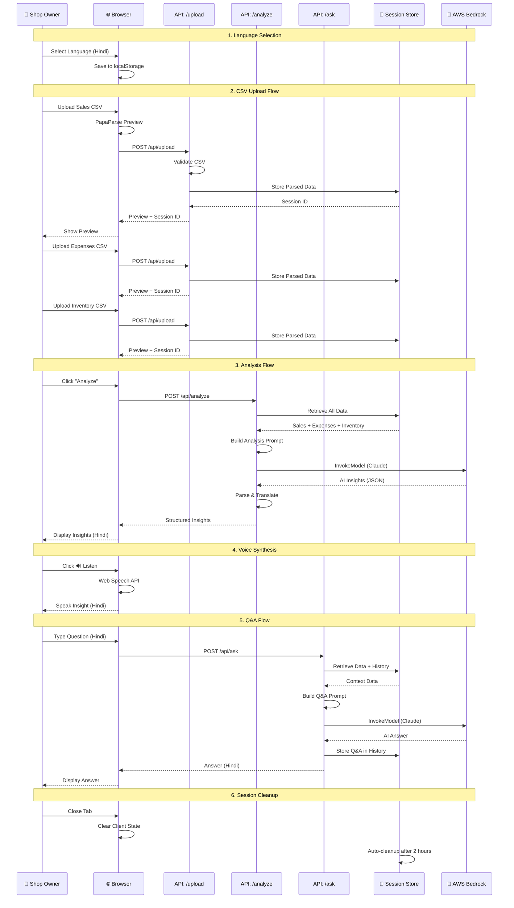
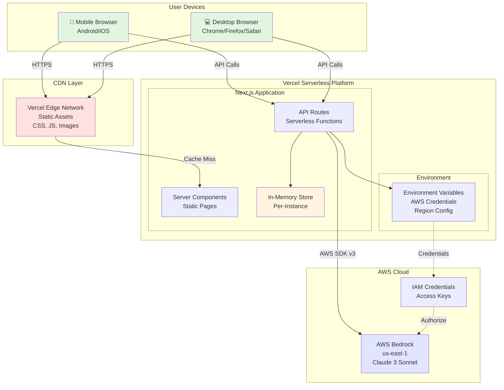
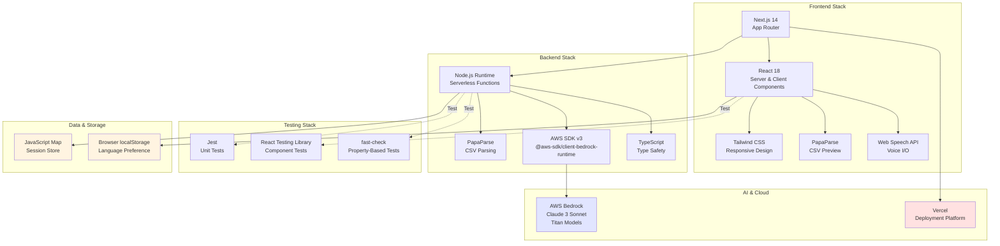
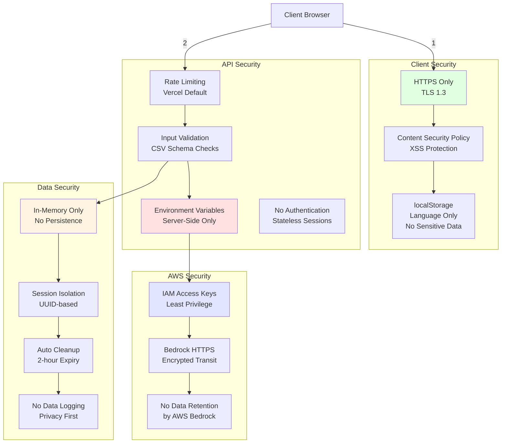
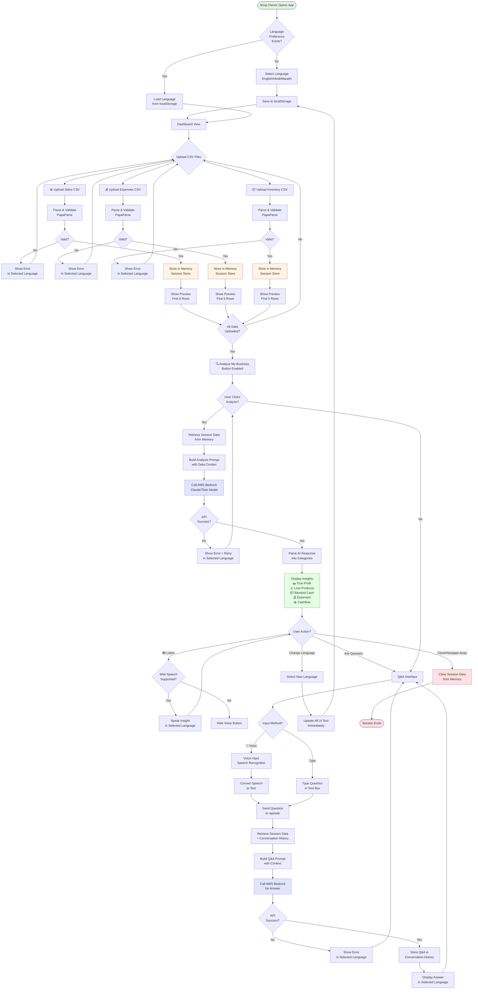
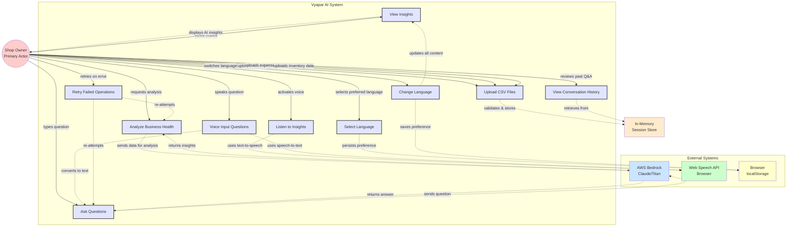

# Vyapar AI - Architecture & Process Flow Diagrams

## System Architecture Diagram

```mermaid
graph TB
    subgraph "Client Layer - Browser"
        subgraph "React Components"
            LP[Landing Page<br/>Server Component]
            LS[Language Selector<br/>Client Component]
            FU[File Upload<br/>Client Component]
            ID[Insights Display<br/>Client Component]
            QA[Q&A Chat<br/>Client Component]
            ER[Error Display<br/>Client Component]
        end
        
        subgraph "Client-Side Services"
            Papa1[PapaParse<br/>CSV Preview]
            WS1[Web Speech API<br/>Synthesis]
            WS2[Web Speech API<br/>Recognition]
            LS_Store[localStorage<br/>Language Preference]
        end
    end
    
    subgraph "Next.js 14 App Router - Server"
        subgraph "API Routes - app/api/"
            API1[POST /api/upload<br/>CSV Processing]
            API2[POST /api/analyze<br/>AI Analysis]
            API3[POST /api/ask<br/>Q&A Handler]
        end
        
        subgraph "Server-Side Utilities"
            Papa2[PapaParse<br/>Server Parser]
            Validator[CSV Validator<br/>Type Guards]
            Translator[Translation Service<br/>en/hi/mr]
            Formatter[Currency Formatter<br/>₹ Symbol]
            PromptBuilder[Prompt Builder<br/>Analysis & Q&A]
        end
        
        subgraph "In-Memory Data Store"
            SessionStore[(Session Store<br/>Map<string, SessionData>)]
            CleanupJob[Cleanup Job<br/>2-hour expiry]
        end
        
        subgraph "AWS Integration"
            BedrockClient[Bedrock Runtime Client<br/>AWS SDK v3]
            RetryLogic[Retry Logic<br/>Exponential Backoff]
        end
    end
    
    subgraph "External Services"
        Bedrock[AWS Bedrock<br/>Claude 3 Sonnet<br/>or Titan Models]
        ENV[Environment Variables<br/>AWS_ACCESS_KEY_ID<br/>AWS_SECRET_ACCESS_KEY<br/>AWS_REGION]
    end
    
    %% Client to Server Connections
    FU -->|1. Upload CSV| API1
    LP -->|2. Request Analysis| API2
    QA -->|3. Ask Question| API3
    
    %% Client-Side Interactions
    FU -.->|Preview| Papa1
    LS -.->|Save/Load| LS_Store
    ID -.->|Speak| WS1
    QA -.->|Listen| WS2
    
    %% API Route Processing
    API1 --> Papa2
    API1 --> Validator
    API1 --> SessionStore
    
    API2 --> SessionStore
    API2 --> PromptBuilder
    API2 --> BedrockClient
    API2 --> Translator
    
    API3 --> SessionStore
    API3 --> PromptBuilder
    API3 --> BedrockClient
    API3 --> Translator
    
    %% Utilities
    Validator --> Translator
    PromptBuilder --> Translator
    ID --> Formatter
    
    %% AWS Integration
    BedrockClient --> RetryLogic
    BedrockClient -.->|API Call| Bedrock
    BedrockClient -.->|Load Credentials| ENV
    Bedrock -.->|AI Response| BedrockClient
    
    %% Session Management
    CleanupJob -.->|Periodic Cleanup| SessionStore
    
    %% Response Flow
    API1 -->|Response| FU
    API2 -->|Insights| ID
    API3 -->|Answer| QA
    
    API1 -.->|Error| ER
    API2 -.->|Error| ER
    API3 -.->|Error| ER
    
    style LP fill:#e1f5e1
    style SessionStore fill:#fff4e1
    style Bedrock fill:#e1e5ff
    style ENV fill:#ffe1e1
    style BedrockClient fill:#cce5ff
    style CleanupJob fill:#ffcccc
```



## Component Architecture Diagram

```mermaid
graph LR
    subgraph "Frontend Components"
        direction TB
        A[app/page.tsx<br/>Main Layout]
        B[LanguageSelector]
        C[FileUpload<br/>Sales]
        D[FileUpload<br/>Expenses]
        E[FileUpload<br/>Inventory]
        F[InsightsDisplay]
        G[QAChat]
        H[ErrorDisplay]
        I[LoadingSpinner]
        
        A --> B
        A --> C
        A --> D
        A --> E
        A --> F
        A --> G
        A --> H
        A --> I
    end
    
    subgraph "API Layer"
        direction TB
        J[/api/upload/route.ts]
        K[/api/analyze/route.ts]
        L[/api/ask/route.ts]
    end
    
    subgraph "Business Logic"
        direction TB
        M[lib/session.ts<br/>Session Management]
        N[lib/csv.ts<br/>CSV Validation]
        O[lib/bedrock.ts<br/>AI Client]
        P[lib/prompts.ts<br/>Prompt Templates]
        Q[lib/translations.ts<br/>i18n]
        R[lib/formatters.ts<br/>Currency/Date]
    end
    
    subgraph "Type Definitions"
        direction TB
        S[types/session.ts]
        T[types/csv.ts]
        U[types/insights.ts]
        V[types/language.ts]
    end
    
    C --> J
    D --> J
    E --> J
    A --> K
    G --> L
    
    J --> M
    J --> N
    K --> M
    K --> O
    K --> P
    K --> Q
    L --> M
    L --> O
    L --> P
    L --> Q
    
    F --> R
    H --> Q
    
    M --> S
    N --> T
    O --> U
    Q --> V
    
    style A fill:#e1f5e1
    style J fill:#ffe1e1
    style K fill:#ffe1e1
    style L fill:#ffe1e1
    style O fill:#e1e5ff
```

## Data Flow Architecture



## Deployment Architecture



## Technology Stack Diagram



## Security Architecture



## Process Flow Diagram



## Use Case Diagram



## Detailed Use Case Descriptions

### UC1: Upload CSV Files
**Actor:** Shop Owner  
**Precondition:** User has CSV files with business data  
**Main Flow:**
1. User selects file type (sales/expenses/inventory)
2. User chooses CSV file from device
3. System parses and validates file
4. System displays preview (first 5 rows)
5. System stores data in memory for session

**Alternative Flow:**
- 3a. If validation fails, show error in selected language
- 3b. User corrects file and re-uploads

---

### UC2: Select Language
**Actor:** Shop Owner  
**Precondition:** None  
**Main Flow:**
1. User opens application
2. System checks for saved language preference
3. If none exists, display language selector
4. User selects English/Hindi/Marathi
5. System saves preference to localStorage
6. System displays all content in selected language

---

### UC3: Analyze Business Health
**Actor:** Shop Owner  
**Precondition:** At least one CSV file uploaded  
**Main Flow:**
1. User clicks "Analyze My Business" button
2. System retrieves uploaded data from session
3. System builds analysis prompt with data
4. System calls AWS Bedrock API
5. System receives AI-generated insights
6. System parses insights into categories
7. System displays insights in selected language

**Alternative Flow:**
- 4a. If API fails, show error with retry option
- 4b. User clicks retry to re-attempt analysis

---

### UC4: View Insights
**Actor:** Shop Owner  
**Precondition:** Analysis completed successfully  
**Main Flow:**
1. System displays insights in categorized sections:
   - 💵 True Profit Analysis
   - ⚠️ Loss-Making Products
   - 📦 Blocked Inventory Cash
   - 💰 Abnormal Expenses
   - 📊 7-Day Cashflow Forecast
2. Each section shows icon + text explanation
3. Monetary values formatted with ₹ symbol
4. Mobile-responsive card layout

---

### UC5: Listen to Insights
**Actor:** Shop Owner  
**Precondition:** Insights displayed, Web Speech API supported  
**Main Flow:**
1. User clicks 🔊 Listen button on insight section
2. System checks browser support for speech synthesis
3. System creates speech utterance in selected language
4. System speaks insight text aloud
5. User can click stop button to cancel playback

**Alternative Flow:**
- 2a. If not supported, hide voice buttons

---

### UC6: Ask Questions
**Actor:** Shop Owner  
**Precondition:** Data uploaded to session  
**Main Flow:**
1. User types question in text input
2. User clicks send button
3. System retrieves session data + conversation history
4. System builds Q&A prompt with context
5. System calls AWS Bedrock API
6. System receives AI answer
7. System stores Q&A in conversation history
8. System displays answer in selected language

**Alternative Flow:**
- 1a. If no data uploaded, show "upload data first" message
- 5a. If API fails, show error message

---

### UC7: Voice Input Questions
**Actor:** Shop Owner  
**Precondition:** Web Speech API supported, microphone access granted  
**Main Flow:**
1. User clicks 🎤 Voice button
2. System activates speech recognition
3. User speaks question in their language
4. System converts speech to text
5. System processes as text question (UC6)

---

### UC8: Change Language
**Actor:** Shop Owner  
**Precondition:** None  
**Main Flow:**
1. User clicks language selector
2. User selects new language
3. System updates localStorage
4. System re-renders all UI text immediately
5. System updates insights (if displayed)
6. System updates conversation history display

---

### UC9: View Conversation History
**Actor:** Shop Owner  
**Precondition:** At least one Q&A exchange completed  
**Main Flow:**
1. System displays all questions and answers chronologically
2. Each message shows role (user/assistant) and content
3. Auto-scrolls to latest message
4. History persists during session only

---

### UC10: Retry Failed Operations
**Actor:** Shop Owner  
**Precondition:** API call failed (analysis or Q&A)  
**Main Flow:**
1. System displays error message in selected language
2. System shows retry button
3. User clicks retry
4. System re-attempts the failed operation
5. On success, continues normal flow

---

## Actor Descriptions

### Primary Actor: Shop Owner
**Characteristics:**
- Small retail business owner in India
- Limited financial literacy
- Primarily uses mobile phone
- Prefers local language (Hindi/Marathi)
- May have limited digital literacy
- Needs simple, actionable insights

**Goals:**
- Understand true profitability
- Identify loss-making products
- Optimize inventory and expenses
- Improve cashflow management
- Get answers in native language

---

## System Boundary

**Inside System:**
- Next.js web application
- API routes (/api/upload, /api/analyze, /api/ask)
- In-memory session store
- CSV parsing and validation
- Prompt engineering
- UI components (React)

**Outside System:**
- AWS Bedrock (AI service)
- Web Speech API (browser)
- Browser localStorage
- User's CSV files
- User's device (mobile/desktop)

---

## Key Interactions

### Shop Owner ↔ System
- Uploads business data files
- Selects language preference
- Requests analysis
- Views insights
- Asks questions
- Listens to voice output

### System ↔ AWS Bedrock
- Sends analysis prompts with data
- Receives AI-generated insights
- Sends Q&A prompts with context
- Receives AI-generated answers

### System ↔ Browser APIs
- Stores language preference (localStorage)
- Synthesizes speech (Web Speech API)
- Recognizes speech (Web Speech API)

### System ↔ In-Memory Store
- Stores uploaded CSV data
- Retrieves data for analysis
- Stores conversation history
- Cleans up expired sessions
