# Vyapar AI - PPT Presentation Diagrams

## 1. High-Level System Overview (For Opening Slide)

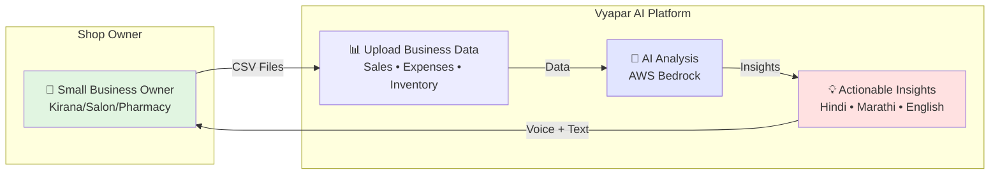

---

## 2. User Journey Flow (For Demo Walkthrough)

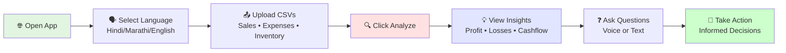

---

## 3. Core Features Overview (For Features Slide)

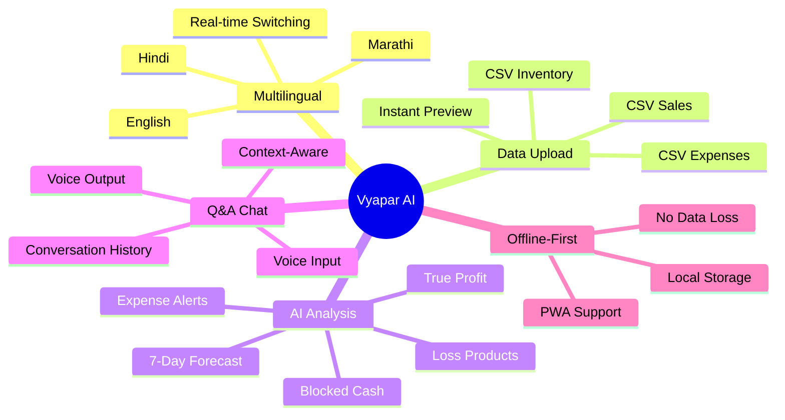

---

## 4. AWS Architecture (For Technical Slide)

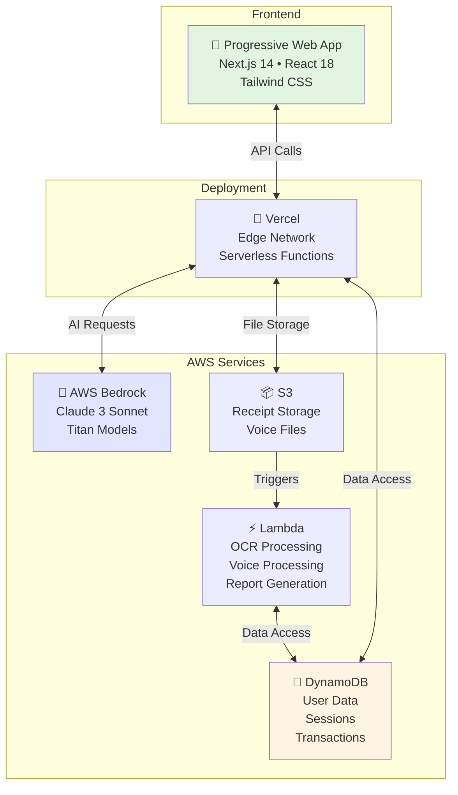

---

## 5. Hybrid Intelligence Model (For Architecture Philosophy)

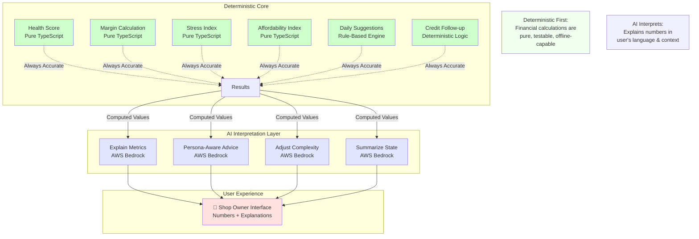

---

## 6. Key Use Cases (For Problem-Solution Slide)

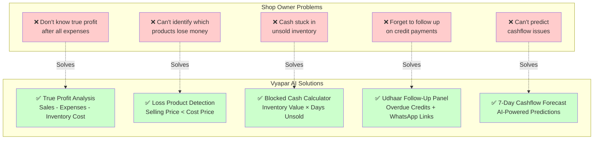

---

## 7. Data Flow - Simple Version (For Technical Overview)

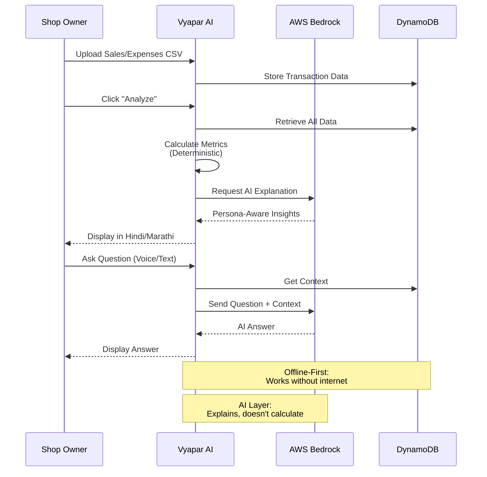

---

## 8. Persona-Aware AI (For AI Features Slide)

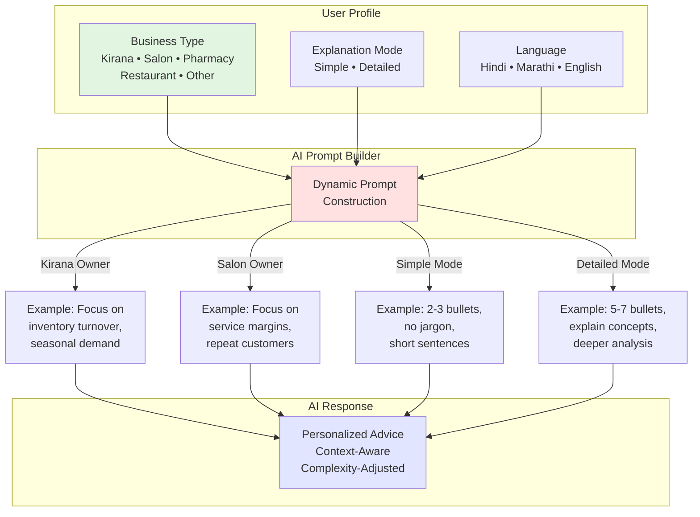

---

## 9. Offline-First Architecture (For PWA Features)

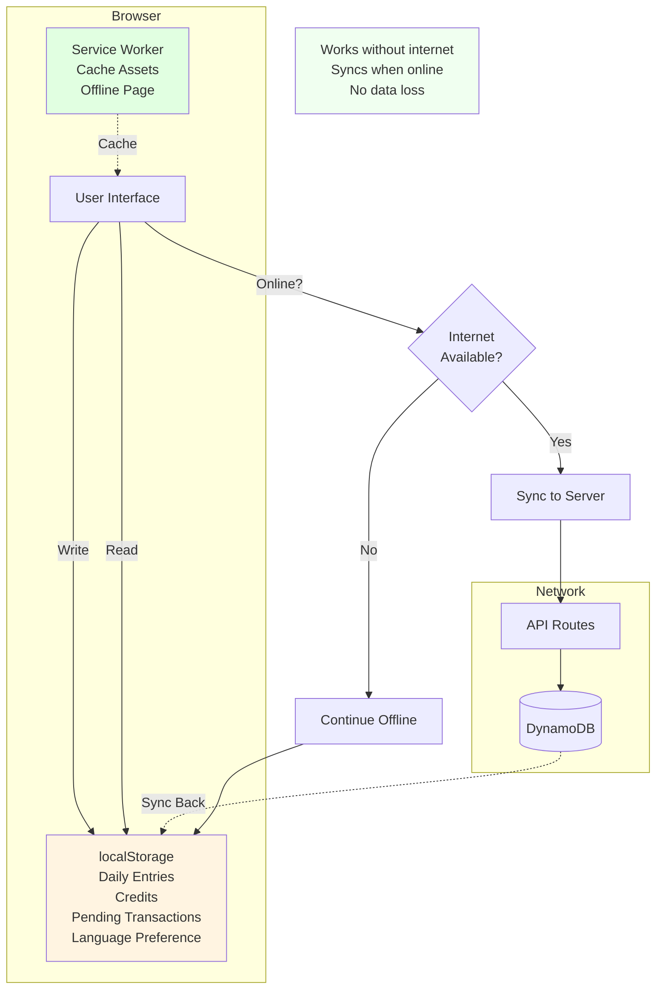

---

## 10. Security & Privacy (For Trust Slide)

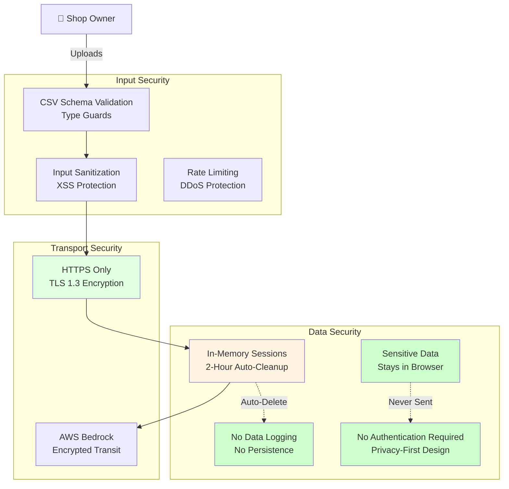

---

## 11. Technology Stack Summary (For Tech Stack Slide)

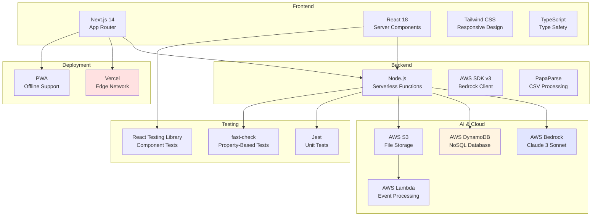

---

## 12. Demo Flow (For Live Demo Slide)

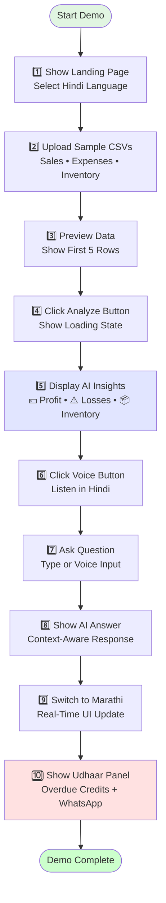

---

## 13. Impact Metrics (For Results Slide)

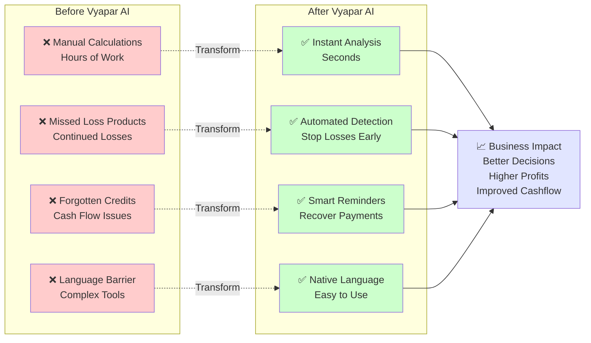

---

## 14. Roadmap (For Future Vision Slide)

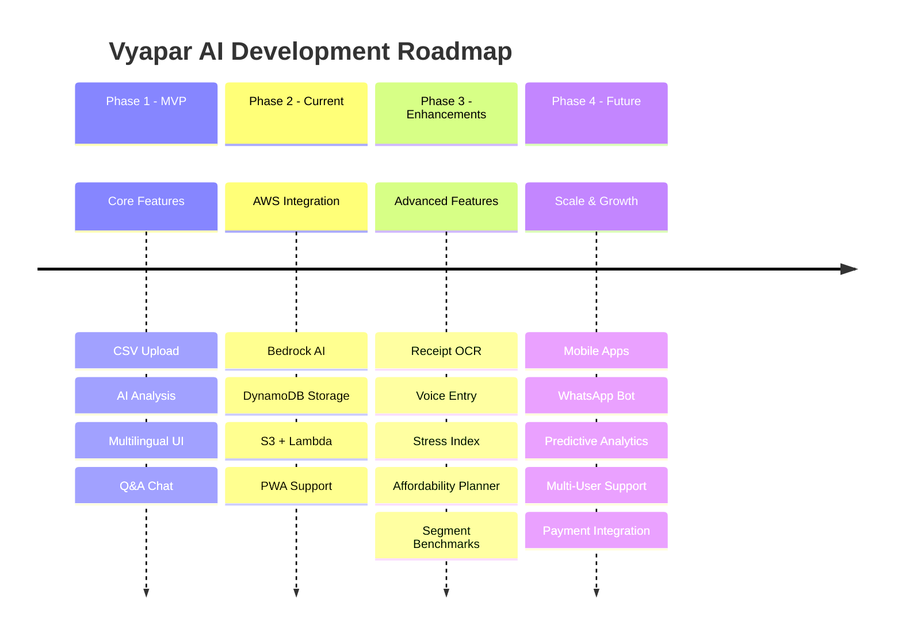

---

## Presentation Tips

### Slide 1: Opening
- Use Diagram #1 (High-Level System Overview)
- Keep it simple, show the value proposition

### Slide 2: Problem Statement
- Use Diagram #6 (Key Use Cases)
- Show real pain points of shop owners

### Slide 3: Solution Overview
- Use Diagram #2 (User Journey Flow)
- Walk through the user experience

### Slide 4: Core Features
- Use Diagram #3 (Core Features Overview)
- Highlight multilingual, AI, and offline capabilities

### Slide 5: Technical Architecture
- Use Diagram #4 (AWS Architecture)
- Show AWS services integration

### Slide 6: Hybrid Intelligence
- Use Diagram #5 (Hybrid Intelligence Model)
- Explain deterministic-first approach

### Slide 7: Persona-Aware AI
- Use Diagram #8 (Persona-Aware AI)
- Show how AI adapts to user context

### Slide 8: Offline-First
- Use Diagram #9 (Offline-First Architecture)
- Demonstrate PWA capabilities

### Slide 9: Security & Privacy
- Use Diagram #10 (Security & Privacy)
- Build trust with judges

### Slide 10: Technology Stack
- Use Diagram #11 (Technology Stack Summary)
- Show comprehensive tech choices

### Slide 11: Live Demo
- Use Diagram #12 (Demo Flow)
- Follow this exact sequence

### Slide 12: Impact
- Use Diagram #13 (Impact Metrics)
- Show before/after transformation

### Slide 13: Roadmap
- Use Diagram #14 (Roadmap)
- Show vision for future

### Slide 14: Closing
- Use Diagram #7 (Data Flow - Simple Version)
- Recap the technical flow

---

## Export Instructions

### For PowerPoint:
1. Copy each mermaid diagram
2. Use online tool: https://mermaid.live/
3. Export as PNG or SVG
4. Insert into PowerPoint slides

### For Google Slides:
1. Same process as PowerPoint
2. Or use Mermaid Chrome extension

### For PDF:
1. Export diagrams as SVG for best quality
2. Use high resolution (300 DPI minimum)

---

## Color Scheme Reference

- **Green (#e1f5e1, #ccffcc)**: User-facing, positive outcomes
- **Blue (#e1e5ff, #cce5ff)**: AI/AWS services, technical components
- **Yellow (#fff4e1, #ffffcc)**: Data storage, sessions
- **Red (#ffe1e1, #ffcccc)**: Problems, errors, warnings
- **Light Green (#e1ffe1, #f0fff0)**: Security, trust, success

Use these consistently across all slides for visual coherence.
